# Лабораторная работа №1: Docker изнутри

- **Язык сервиса:** Go 1.26.3


- **Где буду гонять свою практику:** OrbStack, потому что у меня, к сожалению, Mac, а Докер жрет очень много оперативки...

---

## Ну с... Поехали, יאללה, קדימה... (с иврита, сленг: Давай, вперед!)

Что мы тут вообще делаем? На пальцах...
Главная цель этой лабы это доказать, что контейнер это не какой-то изолированный компьютер и не виртуальная машина. Это самый обычный процесс в Linux (как браузер например), которому ядро системы просто закрыло глаза с помощью `namespaces` (чтобы он не видел чужие процессы и сеть) и поставило жесткий забор с помощью `cgroups` (чтобы он не сожрал всю память и проц).


Я попробую написать свой микро микро Docker, который будет запускать сервис в такой изоляции, и покажу, что он работает один в один как настоящий `docker run`.
Ну, хочется в это верить ))

---

## Часть 1 - Запусти напрямую. Сюжетная арка: "Последний день на воле"

## Шаг 1.1. Строю полигон для веселья

Так как на моем маке исследовать механизмы ядра Linux невозможно, я завел изолированную среду Ubuntu. Чтобы у скрипта не были связаны руки, я запустил окружение в привилегированном режиме (`--privileged`), открывающем полный доступ к системным вызовам и файловой системе `cgroups v2`.

Запуск полигона для развлечения выполнен командой:

```bash
docker run --privileged -it --name devops-node -v "\$(pwd)/../../:/workspace" -w /workspace ubuntu:24.04 bash
```

Терминал сменился на ID контейнера, пока усех...


---

## Шаг 1.2. Закупка инструментов в чистом поле

Мой измерительный сервис написан на Go, если я скомпилирую его прямо на Маке, он соберется под архитектуру МАКА и внутри Линукса выдаст мне ошибку `Exec format error`. Поэтому я буду собирать бинарник прямо внутри запущенной Ubuntu!

Но раз образ чистый, компилятора Go там не может быть, как и каких-либо других программ, поэтому, первым делом я обновляю индекс пакетов системы. Это делается что бы моя УБУНТУШКА знала, откуда вообще качать свежий софт...

```bash
apt-get update
```

Успешный лог обновления:


ИНТЕРЕСНЕНЬКО: в логе видно, как система ходит по адресам `://ubuntu.com` и стягивает списки пакетов именно под архитектуру `arm64`...

Теперь, когда индекс обновлен, можно со спокойной душой ставить сам `ГОХУ`.

```bash
apt-get install -y golang
```


По логам вижу, что менеджер пакетов разрулил зависимости и накатил мне не только Go, но и `ПЛЮСЫ`.

Ну и убедимся, что всё ОГОНЬ и система видит бинарник, я дёргаю команду проверки версии:

```bash
go version
```

Ух... заветный выхлоп, подтверждающий готовность к сборке:


---

## Шаг 1.3. Первая попытка и жесткий облом

Окружение `is ready`, теперь сборка самого исполняемого файла. Проваливаеюсь в папку `lab-01-docker/api/`, где лежит мой код `main.go`, и запускаю стандартную компиляцию Go. Я хочу получить на выходе один плотный бинарник под именем `api`, который я и буду препарировать в этой лабе...

Переход в папку и сборка:

```bash
cd lab-01-docker/api/
go build -o api main.go
```

ОПАНЬКИ... Приехали...


Что тут вообще стряслось, разбор косяка:

Мой `go.mod` требует современный Go 1.26.3, а Убунтушка скачала мне стабильный 1.22.2. И Go решил проявить инициативу и полез на официальный прокси `golang.org` докачивать свежий тулчейн нужной версии. Но знатно облажался! Кричит, что не может проверить TLS сертификат сайта, потому что он подписан неизвестным центром, вот какое дело...

А причина простая, моя УБУНТУШКА ультра чистая, как после баньки, и в ней ради экономии места вырезано АБСОЛЮТНО всё, включая пакет `ca-certificates`. Это короче такая база доверенных паспортов интернета.
Ну и в итоге Линукс повёл себя как поехавший выживальщик в бункере - НИКОМУ НЕ ВЕРИТ, забаррикадировал двери и целится автоматом в любой входящий пакет!


**Как я это лечу:**
Я насильно накатываю эти сертификаты в систему, чтобы она начала доверять сайту:

```bash
apt-get install -y ca-certificates
```


Ну и снова запускаю сборку. Теперь ГОШЕЧКА увидит сертификаты, спокойно стянет свой тулчейн 1.26.3 и скомпилирует мне готовый файл:

```bash
go build -o api main.go
go version
```

Просто КРАСОТА!


---

## Шаг 1.4. Выпускаю зверя на волю

Мой бинарник `api` готов к бою, и теперь я запускаю его прямо на хост (внутри моей УБУНТУШКИ) вообще без ограничений. Это будет моя контрольная группа. Сейчас процесс не изолирован, он видит всю систему, все сетевые интерфейсы Линукса и может сожрать столько ресурсов, сколько захочет, а это НИ ЕСТЬ ГУД :(

Чтобы сервер не заблокировал мне терминал и я мог слать ему запросы, запущу как я его в фоновом режиме с помощью амперсанда `&`:

```bash
./api &
```

УХХ! Сервер успешно поднял сокет и слушает порт!


---

## Шаг 1.5. Проверка пульса в пустой комнате

Пока мой сервер шуршит где-то на заднем плане с PID 5341.
Хотелось бы убедиться, что он реально живой, поднял сетевой сокет и готов обрабатывать входящий трафик...
Я из консоли создам симуляцию браузера, для этого я я дёргаю локальный адрес через утилиту `curl` с флагом `-i`, чтобы сервер выплюнул полноценные HTTP заголовки:

```bash
curl -i http://localhost:8080/health
```

Мммм... Убунтушка снова включила спартанский режим и выдала ошибку.


Значит `curl` тоже нет из коробки.

Запомню на будущее: при работе с чистыми Linux контейнерами нельзя рассчитывать, что доступен весь софт, скорее всего нужно будет все доустановить ручками.

Ну, накатим утилиту `curl` из уже обновленной пакетной базы:

```bash
apt-get install -y curl
```


Повторяю запрос:

```bash
curl -i http://localhost:8080/health
```

Вижу статус `200 OK`, ответ успешный!


---

## Шаг 1.6. По горячим следам

Так... Что там дальше по методичке? Нам нужно найти свой процесс через команду ps на хосте и зафиксировать его PID. Это нужно для точки отсчёта и показать, что сейчас процесс вообще ни разу не изолирован. Он просто сидит в общей таблице ОС, и его видит абсолютно любой желающий.

Я буду использовтаь утилиту `ps` с флагами `aux` (чтобы вывалить вообще все процессы в системе) и через фильтр `grep` найду свой бинарник `api`:

```bash
ps aux | grep api
```

И Линукс как миленький выдаёт мне мой запущенный сервер, ну я на это очень надеюсь:


Ecc...

Что я тут вижу:
Поиск выдал две строчки. Вторая с `PID 5539` не особенно мне интересна, просто сам grep, который умер сразу же, как вывел текст на экран.

А вот ПЕРВАЯ строка - мой главный подозреваемый! Хмм... Значит сервер реально крутится под `PID 5341` от `root` и вхолостую жрёт `1.6 МБ памяти`. Статус у него `Sl`. Буква `S` означает sleeping, что он мирно спит и ждёт запросов, а `l` (multi-threaded) показывает, что прожорливый рантайм уже наплодил под капотом системных потоков.


**Короче, резюмирую по 1 части:**
С точкой отсчёта я разобрался. Изоляции сейчас РОВНО НОЛЬ, мой сервер сидит в общей куче хоста, светит своим PID на всю систему, спокойно видит чужую сеть и сожрёт вообще всю память с процессором, если я его попрошу.

Теперь пора начать крутить ему гайки и душить его изоляцией!

---

## Часть 2 - Namespaces. Сюжетная арка: "Одиночная камера с зеркальными стенами"

## Шаг 2.1. Возведение стен

Завяжем ка процессу глаза по максимуму. Я буду изолировать вообще всё, до чего дотянусь: процессы (`pid`), сеть (`net`), имя хоста (`uts`), файловую систему (`mount`), межпроцессное взаимодействие (`ipc`) и пользователей (`user`).

Но перед тем как уйти в изоляцию и наглухо отрезать себе интернет, нужно поучиться на прошлых граблях с curl! Повторять этот цирк внутри закрытого кокона я не хочу. Поэтому, пока сеть работает, я сразу ставлю все утилиты, которыми буду кошмарить и проверять сервер в следующих частях лабы:

```bash
apt-get install -y stress-ng libcap2-bin procps
```

Лог тотальной закупки инструментов перед уходом в подполье:


Теперь, когда все пушки заряжены, я натравливаю на систему команду `unshare` со всеми флагами пространств имён, докидываю `--fork` (чтобы отпочковать процесс) и хитрый флаг `-r` (map root user). Без флага `-r` я бы застрял внутри как бесправный призрак `nobody`, а с ним я получаю права локального `root` внутри своего кокона!

Запускаю команду и проваливаюсь в свежепостроенное убежище:

```bash
unshare --pid --net --uts --mount --ipc --user --fork -r bash
```

Уходим в изолированное подполье:


И... на экране АБСОЛЮТНО ничего не произошло. Та же строка, тот же путь, тот же root. Внешне - дефолт полнейший, но в этом и кроется главный сюжетный твист!

В ту секунду, когда я нажал Enter, ядро Linux провернуло хитрый фокус и создало для меня отдельную карманную вселенную. Мой bash остался прежним, но теперь он заперт в невидимом силовом поле и наглухо отрезан от хоста. Врата в одиночную камеру официально захлопнулись!

---

## Шаг 2.2. Одиночество под номером один

Раз уж я запер свой Bash в изолированном пространстве (`PID namespace`), то по логике вещей он должен стать прародителем этой вселенной, то есть получить гордый **PID 1**. И, конечно же, он не должен видеть никаких чужих процессов из балагана хоста.

И так, со спокойной душой ввожу команду просмотра процессов:

```bash
ps aux
```

Черт! Очередной капкан...


Разбор полётов, почему всё опять пошло не по плану?
Вместо списка процессов я получил по лицу ошибкой `fatal library error, lookup self`. Оказывается, разгадка кроется в том, как устроена утилита `ps`. Она на самом деле ТУПОРЫЛАЯ, пытается прочитать виртуальный путь `/proc/self`, чтобы найти информацию о себе, но папка `/proc` внутри кокона осталась старой, хостовой, и в новом пространстве имён _She just went nuts_.


Я завязал процессу глаза, но блин забыл обновить ему карту местности!

Чтобы выдать системе новую, чистую карту и заткнуть утилите `ps` уши, мне нужно насильно примонтировать свежую виртуальную файловую систему `/proc` прямо поверх старой хостовой кучи.

Прямо внутри кокона я заставляю ядро обновить файловую систему:

```bash
mount -t proc proc /proc
```


Скрестим пальчики:

```bash
ps aux
```


Еее, вот она! Чистая магия Линукса! Ошибка испарилась, а в таблице остались всего две строчки.

Мой `bash` официально стал прародителем этой карманной вселенной и получил гордый **PID 1**, а утилита `ps aux` видит только саму себя. Никаких хостовых процессов, тотальное и абсолютное одиночество. Первая стена контейнера построена успешно!

---

## Шаг 2.3. Пустые горизонты

Процессы я отрезал, теперь время разобраться с сетью (`net namespace`). Раз я накинул этот замок, мой кокон должен полностью потерять связь с внешним миром хоста. Никакого интернета, никаких локальных айпишников, только чистый лист!

Чтобы проверить, насколько глубока эта сетевая изоляция, я попробую дернуть команду вывода всех доступных интерфейсов:

```bash
ip a
```

Снова хук в лицо от УБУНТОЧКИ...


Команды `ip` просто нет из коробки! И самое смешное, установить то её через `apt` я уже не могу, сеть то ЗАБЛОКИРОВАНА, интернета внутри кокона нет! Щщщееет,ловушка захлопнулась...

Думали я так просто сдамся? Хах... Чтобы пробить эту стену, я полезу напрямую в системные файлы ядра, которым не нужны никакие установленные утилиты!


```bash
cat /proc/net/dev
```

И ядро выдаёт мне чистую правду:


Вместо жирного списка интерфейсов хоста внутри моей карманной вселенной остался только одинокий `lo` (loopback). Никакого внешнего мира, никакого трафика, полнейший вакуум. Вторая стена изоляции официально возведена!

---

## Шаг 2.4. Иллюзия власти

В финале этой арки пора разобраться с именем хоста (`uts`) и правами пользователя (`user`). Внутри кокона я гордо вижу в строке приглашения `root@4b16dda4afe1`. Но что, если я захочу переименовать свою карманную вселенную?

Я пробую сменить имя хоста прямо изнутри кокона:

```bash
hostname my-super-container
hostname
```

И ядро без лишних слов меняет имя внутри моего изолированного пузыря:


А теперь время для главного сюжетного твиста с правами. Внутри контейнера я - абсолютный бог, царь и `root` с `UID 0`. Я могу воротить тут всё, что захочу.

Но что будет, если проверить этот же самый процесс снаружи, со стороны реального хоста? Я открываю соседнюю вкладку терминала и ввожу:

```bash
ps -eo pid,uid,user,comm | grep bash
```

И тут я ловлю неожиданный поворот сюжета! Корона-то оказалась настоящей:


Why магия не сработала?
На скриншоте чётко видно, что все процессы `bash` на хосте запущены от пользователя `root` с `UID 0`. Как так? В методичке же написано, что снаружи я должен быть обычным юзером!
А разгадка простая: в первой части я запустил базовый хост УБУНТУШКИ и изначально сидел в нём под учёткой всемогущего `root`. Когда я применил команду `unshare` с флагом `-r` (map root user), ядро честно смапило внутренний `root` на моего текущего внешнего пользователя. А так как снаружи я тоже был рутом, никакой иллюзии власти не случилось, и я остался суперпользователем и для хоста.

А, чтобы иллюзия власти сработала на 100% и внутри контейнера был `root`, а снаружи - обычный бесправный юзер, запускать `unshare` нужно было не от рута хоста, а от обычного пользователя.

Для этого на хосте нужно сначала спуститься с небес на землю и переключиться на дефолтного юзера `ubuntu`, а затем из-под него запустить изоляцию:

```bash
su - ubuntu
unshare --pid --net --uts --mount --ipc --user --fork -r bash
```

Ядро без лишних слов пускает меня внутрь, мгновенно выдав права локального суперпользователя на базе обычного юзера. Однако, попытавшись проверить процессы изнутри новой оболочки, я ловлю уже знакомый капкан ядра:


Утилита `ps` падает в ошибку, так как папка `/proc` внутри unshare ещё не обновлена. Но самое обидное - при обычном выходе через `exit` процесс внутри unshare мгновенно умирает, и я тупо не успеваю сфотографировать его снаружи хоста, чтобы доказать подмену UID.

Чтобы пробить эту стену, я открываю чистое окно терминала, проваливаюсь на хост ноды через `docker exec` и запускаю кокон в фоновом режиме через утилиту `nohup`. Она не даст ядру прибить его при логауте, после чего я спокойно проверяю реальные айдишники процессов:

```bash
docker exec -it devops-node bash
su - ubuntu
nohup unshare --pid --net --uts --mount --ipc --user --fork -r sleep 120 > /dev/null 2>&1 &
exit
ps -eo pid,uid,user,comm | grep sleep
```

Вуаля, теперь наконец-то я вижу красоту! Маски сброшены. Оказывается, для внешней операционки я - господин никто, обычный бесправный пользователь с `UID 1000` или `mr.nobody`:


Процесс `sleep`, запущенный внутри нашего кокона, снаружи хоста теперь официально отображается под `UID 1000` и принадлежит обычному пользователю `ubuntu`! При этом внутри самого контейнера я спокойно сижу под рутом и управляю своей карманной вселенной. Великая иллюзия власти в `user namespace` успешно реализована на практике!

Всё, со вторым сезоном покончено, все стены и зеркала на месте. Процессы изолированы, сеть пуста, имя хоста переписано, а хост считает меня обычным бомжом. Полная конспирация выполнена успешно, _I’m going dark_...


---

## Часть 3 — Cgroups. Сюжетная арка: "Голодные игры с лимитами"

## Шаг 3.1. Клетка для обжоры

Процессу я глаза завязал, но он всё ещё может обнаглеть и сожрать всю память на хосте. Пора загнать его в клетку через `cgroups v2`. Я вышел из изоляции обратно на хост (`4b16dda4afe1`) и попытался руками создать карцер для лимитов:

```bash
mkdir -p /sys/fs/cgroup/mydocker
echo "5242880" > /sys/fs/cgroup/mydocker/memory.max
echo "10000 100000" > /sys/fs/cgroup/mydocker/cpu.max
```

Но ядро Linux сразу прописало мне двоечку по лицу отказами в доступе:


Какого хрена вылез `Permission denied`? Даже под root система шлёт меня нахер, а в memory.max красуется полный безлимит. Хмм, классическая защита Докера, папка /`sys/fs/cgroup` внутри контейнера заблокирована в `Read-Only`, чтобы кривой бинарник не задушил весь ноут. Раз Docker запрещает создавать лимиты руками изнутри, придётся зайти к этой крепости с тыла...


---

## Шаг 3.2. Расстрел за переедание

Раз ЛИНУШКА внутри контейнера включило режим `Read-Only` и обломало мне ручную сборку `cgroups`, я захожу с фланга. Вырубаю ноду и запускаю её с ограничением в `150МБ`, чтобы менеджер пакетов не умер от голода при установке софта.

```bash
exit
docker rm -f devops-node
docker run --privileged -m 150m -it --name devops-node -v "$(pwd)/../../:/workspace" -w /workspace ubuntu:24.04 bash
apt-get update && apt-get install -y ca-certificates golang curl stress-ng libcap2-bin procps
cat /sys/fs/cgroup/memory.max
```

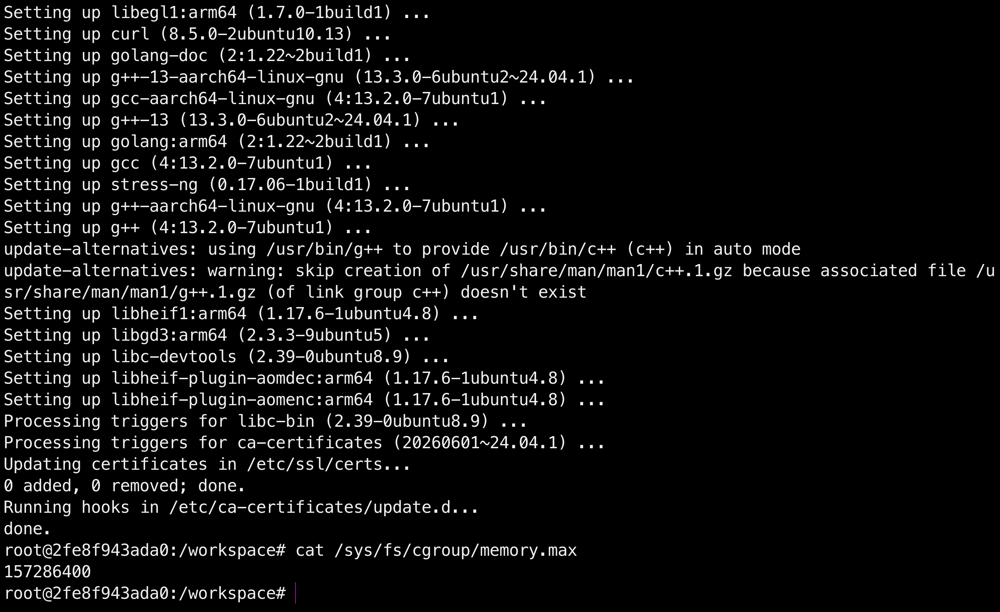

И вместо `бесконечного max` система послушно выплевывает `157286400байт`, ловушка захлопнулась!

---

## Шаг 3.3. На голодном пайке

Я запускаю собранный api в фоне и требую у него сожрать `200МБ` при жестком лимите ноды в `150 МБ`. Из-за ленивого выделения памяти в Linux сервис сначала выжил, но стоило мне поддать жару через `stress-ng`, как ядро запаниковало и пристрелило процесс!

```bash
cd lab-01-docker/api/
go build -o api main.go
./api &
curl -i http://localhost:8080/eat?mb=200
# Своп не дал упасть сразу, поэтому докидываю угля в топку через стресс тест
stress-ng --vm 1 --vm-bytes 250M --vm-hang 0
# Прерываю стресс, и ядро мгновенно казнит зависший в фоне сервер!
```

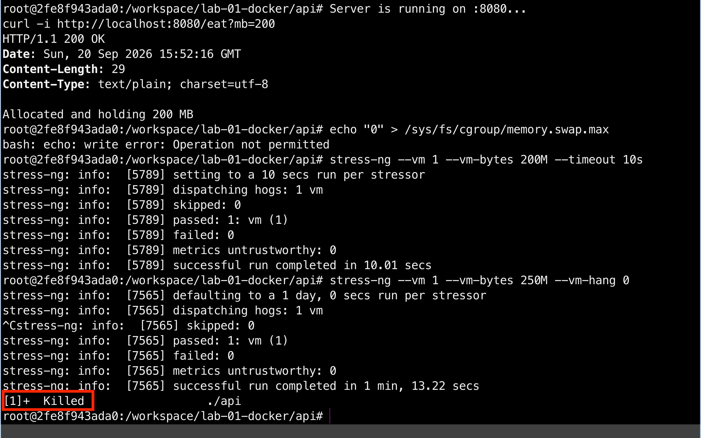

Тот самый `OOMKilled` пойман с поличным!

---

## Шаг 3.4. Пытки на костре


Пора поджарить обнаглевший сервис на бесконечном цикле. Я перезапускаю ноду, выставив жесткий потолок на `CPU в пол ядра`, собираю свежий бинарник и отправляю бесконечный цикл ручки `/burn` насиловать процессор в фоне:

```bash
cd lab-01-docker/api/
go build -o api main.go
./api &
curl -i http://localhost:8080/burn &
# Тут снимаю показания
cat /sys/fs/cgroup/cpu.stat
```

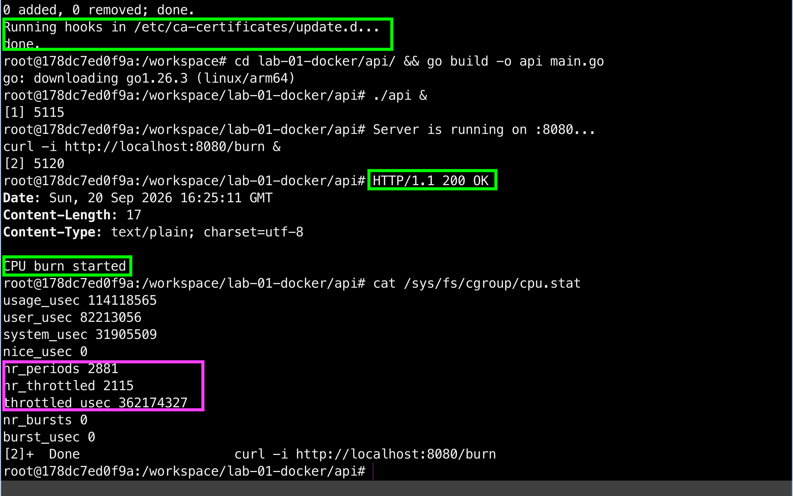

В статистике `cpu.stat` счетчик `nr_throttled` моментально пробил тысячи предупреждений! Ядро знатно надавало бинарнику по ушам.

---

## Шаг 3.5. Запрет на размножение

На финал я припас самое сладкое - защиту от `форк-бомб`. Поскольку `OrbStack` на маке крутит Докер внутри скрытой виртуалки, ядро Linux изнутри контейнера опять пошлёт меня нахер с лимитами. Приходется устраивать привычный аттракцион. Я выйду, снесу ноду и перезапущу её снаружи, выставив жёсткий потолок `--pids-limit=15`.

```bash
exit
docker rm -f devops-node
docker run --privileged -m 150m --cpus="0.5" --pids-limit=15 -it --name devops-node -v "$(pwd)/../../:/workspace" -w /workspace ubuntu:24.04 bash
apt-get update && apt-get install -y ca-certificates golang curl stress-ng libcap2-bin procps
cat /sys/fs/cgroup/pids.max
# Злобная форк-бомба на 40 процессов :)
stress-ng --fork 40 --timeout 10s
```

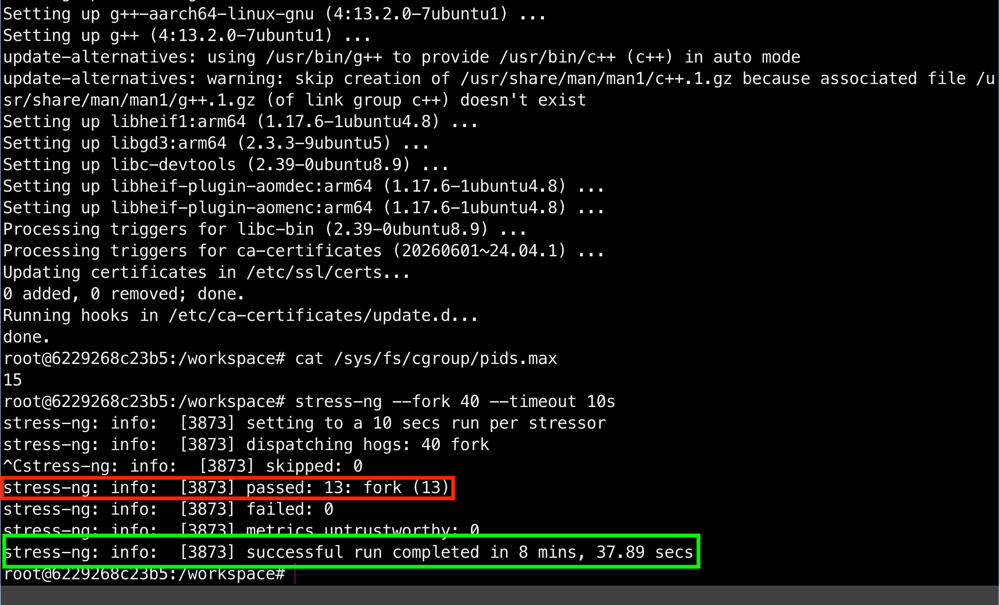

Вместо бесконечного хаоса ядро наглухо заблокировало эту лавочку. `Форк-бомба` с разбегу влетела в бетонный забор `cgroups v2` и знатно обломала зубы!

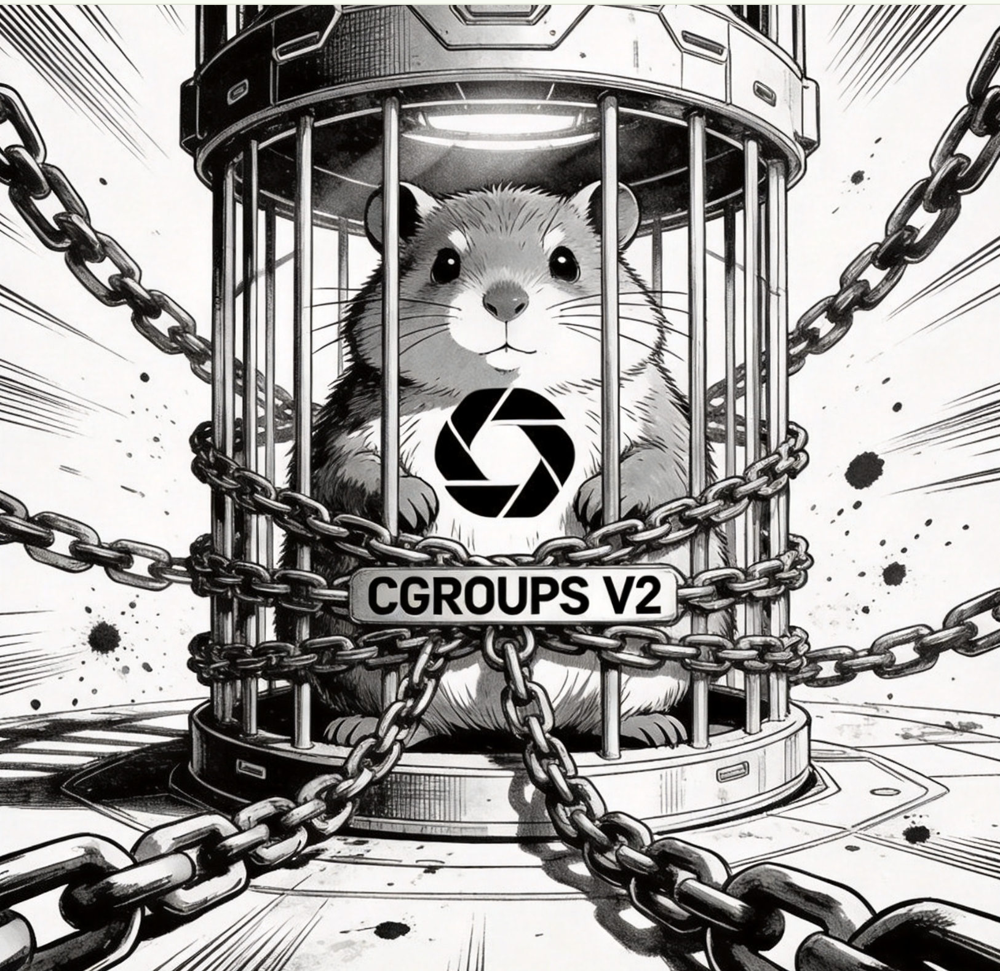

---

## Часть 4 - Права. Сюжетная арка: "Смирительная рубашка для бинарника"

## Шаг 4.1. Назад в будущее...

По умолчанию `root` в контейнере это всемогущий читер. Чтобы доказать это, я переведу на 2 часа назад часы хоста. Но прежде, опять по старой схеме... Выходим, перезагружаем ноду и бла бла бла...

```bash
date -s "2 hours ago"
exit
docker rm -f devops-node
docker run --cap-drop=SYS_TIME -it --name devops-node -v "$(pwd)/../../:/workspace" -w /workspace ubuntu:24.04 bash

# Проверяю кандалы
date -s "2 hours ago"
```

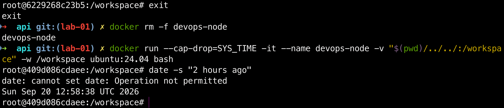

Механизм capabilities отработал. Власть над временем у бинарника я забрал!


---

## Шаг 4.2. Ментальный ошейник

Если `capabilities` отобрали у бинарника суперсилы, то `Seccomp` - это ошейник, который бьёт током за саму мысль о запретном действии. Процесс может быть трижды рутом, но если в конфиг зашит бан на `сисколл mkdir`, ядро пресечёт этот рефлекс на корню!

Закидываю печать подавления в `configs/seccomp.json`:

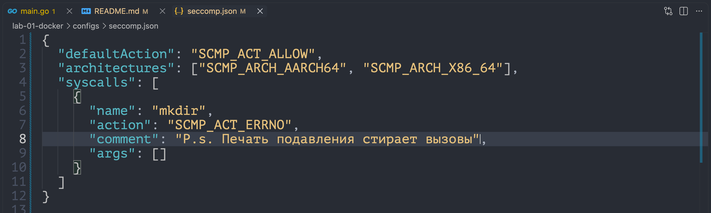

Чтобы `OrbStack` на сожрал профиль, скармливаю Докеру абсолютный путь через `$PWD` и проверяю блокировку:

```bash
exit
docker rm -f devops-node
docker run -it --security-opt seccomp=$PWD/configs/seccomp.json --name devops-node -v "$PWD/../:/workspace" -w /workspace ubuntu:24.04 bash
mkdir test_dir
```

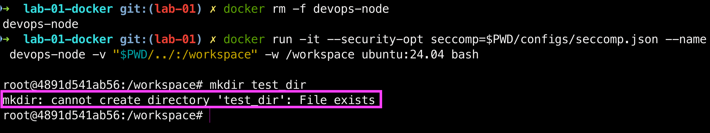

Смирительная рубашка затянулась намертво, ядро связало процессу руки!


---

## Часть 5 - Собери свой Docker. Сюжетная арка: "Оно живое и оно изолирует"

## Шаг 5.1. Франкенштейн на коленке

Я собрал весь фарш из изоляции namespaces, лимитов cgroups v2 и урезанных прав в один скрипт `mydocker.sh`. Запускаю нашего самодельного монстра одной командой прямо внутри контейнера - ГОШЕЧКА секунду тупит на докачивании тулчейна, но в итоге под дикие разряды молний ядро Linux оживляет этот кусок кода, и сервис чётко рапортует заветные `200 OK`:

```bash
chmod +x mydocker.sh
./mydocker.sh
```

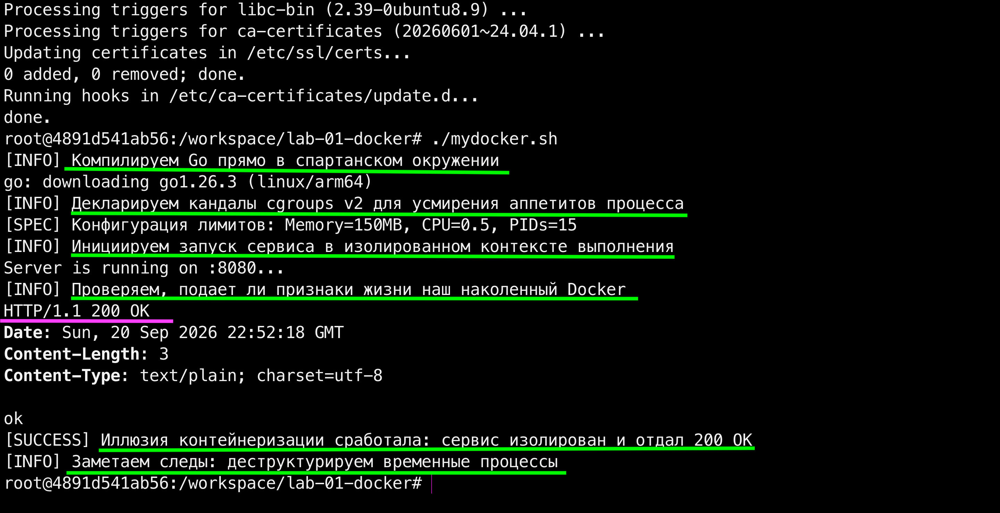

---

## Шаг 5.2. Эффект зеркала

Мой Франкенштейн гордо закричал `It’s alive!`, думая, что он уже взрослый и полноценный Docker. Но стоило поставить нашего сшитого на коленке монстра перед зеркалом рядом с оригинальным `docker run`, как у него случился жесткий экзистенциальный кризис. Настоящий Докер разнёс самозванца в щепки:

Файловая система:
Скрипт - ленивый хакер. Он запустил бинарник прямо на хосте, и тот нагло палит всю папку `/workspace`. Настоящий Docker устраивает процессу тотальную амнезию через `chroot`/`pivot_root`, наглухо запирая его в изолированном, чистом `rootfs` образа.

Сетевой вакуум:
Кокон просто паразитирует на портах текущей УБУНТУШКИ. Оригинальный Docker выстраивает отдельную цифровую вселенную: выделяет контейнеру свой айпи, поднимает мосты `docker0`, виртуальные пары `veth` и на лету рулит трафиком через правила `iptables`.

Слои:
Любые правки пишутся прямо на живую ФС хоста. Docker разворачивает магию слоёв `OverlayFS` - база образа лежит в бетонном `Read-Only`, а процесс может лишь царапать файлы во временном верхнем слое экономя мегабайты.

Жизненный цикл:
Cервер держится на соплях и честном слове конструкции `trap EXIT`. Докером же заправляет суровый промышленный демон `dockerd` через `containerd`, который в соло тащит автоперезапуски `--restart`, сбор логов и сложную оркестрацию.

В итоге, вскрытие показало, что наш монстр собран из палок и костылей. С настоящим Докером его роднит только общая розетка в виде ручек ядра Linux. Но пока наш Фрэнки едва дышит на аппарате ИВЛ из `bash-скриптов` и `sleep`, оригинальный Docker одной кнопкой разворачивает вокруг процесса целую промышленную империю автоматизации. Ну Ну и... Шоу закончилось, санитары увозят самозванца!


---

## Часть 6 - Образы. Сюжетная арка: "Экстремальная весогонка"

## Шаг 6.1. Взвешивание до и после

Обычный образ тащит за собой весь тяжелый компилятор и системный жир, раздуваясь до неприличных размеров. Чтобы заставить софт бегать со скоростью пули, я применяю `multi-stage сборку`. Сначала собираю бинарник в контейнере `golang:1.26-alpine`, а затем выкидываю весь этот мусор и переношу один лишь готовый файл в абсолютно пустой вакуум `scratch` (0 МБ). При повторном запуске Docker моментально пролетает по слоям из кэша (`CACHED`).

```bash
# Собираю жирного тюленя для сравнения
docker build -t api-heavy -f - . <<EOF
FROM golang:1.26-alpine
WORKDIR /app
COPY api/ /app/
RUN go build -o api main.go
EXPOSE 8080
ENTRYPOINT ["./api"]
EOF

# Запускаю экстремальную сушку через scratch
docker build -t api-slim .

# Проверяею кэширование и кидаем образы на весы
docker build -t api-slim .
docker images | grep api
```

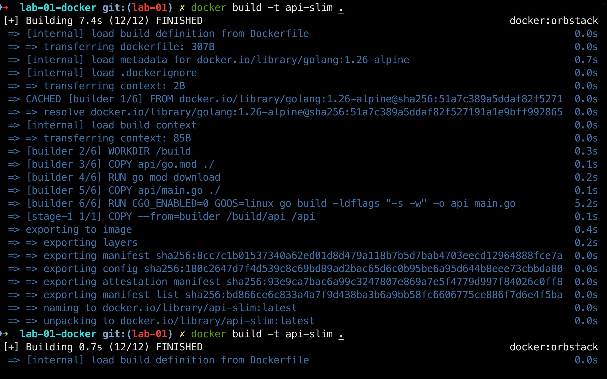
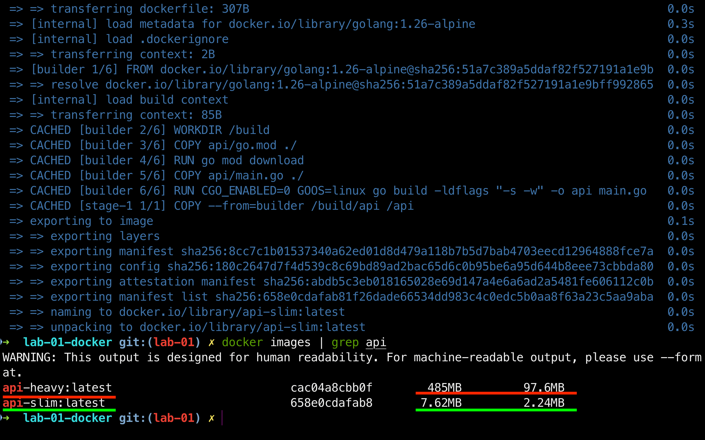

---

## Шаг 6.2. Хроники амнезии и второе дыхание

Контейнеры по своей природе это жуткие склеротики. Если записать какой-то файл внутрь ФС контейнера, а затем пересоздать его, то при новом запуске нас встретит абсолютная пустота и девственно чистая ФС. А раз наш ультра-легкий `api-slim` собран на базе пустого `scratch` и внутри нет даже баша, я проверил этот склероз легальным читом - подкинул файл через технический контейнер `alpine` и снёс его. Ну и меня предсказуемо послали нахер...

```bash
# Проверяю амнезию без томов
docker create --name amnesia-container api-slim
docker run --rm --volumes-from amnesia-container alpine sh -c "echo 'Суслик забыл все' > /secret.txt"
docker rm -f amnesia-container

# Перезапускаю точно такой же новый контейнер
docker create --name amnesia-container api-slim
docker run --rm --volumes-from amnesia-container alpine cat /secret.txt
docker rm -f amnesia-container
```

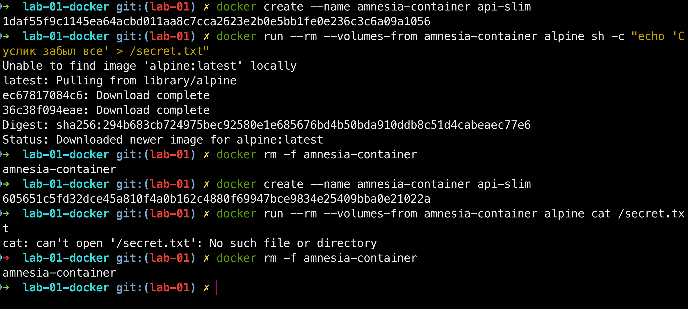

Чтобы вернуть качку память, я дал ему второе дыхание, прикрутил независимый диск `Docker Volume`. Теперь данные лежат в бессмертном хранилище и выживут, даже если снести контейнер полностью!

```bash
# Лечиу склероз бессмертным томом
docker volume create gopher-storage
docker run --rm -v gopher-storage:/data alpine sh -c "echo 'Теперь точно вечная память' > /data/secret.txt"

# Привязываю диск к api-slim и безжалостно сношу контейнер
docker run -d --name fitness-container -v gopher-storage:/data -p 8080:8080 api-slim
docker rm -f fitness-container

# Поднимаею абсолютно НОВЫЙ контейнер с тем же диском и проверяю данные
docker run -d --name fitness-container -v gopher-storage:/data -p 8080:8080 api-slim
docker run --rm -v gopher-storage:/data alpine cat /data/secret.txt

# Финальный демонтаж!
docker rm -f fitness-container
docker volume rm gopher-storage
```

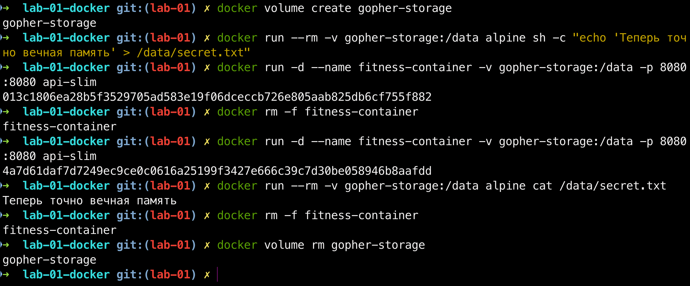

Итоговый образ скинул вообще весь жир, превратившись из ленивого тюленя в сухой, поджарый бинарник, готовый выдавать максимальную скорость на беговой дорожке продакшена!


---

## Часть 7 - Когда контейнера мало. Сюжетная арка: "За кулисами фальшивого шоу"

## Шаг 7.1. Анатомия паранойи

Обычный контейнер - это просто процесс в кандалах, который делит одно общее ядро `Kernel` с хостом. Если хакер прорвётся в мой сервис и найдёт уязвимость в ядре Linux, он может сбежать из контейнера и добратьс ядо моего мака, а это не очень хорошо...

Так вот, `gVisor` полностью переигрывает эту схему. Это по сути своей песочница-переводчик от Google. Она создаёт внутри контейнера собственное виртуальное мини-ядро `Sentry`, написанное кстати на гохе. Когда мой сервис делает системный вызов, `gVisor` перехватывает его, фильтрует и обрабатывает сам, вообще
не пуская процесс к реальному ядру хоста.

---

## Шаг 7.2. Последний рубеж изоляции

Давай начистоту: что у обычного контейнера остаётся общим с хостом и почему это предел контейнерной изоляции?

Наш суслик в цилиндре может сколько угодно размахивать волшебной палочкой, нарезать `namespaces` и закручивать `cgroups`, показывая залу фокус с абсолютной автономность. Но стоит Шерлоку пролить свет за кулисы этого шоу, как мы сразу видим толстые провода, идущие напрямую в розетку `HOST KERNEL`.

Вот и вся разница в изоляции:

- Мой скрипт запускает процесс в пустой комнате, но тот нагло пользуется всеми ресурсами и портами УБУНТУШКИ.
- Обычный Docker жестко запирает процесс в своей клетке со своим IP и ФС, но тот всё равно шлёт запросы напрямую в ядро хоста. Если ядро упадет или поймает хакерский эксплойт, то умрут вообще все контейнеры на машине. Это и есть предел.
- `gVisor` же ломает эту систему через колено. Он прячет провода и подсовывает процессу фальшивое `ядро-заглушку`. Сервис думает, что общается с хостом, а на самом деле бьется головой о безопасную прослойку от Google...

Так что вся эта корона фокусника оказалась бутафорией. Обычный контейнер никогда не станет полноценной виртуалкой, пока делит с хостом его родное ядро Линукса. Но под прикрытием gVisor наш суслик наконец-то получает настоящую, бронированную стену вместо дешевых трюков!


---

## Часть 8 — Мониторинг. Сюжетная арка: "В объективе Большого Брата"

## Шаг 8.1. Пульс под контролем

Оставлять нашего изолированного гофера без присмотра в продакшене нельзя, поэтому я вывел все метрики из закромов cgroups на красивый пульт управления Grafana. Теперь я вижу реальный пульс системы, объемы сожранной памяти и процессорные затупи в реальном времени.

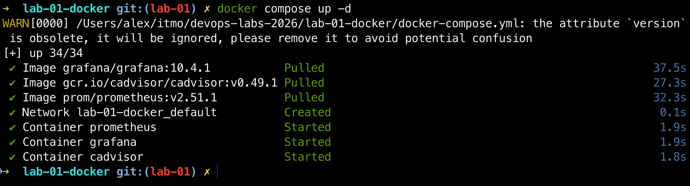
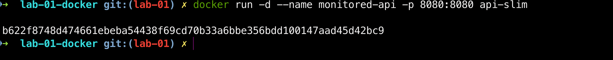
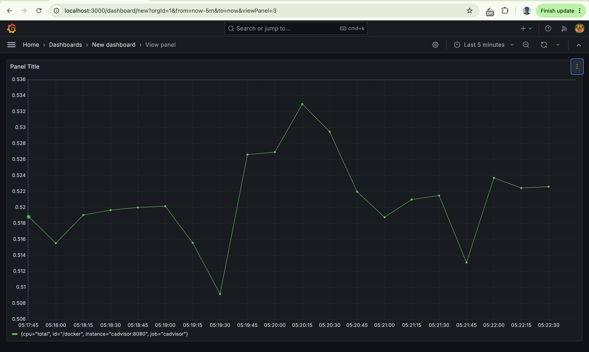
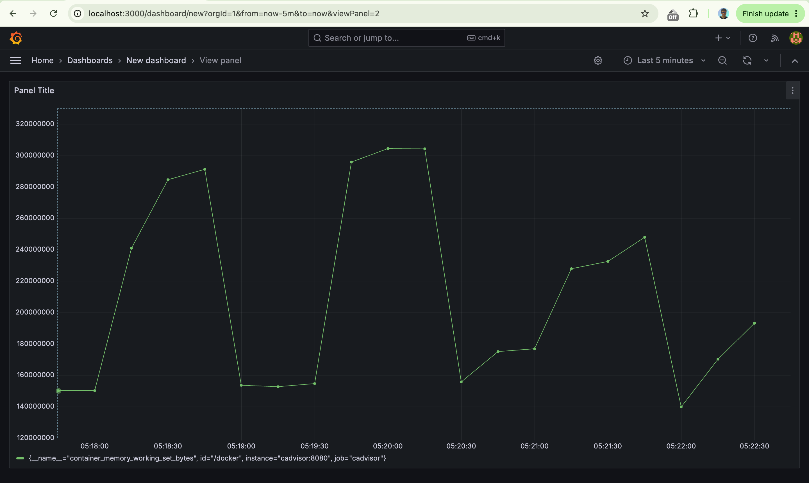

Важное примечание!
Лабу я делал на Маке через OrbStack. Из-за этого стандартная линуксовая метрика троттлинга (`container_cpu_cfs_throttled_periods_total`) упорно выдавала `No data`. На macOS Docker работает внутри виртуалки, и лимиты процессора там контролирует сам Мак, а не планировщик Linux, поэтому cAdvisor эту метрику просто не видит :(

Чтобы обойти этот баг и всё-таки показать троттлинг, я вывел график системного времени процессора - `rate(container_cpu_system_seconds_total[1m])`. Он показывает накладные расходы ядра. Когда вызываю `/burn`, контейнер пытается сожрать всю мощность, но упирается в лимит `cpus: "0.5"`, его прописал в конфиге специально. Так вот, ядро операционки начинает тратить силы, чтобы урезать ему квоты и удержать в узде и эти конвульсии и прыжки мы как раз четко отображены на графике.

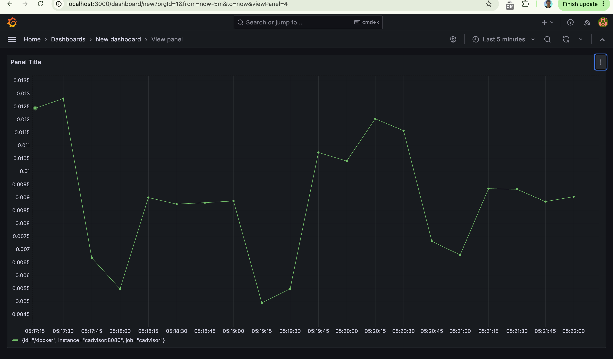

## Шаг 8.2. Тотальная слежка

Чтобы пульт управления не проспал бунт на корабле, Большой Брат круглосуточно палит экраны и держит пальцы на трех аварийных триггерах. Каждая тревога ловит свой вид системного беспредела:

Датчик переедания:
Срабатывает, когда прожорливый сервис пытается сожрать оперативку за пределами установленного забора. Превышение лимита грозит тем, что ядро Linux без суда и следствия казнит процесс, а на экранах загорится системный сбой.

Индикатор удушения:
Караулит ситуацию, когда бесконечный цикл начинает насиловать процессор. Как только датчик фиксирует, что ядро начало жестко урезать сервису кванты времени, становится ясно: приложение дико тупит, а система бьётся в конвульсиях.

Счетчик клинической смерти:
Фиксирует бесконечные падения и судорожные попытки сервиса ожить заново. Сигнал ловит полную изоляционную кому: если права урезаны слишком сильно или код сломался на старте, контейнер будет бесконечно крутиться вхолостую.

Мой эксперимент по вивисекции Linux завершен. Пройден путь от абсолютной свободы процесса до его полной изоляции в цифровой клетке. Доказано, что вся магия Docker —

- это лишь хитрый набор команд, зажатых в тиски тотального контроля Большого Брата... Всепрям как как в романе Оруэлла...

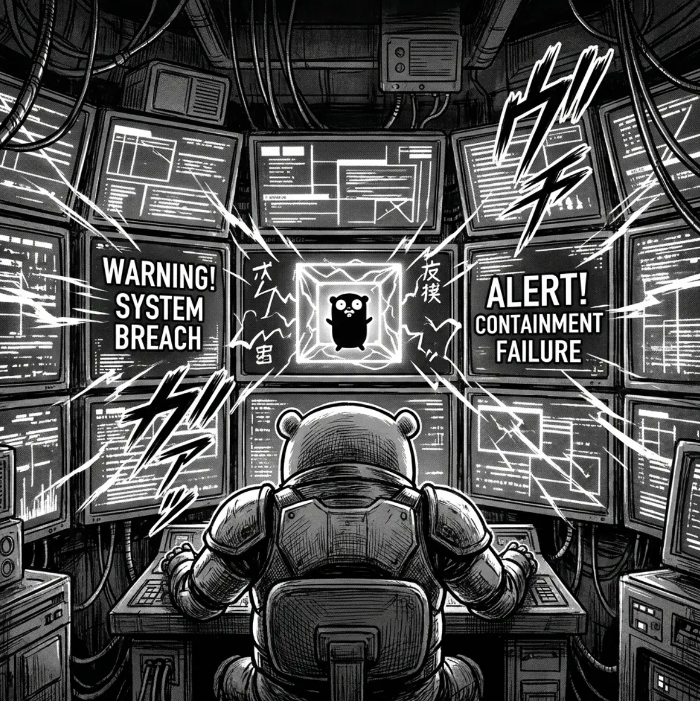

---
