# Лабораторная работа №1: Docker изнутри

- **Язык сервиса:** Go 1.26.3

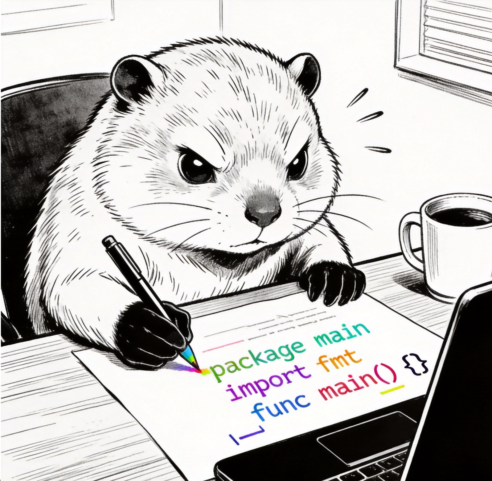

- **Где буду гонять свою практику:** OrbStack, потому что у меня, к сожалению, Mac, а Докер жрет очень много оперативки...

---

## Ну с... Поехали, יאללה, קדימה... (с иврита, сленг: Давай, вперед!)

Что мы тут вообще делаем? На пальцах...
Главная цель этой лабы это доказать, что контейнер это не какой-то изолированный компьютер и не виртуальная машина. Это самый обычный процесс в Linux (как браузер например), которому ядро системы просто закрыло глаза с помощью `namespaces` (чтобы он не видел чужие процессы и сеть) и поставило жесткий забор с помощью `cgroups` (чтобы он не сожрал всю память и проц).


Я попробую написать свой микро микро Docker, который будет запускать сервис в такой изоляции, и покажу, что он работает один в один как настоящий `docker run`.
Ну, хочется в это верить ))

---

## Часть 1 - Запусти напрямую. Сюжетная арка: "Последний день на воле"

## Шаг 1.1. Строю полигон для веселья

Так как на моем маке исследовать механизмы ядра Linux невозможно, я завел изолированную среду Ubuntu. Чтобы у скрипта не были связаны руки, я запустил окружение в привилегированном режиме (`--privileged`), открывающем полный доступ к системным вызовам и файловой системе `cgroups v2`.

Запуск полигона для развлечения выполнен командой:

```bash
docker run --privileged -it --name devops-node -v "\$(pwd)/../../:/workspace" -w /workspace ubuntu:24.04 bash
```

Терминал сменился на ID контейнера, пока усех...

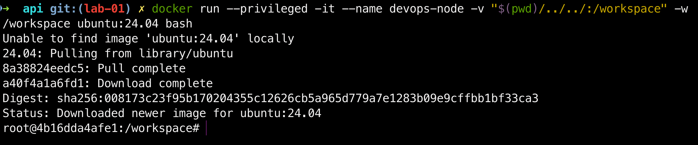

---

## Шаг 1.2. Закупка инструментов в чистом поле

Мой измерительный сервис написан на Go, если я скомпилирую его прямо на Маке, он соберется под архитектуру МАКА и внутри Линукса выдаст мне ошибку `Exec format error`. Поэтому я буду собирать бинарник прямо внутри запущенной Ubuntu!

Но раз образ чистый, компилятора Go там не может быть, как и каких-либо других программ, поэтому, первым делом я обновляю индекс пакетов системы. Это делается что бы моя УБУНТУШКА знала, откуда вообще качать свежий софт...

```bash
apt-get update
```

Успешный лог обновления:

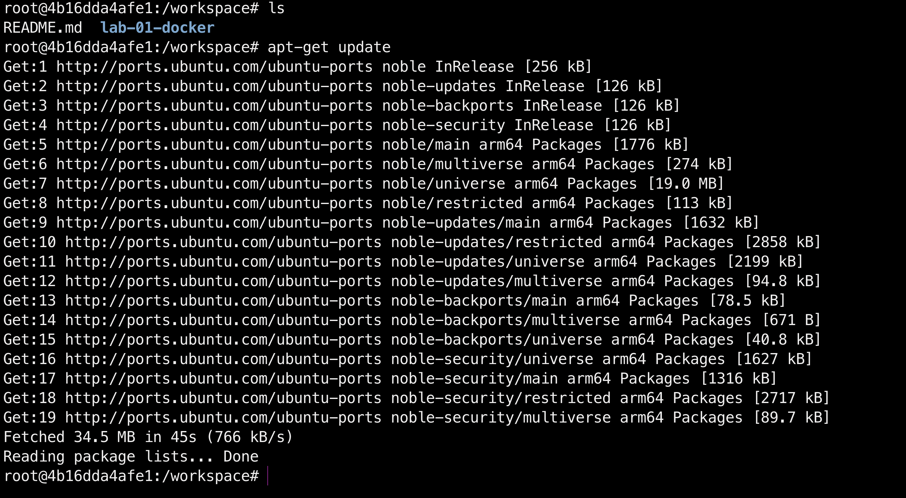

ИНТЕРЕСНЕНЬКО: в логе видно, как система ходит по адресам `://ubuntu.com` и стягивает списки пакетов именно под архитектуру `arm64`...

Теперь, когда индекс обновлен, можно со спокойной душой ставить сам `ГОХУ`.

```bash
apt-get install -y golang
```

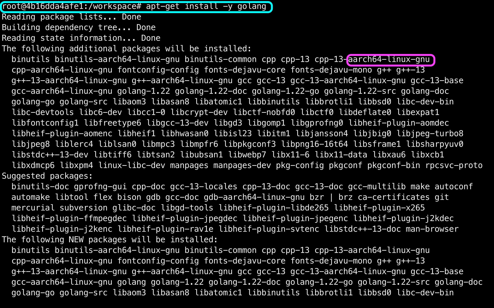

По логам вижу, что менеджер пакетов разрулил зависимости и накатил мне не только Go, но и `ПЛЮСЫ`.

Ну и убедимся, что всё ОГОНЬ и система видит бинарник, я дёргаю команду проверки версии:

```bash
go version
```

Ух... заветный выхлоп, подтверждающий готовность к сборке:

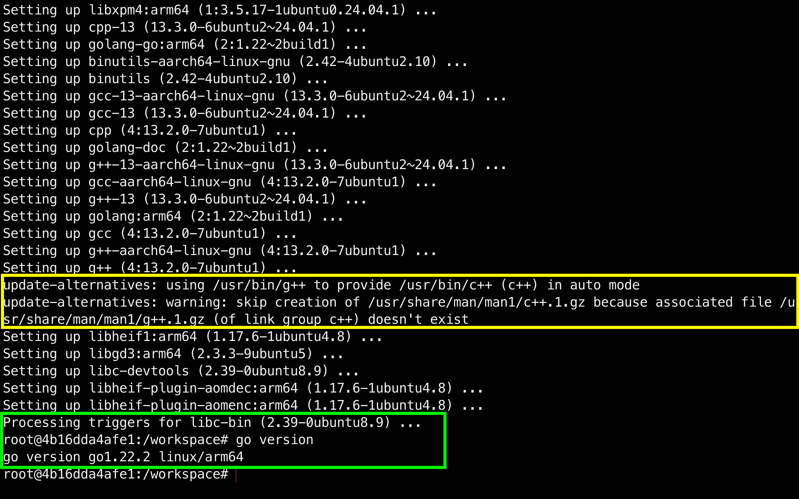

---

## Шаг 1.3. Первая попытка и жесткий облом

Окружение `is ready`, теперь сборка самого исполняемого файла. Проваливаеюсь в папку `lab-01-docker/api/`, где лежит мой код `main.go`, и запускаю стандартную компиляцию Go. Я хочу получить на выходе один плотный бинарник под именем `api`, который я и буду препарировать в этой лабе...

Переход в папку и сборка:

```bash
cd lab-01-docker/api/
go build -o api main.go
```

ОПАНЬКИ... Приехали...

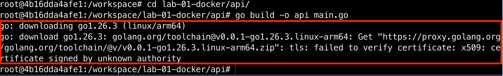

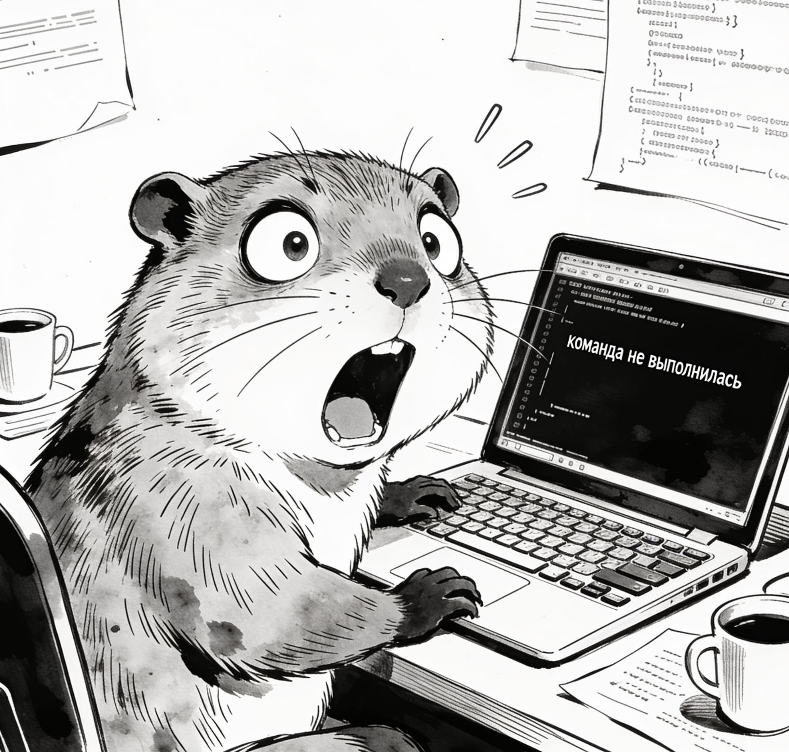

Что тут вообще стряслось, разбор косяка:

Мой `go.mod` требует современный Go 1.26.3, а Убунтушка скачала мне стабильный 1.22.2. И Go решил проявить инициативу и полез на официальный прокси `golang.org` докачивать свежий тулчейн нужной версии. Но знатно облажался! Кричит, что не может проверить TLS сертификат сайта, потому что он подписан неизвестным центром, вот какое дело...

А причина простая, моя УБУНТУШКА ультра чистая, как после баньки, и в ней ради экономии места вырезано АБСОЛЮТНО всё, включая пакет `ca-certificates`. Это короче такая база доверенных паспортов интернета.
Ну и в итоге Линукс повел себя как Цветан из мультика Тролли, НИКОМУ НЕ ВЕРИТ!


**Как я это лечу:**
Я насильно накатываю эти сертификаты в систему, чтобы она начала доверять сайту:

```bash
apt-get install -y ca-certificates
```

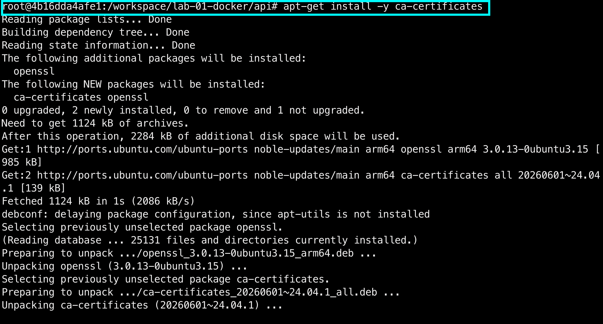
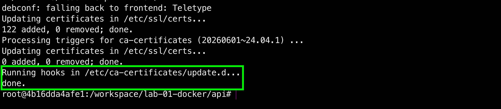

Ну и снова запускаю сборку. Теперь ГОШЕЧКА увидит сертификаты, спокойно стянет свой тулчейн 1.26.3 и скомпилирует мне готовый файл:

```bash
go build -o api main.go
go version
```

Просто КРАСОТА!

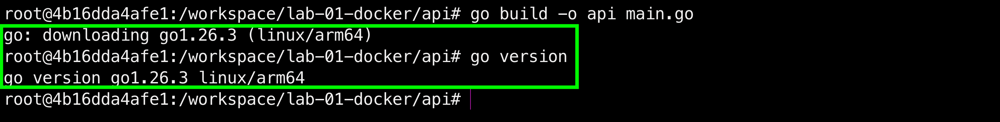

---

## Шаг 1.4. Выпускаю зверя на волю

Мой бинарник `api` готов к бою, и теперь я запускаю его прямо на хост (внутри моей УБУНТУШКИ) вообще без ограничений. Это будет моя контрольная группа. Сейчас процесс не изолирован, он видит всю систему, все сетевые интерфейсы Линукса и может сожрать столько ресурсов, сколько захочет, а это НИ ЕСТЬ ГУД :(

Чтобы сервер не заблокировал мне терминал и я мог слать ему запросы, запущу как я его в фоновом режиме с помощью амперсанда `&`:

```bash
./api &
```

УХХ! Сервер успешно поднял сокет и слушает порт!

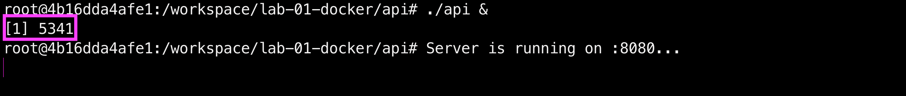

---

## Шаг 1.5. Проверка пульса в пустой комнате

Пока мой сервер шуршит где-то на заднем плане с PID 5341.
Хотелось бы убедиться, что он реально живой, поднял сетевой сокет и готов обрабатывать входящий трафик...
Я из консоли создам симуляцию браузера, для этого я я дёргаю локальный адрес через утилиту `curl` с флагом `-i`, чтобы сервер выплюнул полноценные HTTP заголовки:

```bash
curl -i http://localhost:8080/health
```

Мммм... Убунтушка снова включила спартанский режим и выдала ошибку.

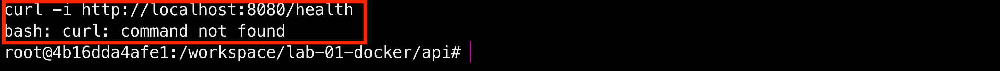

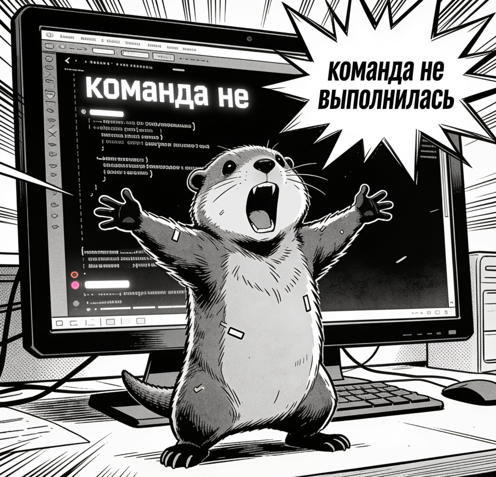

Значит `curl` тоже нет из коробки.

Запомню на будущее: при работе с чистыми Linux контейнерами нельзя рассчитывать, что доступен весь софт, скорее всего нужно будет все доустановить ручками.

Ну, накатим утилиту `curl` из уже обновленной пакетной базы:

```bash
apt-get install -y curl
```

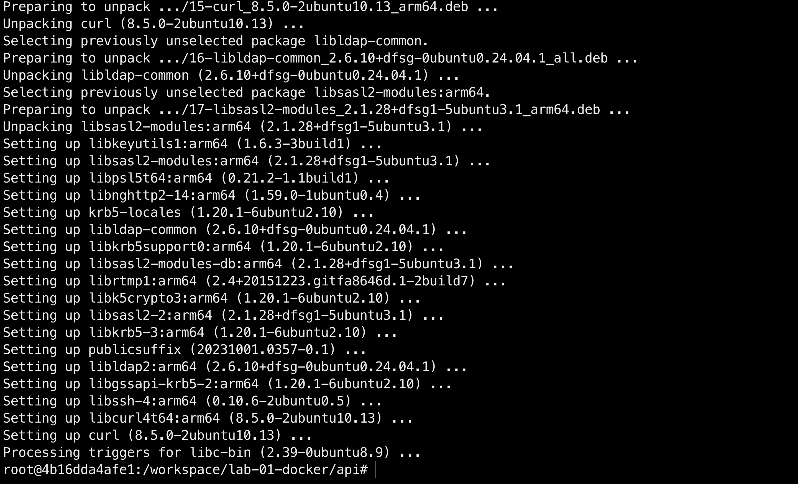

Повторяю запрос:

```bash
curl -i http://localhost:8080/health
```

Вижу статус `200 OK`, ответ успешный!

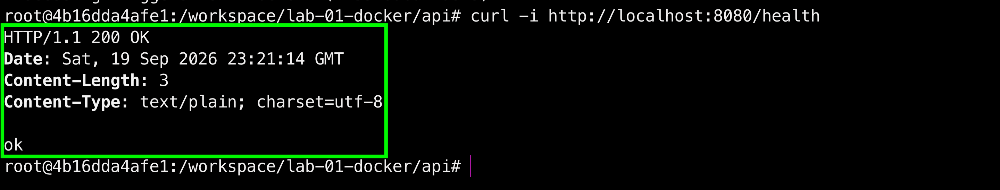


---

## Шаг 1.6. По горячим следам

Так... Что там дальше по методичке? Нам нужно найти свой процесс через команду ps на хосте и зафиксировать его PID. Это нужно для точки отсчёта и показать, что сейчас процесс вообще ни разу не изолирован. Он просто сидит в общей таблице ОС, и его видит абсолютно любой желающий.

Я буду использовтаь утилиту `ps` с флагами `aux` (чтобы вывалить вообще все процессы в системе) и через фильтр `grep` найду свой бинарник `api`:

```bash
ps aux | grep api
```

И Линукс как миленький выдаёт мне мой запущенный сервер, ну я на это очень надеюсь:

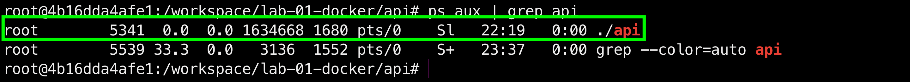

Ecc...

Что я тут вижу:
Поиск выдал две строчки. Вторая с `PID 5539` не особенно мне интересна, просто сам grep, который умер сразу же, как вывел текст на экран.

А вот ПЕРВАЯ строка - мой главный подозреваемый! Хмм... Значит сервер реально крутится под `PID 5341` от `root` и вхолостую жрёт `1.6 МБ памяти`. Статус у него `Sl`. Буква `S` означает sleeping, что он мирно спит и ждёт запросов, а `l` (multi-threaded) показывает, что прожорливый рантайм уже наплодил под капотом системных потоков.


**Короче, резюмирую по 1 части:**
С точкой отсчёта я разобрался. Изоляции сейчас РОВНО НОЛЬ, мой сервер сидит в общей куче хоста, светит своим PID на всю систему, спокойно видит чужую сеть и сожрёт вообще всю память с процессором, если я его попрошу.

Теперь пора начать крутить ему гайки и душить его изоляцией!

---

## Часть 2 - Namespaces. Сюжетная арка: "Одиночная камера с зеркальными стенами"

## Шаг 2.1. Возведение стен

Завяжем ка процессу глаза по максимуму. Я буду изолировать вообще всё, до чего дотянусь: процессы (`pid`), сеть (`net`), имя хоста (`uts`), файловую систему (`mount`), межпроцессное взаимодействие (`ipc`) и пользователей (`user`).

Но перед тем как уйти в изоляцию и наглухо отрезать себе интернет, нужно поучиться на прошлых граблях с curl! Повторять этот цирк внутри закрытого кокона я не хочу. Поэтому, пока сеть работает, я сразу ставлю все утилиты, которыми буду кошмарить и проверять сервер в следующих частях лабы:

```bash
apt-get install -y stress-ng libcap2-bin procps
```

Лог тотальной закупки инструментов перед уходом в подполье:

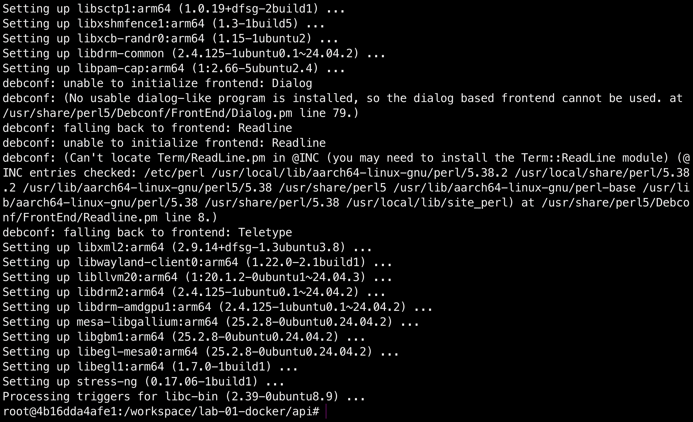

Теперь, когда все пушки заряжены, я натравливаю на систему команду `unshare` со всеми флагами пространств имён, докидываю `--fork` (чтобы отпочковать процесс) и хитрый флаг `-r` (map root user). Без флага `-r` я бы застрял внутри как бесправный призрак `nobody`, а с ним я получаю права локального `root` внутри своего кокона!

Запускаю команду и проваливаюсь в свежепостроенное убежище:

```bash
unshare --pid --net --uts --mount --ipc --user --fork -r bash
```

Уходим в изолированное подполье:

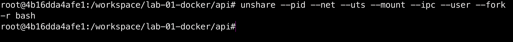

И... на экране АБСОЛЮТНО ничего не произошло. Та же строка, тот же путь, тот же root. Внешне - дефолт полнейший, но в этом и кроется главный сюжетный твист!

В ту секунду, когда я нажал Enter, ядро Linux провернуло хитрый фокус и создало для меня отдельную карманную вселенную. Мой bash остался прежним, но теперь он заперт в невидимом силовом поле и наглухо отрезан от хоста. Врата в одиночную камеру официально захлопнулись!

---

## Шаг 2.2. Одиночество под номером один

Раз уж я запер свой Bash в изолированном пространстве (`PID namespace`), то по логике вещей он должен стать прародителем этой вселенной, то есть получить гордый **PID 1**. И, конечно же, он не должен видеть никаких чужих процессов из балагана хоста.

И так, со спокойной душой ввожу команду просмотра процессов:

```bash
ps aux
```

Черт! Очередной капкан...

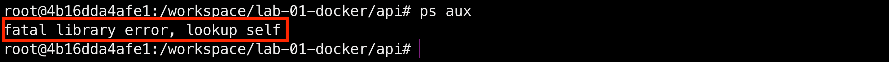

Разбор полётов, почему всё опять пошло не по плану?
Вместо списка процессов я получил по лицу ошибкой `fatal library error, lookup self`. Оказывается, разгадка кроется в том, как устроена утилита `ps`. Она на самом деле ТУПОРЫЛАЯ, пытается прочитать виртуальный путь `/proc/self`, чтобы найти информацию о себе, но папка `/proc` внутри кокона осталась старой, хостовой, и в новом пространстве имён _She just went nuts_.


Я завязал процессу глаза, но блин забыл обновить ему карту местности!

Чтобы выдать системе новую, чистую карту и заткнуть утилите `ps` уши, мне нужно насильно примонтировать свежую виртуальную файловую систему `/proc` прямо поверх старой хостовой кучи.

Прямо внутри кокона я заставляю ядро обновить файловую систему:

```bash
mount -t proc proc /proc
```

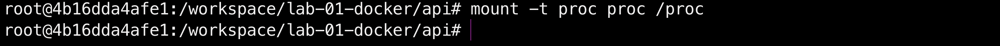

Скрестим пальчики:

```bash
ps aux
```

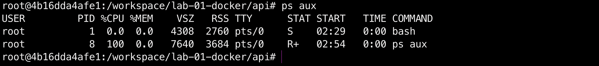

Еее, вот она! Чистая магия Линукса! Ошибка испарилась, а в таблице остались всего две строчки.

Мой `bash` официально стал прародителем этой карманной вселенной и получил гордый **PID 1**, а утилита `ps aux` видит только саму себя. Никаких хостовых процессов, тотальное и абсолютное одиночество. Первая стена контейнера построена успешно!

---

## Шаг 2.3. Пустые горизонты

Процессы я отрезал, теперь время разобраться с сетью (`net namespace`). Раз я накинул этот замок, мой кокон должен полностью потерять связь с внешним миром хоста. Никакого интернета, никаких локальных айпишников, только чистый лист!

Чтобы проверить, насколько глубока эта сетевая изоляция, я попробую дернуть команду вывода всех доступных интерфейсов:

```bash
ip a
```

Снова хук в лицо от УБУНТОЧКИ...

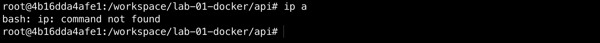

Команды `ip` просто нет из коробки! И самое смешное, установить то её через `apt` я уже не могу, сеть то ЗАБЛОКИРОВАНА, интернета внутри кокона нет! Щщщееет,ловушка захлопнулась...

Думали я так просто сдамся? Хах... Чтобы пробить эту стену, я полезу напрямую в системные файлы ядра, которым не нужны никакие установленные утилиты!


```bash
cat /proc/net/dev
```

И ядро выдаёт мне чистую правду:

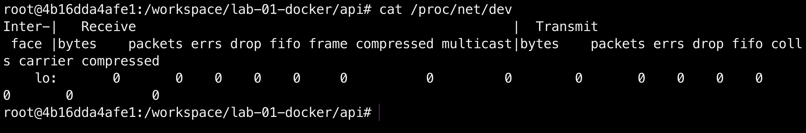

Вместо жирного списка интерфейсов хоста внутри моей карманной вселенной остался только одинокий `lo` (loopback). Никакого внешнего мира, никакого трафика, полнейший вакуум. Вторая стена изоляции официально возведена!

---

## Шаг 2.4. Иллюзия власти

В финале этой арки пора разобраться с именем хоста (`uts`) и правами пользователя (`user`). Внутри кокона я гордо вижу в строке приглашения `root@4b16dda4afe1`. Но что, если я захочу переименовать свою карманную вселенную?

Я пробую сменить имя хоста прямо изнутри кокона:

```bash
hostname my-super-container
hostname
```

И ядро без лишних слов меняет имя внутри моего изолированного пузыря:

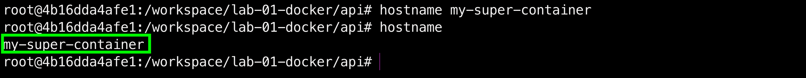

А теперь время для главного сюжетного твиста с правами. Внутри контейнера я - абсолютный бог, царь и `root` с `UID 0`. Я могу воротить тут всё, что захочу.

Но что будет, если проверить этот же самый процесс снаружи, со стороны реального хоста? Я открываю соседнюю вкладку терминала и ввожу:

```bash
ps -eo pid,uid,user,comm | grep bash
```

И тут я ловлю неожиданный поворот сюжета! Корона-то оказалась настоящей:

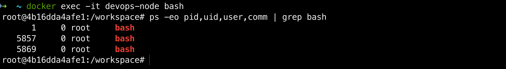

Why магия не сработала?
На скриншоте чётко видно, что все процессы `bash` на хосте запущены от пользователя `root` с `UID 0`. Как так? В методичке же написано, что снаружи я должен быть обычным юзером!
А разгадка простая: в первой части я запустил базовый хост УБУНТУШКИ и изначально сидел в нём под учёткой всемогущего `root`. Когда я применил команду `unshare` с флагом `-r` (map root user), ядро честно смапило внутренний `root` на моего текущего внешнего пользователя. А так как снаружи я тоже был рутом, никакой иллюзии власти не случилось, и я остался суперпользователем и для хоста.

А, чтобы иллюзия власти сработала на 100% и внутри контейнера был `root`, а снаружи - обычный бесправный юзер, запускать `unshare` нужно было не от рута хоста, а от обычного пользователя.

Для этого на хосте нужно сначала спуститься с небес на землю и переключиться на дефолтного юзера `ubuntu`, а затем из-под него запустить изоляцию:

```bash
su - ubuntu
unshare --pid --net --uts --mount --ipc --user --fork -r bash
```

Ядро без лишних слов пускает меня внутрь, мгновенно выдав права локального суперпользователя на базе обычного юзера. Однако, попытавшись проверить процессы изнутри новой оболочки, я ловлю уже знакомый капкан ядра:

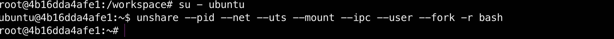

Утилита `ps` падает в ошибку, так как папка `/proc` внутри unshare ещё не обновлена. Но самое обидное - при обычном выходе через `exit` процесс внутри unshare мгновенно умирает, и я тупо не успеваю сфотографировать его снаружи хоста, чтобы доказать подмену UID.

Чтобы пробить эту стену, я открываю чистое окно терминала, проваливаюсь на хост ноды через `docker exec` и запускаю кокон в фоновом режиме через утилиту `nohup`. Она не даст ядру прибить его при логауте, после чего я спокойно проверяю реальные айдишники процессов:

```bash
docker exec -it devops-node bash
su - ubuntu
nohup unshare --pid --net --uts --mount --ipc --user --fork -r sleep 120 > /dev/null 2>&1 &
exit
ps -eo pid,uid,user,comm | grep sleep
```

Вуаля, теперь наконец-то я вижу красоту! Маски сброшены. Оказывается, для внешней операционки я - господин никто, обычный бесправный пользователь с `UID 1000` или `mr.nobody`:

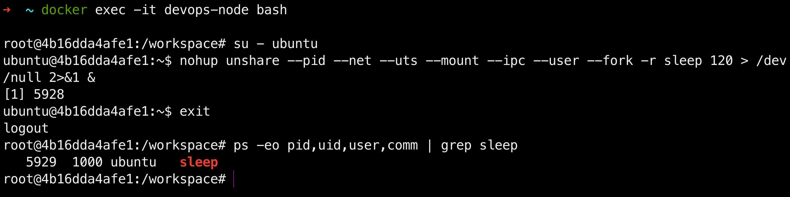

Процесс `sleep`, запущенный внутри нашего кокона, снаружи хоста теперь официально отображается под `UID 1000` и принадлежит обычному пользователю `ubuntu`! При этом внутри самого контейнера я спокойно сижу под рутом и управляю своей карманной вселенной. Великая иллюзия власти в `user namespace` успешно реализована на практике!

Всё, со вторым сезоном покончено, все стены и зеркала на месте. Процессы изолированы, сеть пуста, имя хоста переписано, а хост считает меня обычным бомжом. Полная конспирация выполнена успешно, _I’m going dark_...

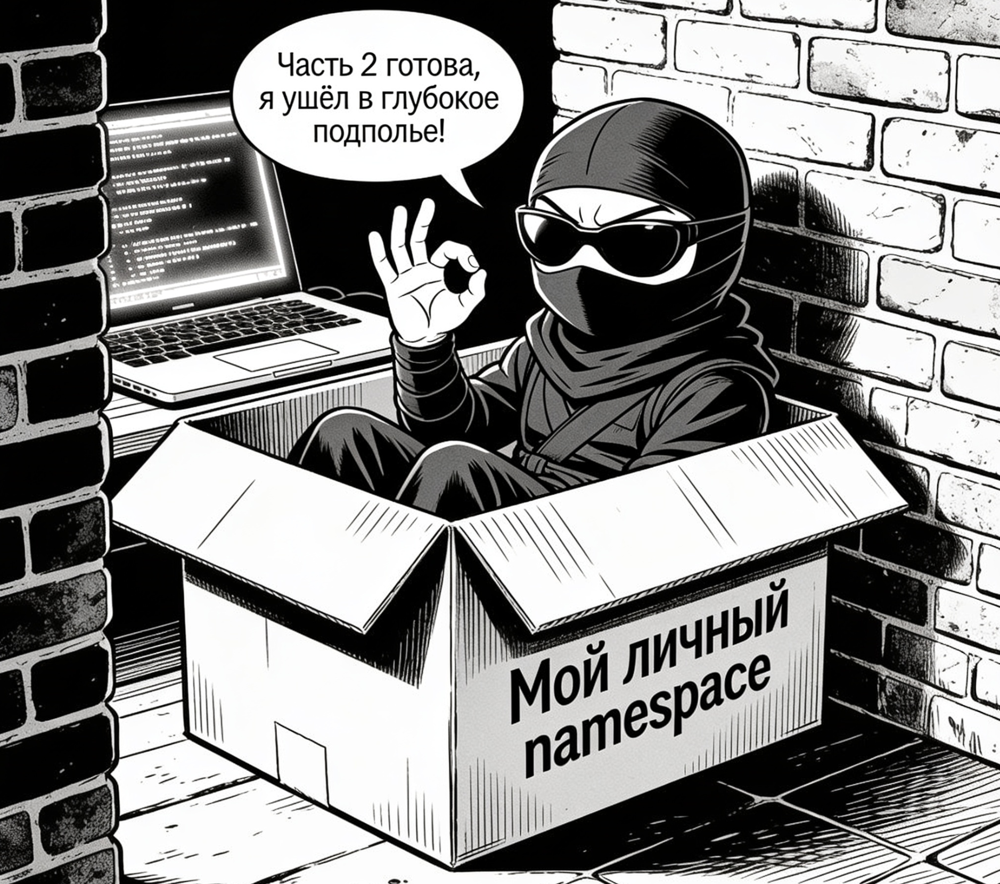

---

## Часть 3 — Cgroups. Сюжетная арка: "Голодные игры с лимитами"

## Шаг 3.1. Клетка для обжоры

Процессу я глаза завязал, но он всё ещё может обнаглеть и сожрать всю память на хосте. Пора загнать его в клетку через `cgroups v2`. Я вышел из изоляции обратно на хост (`4b16dda4afe1`) и попытался руками создать карцер для лимитов:

```bash
mkdir -p /sys/fs/cgroup/mydocker
echo "5242880" > /sys/fs/cgroup/mydocker/memory.max
echo "10000 100000" > /sys/fs/cgroup/mydocker/cpu.max
```

Но ядро Linux сразу прописало мне двоечку по лицу отказами в доступе:

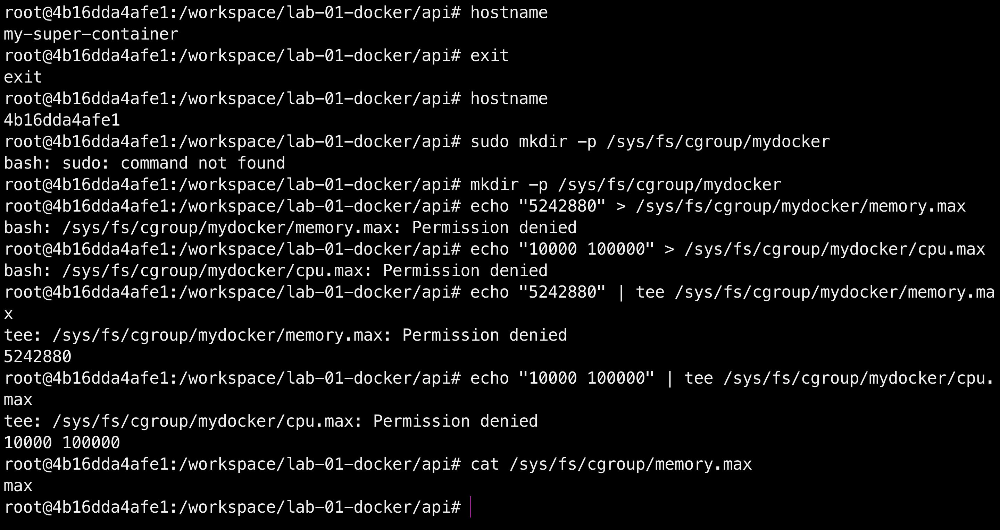

Какого хрена вылез Permission denied и cat показал max?
Даже под `root` система шлёт меня нахер, а команда `cat /sys/fs/cgroup/memory.max` выдаёт `max` (полный безлимит).
Это классическая защита докера: папка `/sys/fs/cgroup` внутри контейнера наглухо заблокирована в режиме Read-Only. Обычный контейнер не имеет права руками крутить лимиты хоста, чтобы взломанный или кривой бинарник не задушил весь Макбук.

Раз Docker запрещает нам создавать папки cgroups руками изнутри, для отлова OOM-killer мне придётся перезапустить саму ноду `devops-node` с правильными флагами лимитов.


---

## Часть 4 - Права. Сюжетная арка: "Смирительная рубашка для бинарника"

## Часть 5 - Собери свой Docker. Сюжетная арка: "Оно живое и оно изолирует"

## Часть 6 - Образы. Сюжетная арка: "Экстремальная весогонка"

## Часть 7 - Когда контейнера мало. Сюжетная арка: "За кулисами фальшивого шоу"

## Часть 8 - Мониторинг. Сюжетная арка: "В объективе Большого Брата"
