# Хроники Гофера. Сезон 2: Мониторинг сервиса в Kubernetes (Метрики, Логи, Трейсы, Алерты)

- **Язык сервиса:** Go 1.26.3
- **Стенд:** Встроенный Kubernetes-кластер OrbStack
- **Инструменты развертывания:** Helm v4

---

## Введение и цель работы. Сюжетная арка: Жизнь за стеклом

Что тут вообще происходит? На пальцах...

В первом сезоне я запирал Гофера в цифровую клетку суровыми механизмами ядра Linux (`namespaces`, `cgroups`). В этом всё развернется на 180 градусов! Мой подопытный суслик пошёл на повышение и переехал в облако, в кластер `Kubernetes`. Разворачивать всё буду через `Helm`.


Только на новом месте за ним нужен глаз да глаз. Поэтому я разверну полноценную инфраструктуру наблюдаемости и докажу, что могу просветить Гофера рентгеном на всех уровнях:

1. Метрики `Prometheus + Grafana` - чтобы замерить пульс системы, видеть общее здоровье, объемы трафика и скорость работы моего суслика.
2. `Логи Loki + Grafana Alloy` - чтобы читать личный дневник приложения в структурированном JSON-формате и понимать, что конкретно пошло не так в данную секунду.
3. Трассировка `OpenTelemetry + Jaeger` - чтобы просветить кости каждого входящего запроса рентгеном и увидеть, в какой именно функции кода Гофер решил прикорнуть на пару секунд.
4. Оповещения `Alertmanager + Karma` - чтобы у меня в бункере орала ядерная сирена и сообщала о критических авариях до того, как о них узнает разъяренный пользователь.

Короче, не просто навалить в кластер гору софта, а спаять всё в один рабочий комбайн. Чтобы по строчке из лога в `Grafana` можно было в один клик провалиться в нужный трейс в `Jaeger`. Полная конспирация отменяется, шоу `За стеклом` официально объявляется открытым!

---

## Часть 0 - Создание подопытного сервиса на Go. Сюжетная арка: Прошивка для киборга

Перед отправкой под купол Kubernetes я превратил Гофера в идеального киборга для опытов. Обычный сервис на Go нем как рыба, поэтому я снабдил его специальными ручками, чтобы дистанционно устраивать ему пытки и проверять системы слежения:

- `GET /health` - проверка пульса. Показывает Kubernetes, что поды живы.
- `GET /fail` - выстрел в колено. Генерирует 500 ошибки для проверки алертов.
- `GET /slow` - сонная лощина. Засыпает на 1–3 секунды, имитируя дикую задержку (Latency).
- `GET /load` - режим берсерка. Спамит запросами сам в себя, взвинчивая RPS до небес.

Чтобы фиксировать эти мучения, я зашил в рантайм три шпионских чипа:

1. `Клиент Prometheus (/metrics)` - переводит каждое действие в сухие цифры RED-метрик.
2. `Пакет slog` - выдает жесткий JSON-лог, вживляя в каждую строчку уникальный паспорт (`trace_id`).
3. `SDK OpenTelemetry` - распределенная нервная система, шьющая OTLP-трейсы прямо наружу.

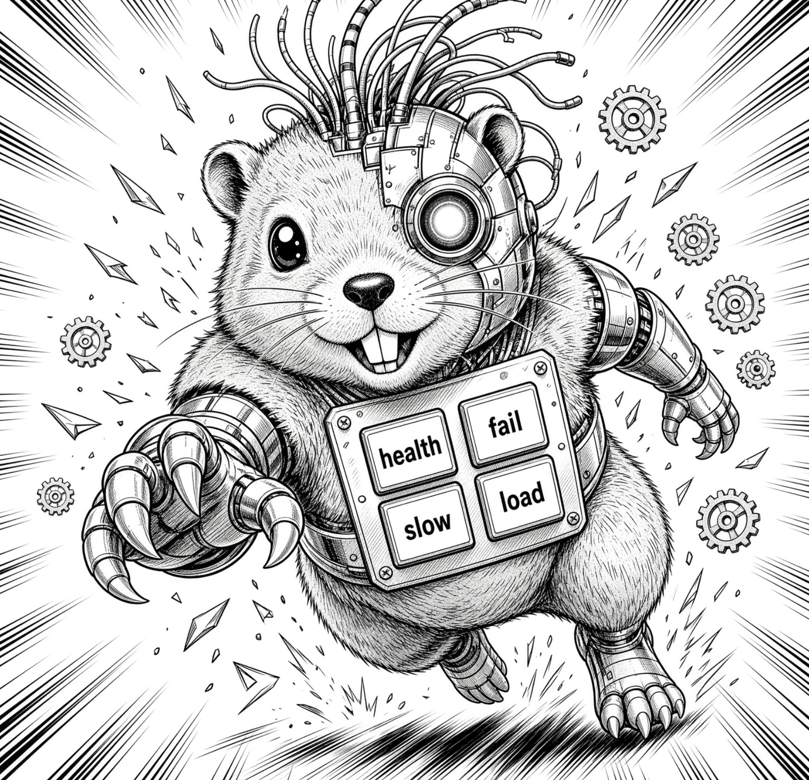

---

## Часть 1 - Метрики (Prometheus + Grafana). Сюжетная арка: Палата №6

### Шаг 1.1. Замер пульса

Сначала проверяю, что я вообще там, где думаю. А то вдруг это старый `kind-кластер` из прошлой лабы, а не мой любимый OrbStack.

Дёргаю две команды:

```bash
kubectl cluster-info
kubectl config current-context
```

Первая говорит: мозги кластера на месте, DNS крутится. Вторая: да, это OrbStack, никуда не уехали

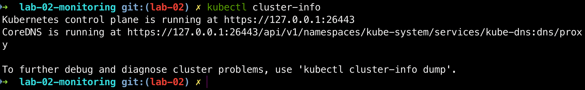

Теперь тащу нужные репозитории: `prometheus-community` и `grafana`. Потом `helm` `repo update`, чтобы список чартов был свежий, как хлеб из печки.

Дальше отвожу мониторингу отдельный закуток - `namespace monitoring`. Чтобы поды `Prometheus` и `Grafana` не толкались локтями с рабочими сервисами. `kubectl create namespace monitoring`.

И финальный босс одной командой:

```bash
helm install kube-prom prometheus-community/kube-prometheus-stack -n monitoring
```

Этот чарт как комбо в файтинге: сразу `Prometheus`, `Grafana`, `Alertmanager`, `kube-state-metrics`, `node-exporter` и целый выводок `CRD`. Руками такое собирать просто мазохизм...

Первые секунды поды вялые, образы качаются, init-контейнеры копошатся. Дам им минутку.

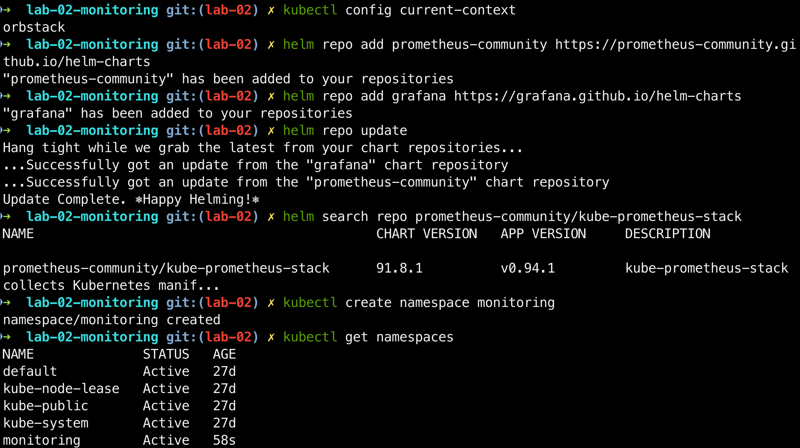
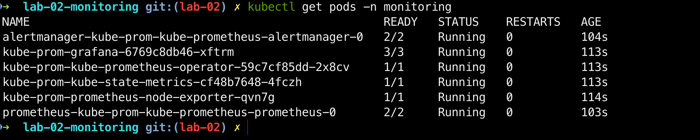
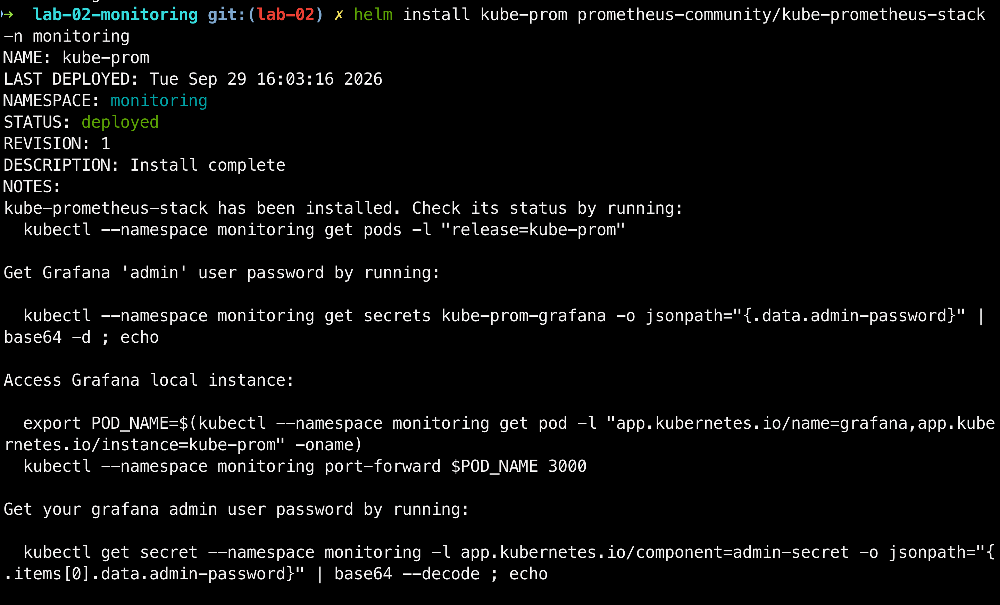


---

### Шаг 1.2. Цепляем датчики

Гофер лежит в палате, но врачи его не видят. Пора прицепить аппаратуру.

Первая бумажка это сам пациент. Две копии Гофера, чтобы если один загнётся, второй доработал смену. Плюс вахтёрша на входе, раскидывает посетителей между копиями, чтобы никто не толкался в одну дверь.

Вторая бумажка это направление на слежку. Кладу рядом с подопечным и пишу: `этот наш, следи за ним, снимай показания каждые 5 секунд`. Без одной волшебной печати бумажка для системы просто фантик.

Кидаю обе в регистратуру:

```bash
kubectl apply -f deploy/api.yaml
kubectl apply -f deploy/service-monitor.yaml
```

Проверяю, как пациент:

```bash
kubectl get pods -n monitoring -l app=api-server
```

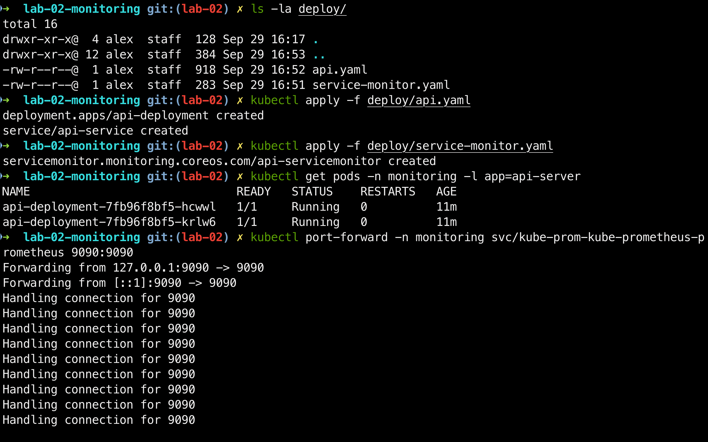

Обе копии дышат, обе в строю.

Теперь открываю окно в ординаторскую:

```bash
kubectl port-forward -n monitoring svc/kube-prom-kube-prometheus-prometheus 9090:9090
```

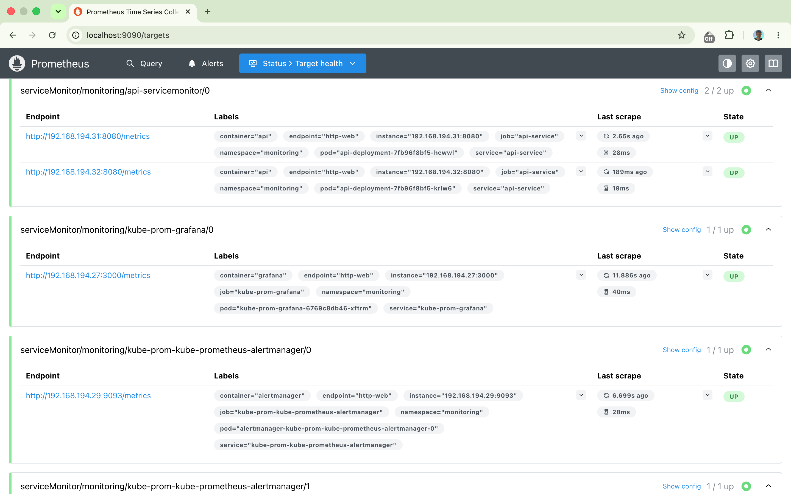

И вижу, доктор Prometheus уже прицепил обоим по датчику. Оба зелёные, оба на связи. Пациент под наблюдением...

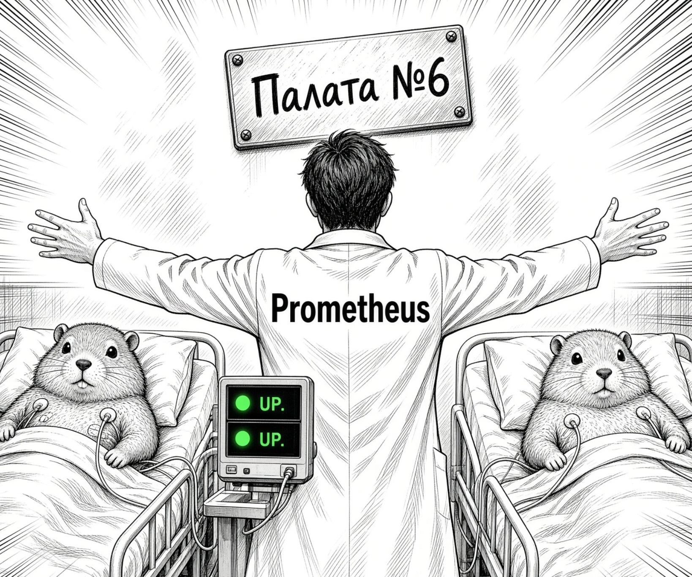

---

### Шаг 1.3. Выводим кардиограмму

Пациент весь в датчиках, но врачи пока ничего не видят. Данные капают в `Prometheus`, а толку ноль. Пора вывести всё на мониторы в ординаторской.

Захожу в `Grafana`. Она уже подцеплена к `Prometheus` как источник, это сделал сам чарт при установке. Намёк понял, работаем...

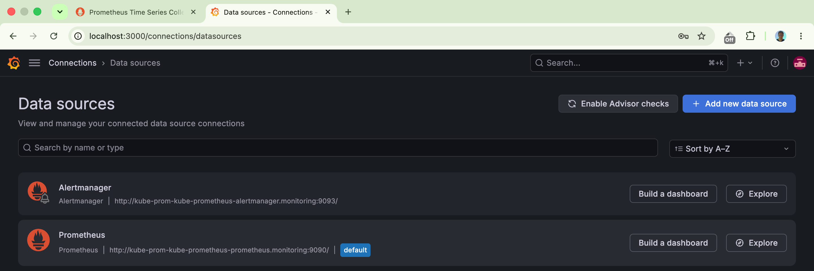

Вытаскиваю пароль админа из секретов, пробрасываю порт 3000 наружу и открываю чистый лист. Дальше вешаю на него три прибора. `Классика RED`.

Первый прибор. `Пульс`.
Считает, сколько запросов прилетает в секунду. Если линия ровная, пациент дышит спокойно. Если шарашит вверх, значит, кто-то его дёргает без остановки.

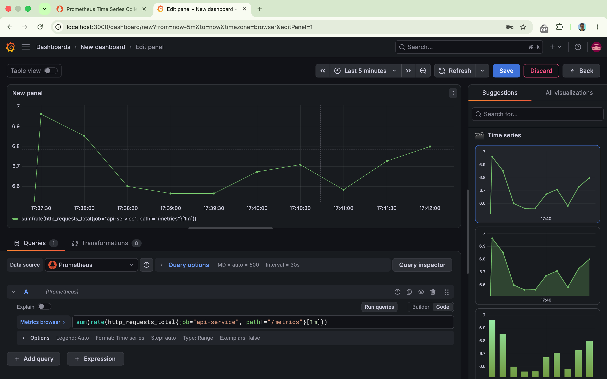

Второй прибор. `Осложнения`.
Показывает долю пятисотых ошибок от всех запросов. Другими словами, сколько раз пациент не справился и выдал брак. На скрине как раз видно, как я его разогнал до `32 процентов`.

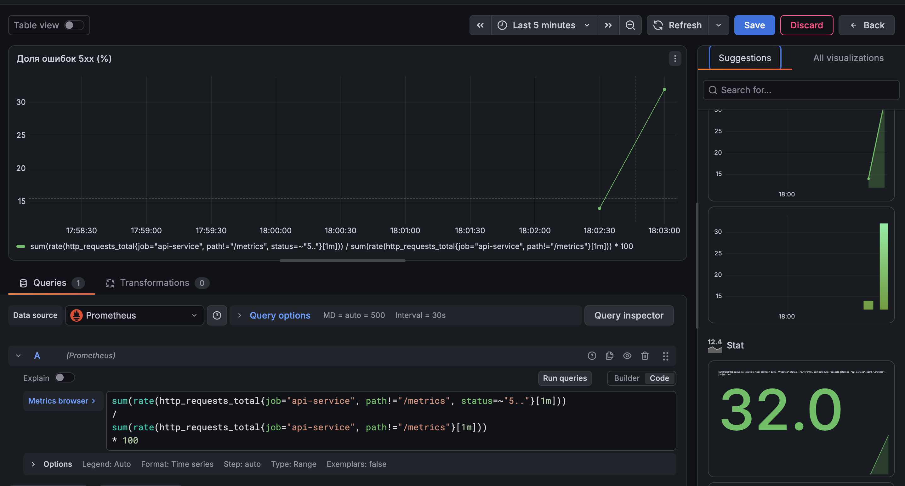

Дополнительно заглянул в сырые показания, чтобы убедиться, что счётчик реально тикает. Дёрнул метрики и увидел, что счётчик по ручке `/fail` уже накрутил `297 вызовов`:

```bash
curl -s http://localhost:8090/metrics | grep fail
```

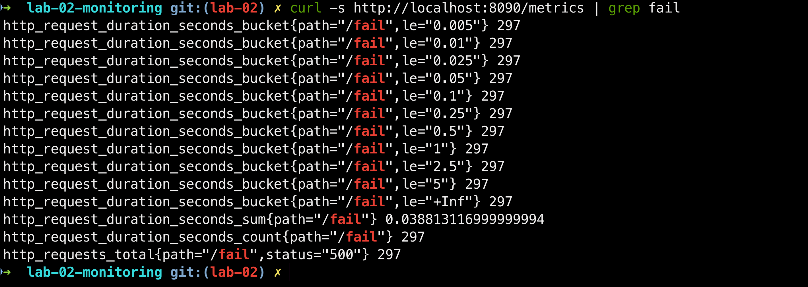

Третий прибор. `Скорость реакции`.
Тут хитрее. Это `p95`, то есть время, за которое отвечает 95 процентов всех обращений. Единичные тормоза отсекаются, берётся общая картина. Если пациент начинает тупить, линия ползёт вверх.

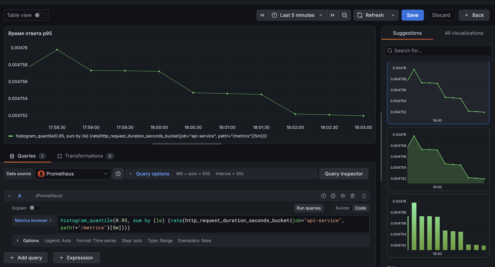

Все три прибора висят на одном мониторе. Пока я дёргал только быстрые ручки, p95 держался где-то в районе `4.7 миллисекунды`. То есть пациент даже не вспотел :)

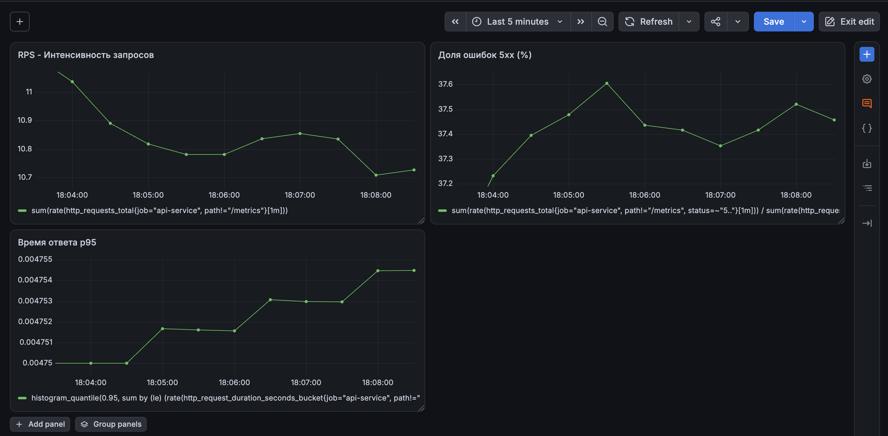


---

### Шаг 1.4. Ставим капельницу

Пациент лежит под мониторами, но пока дышит ровно. Скучно. Пора вкатить ему дозу и посмотреть, как задёргается.

Накрутил три разных препарата и по очереди вкатываю.

Доза первая. Лёгкая встряска через `/load`.
Гоняю запросы каждые `0.1 секунды`. Пульс на мониторе тут же выпрямился в полку на 10-11 ударах в секунду. Пациент бодрый, дышит ровно, ничего не предвещает беды.

Доза вторая. Отрава через `/fail`.
Параллельно спамлю ручку /fail каждые 0.2 секунды. График осложнений резко скакнул и залип на 37 процентах. Успешные запросы от первой дозы слегка разбавили картину, иначе было бы ещё жёстче.

Доза третья. Замедлитель через `/slow`.
Первые два шприца выдернул, пустил трафик на /slow раз в секунду. Тут самое интересное. Монитор времени реакции не дёрнулся сразу, потому что формула смотрит на пятиминутное окно. Но постепенно быстрые запросы вытеснились медленными, и линия поползла вверх. `С 4 миллисекунд до 4 секунд`. Пациент знатно затупил.

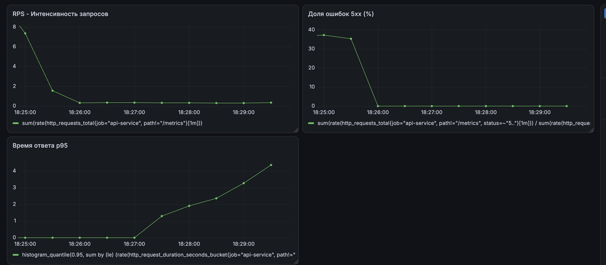

**Итог сеанса.** Все три прибора отработали чётко: сервис выдал метрики, Prometheus их проглотил, Grafana нарисовала. Первая палата официально закрыта.


---

## Часть 2 - Логи (Loki + Grafana). Сюжетная арка: "Карта пациента"

### Шаг 2.1. Заводим картотеку

`Loki` это архив для медкарт. Сам он за бумажками не бегает, только принимает и складывает на полку. Поэтому сначала я поставил именно архив.

Развернул в monitoring. Настройки вынес в отдельный файлик `deploy/values/loki.yaml`.

И тут же встрял. Первая попытка упала. Шкаф принесли, а полку под него не выделили, вот он и обиделся. Подшаманил, добавил полку. Снёс старый, поставил заново:

```bash
helm install loki grafana/loki -n monitoring -f deploy/values/loki.yaml
```

STATUS: deployed. Проверяю, кто въехал:

```bash
kubectl get pods -n monitoring -l app.kubernetes.io/name=loki
```

Три шкафа стоят, все дышат. Картотека готова, полки пустые, ждём первых пациентов.

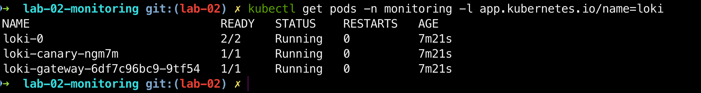


---

### Шаг 2.2. Утренний обход

Отправляю медсестру `Grafana Alloy` в обход. Ставлю её так, чтобы по одной сестре висело на каждой ноде. Больше не надо, меньше тоже.

Все настройки вынес в `deploy/values/alloy.yaml`. Сестре выдал пропуск, чтобы читала карты у наших подов.

Ставлю её на смену:

```bash
helm install alloy grafana/alloy -n monitoring -f deploy/values/alloy.yaml
```

Проверяю, что заступила:

```bash
kubectl get pods -n monitoring -l app.kubernetes.io/name=alloy
```

Сначала была `ContainerCreating`, потом перешла в `2/2 Running`. Рестартов нет.

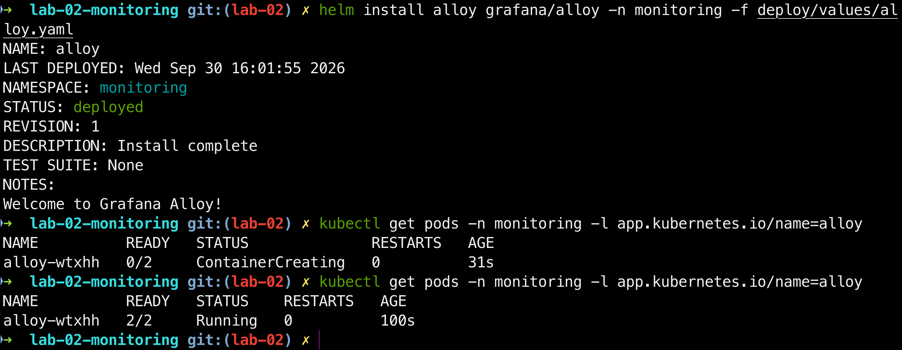

Теперь смотрю, дошла ли она до наших палат:

```bash
kubectl logs -n monitoring -l app.kubernetes.io/name=alloy --tail=-1 | grep -E "Alloy is running|tailer running|opened log stream"
```

В логах видно: заступила, нашла оба пода моего сервиса, открыла по каждому поток чтения. Ни одной ошибки.

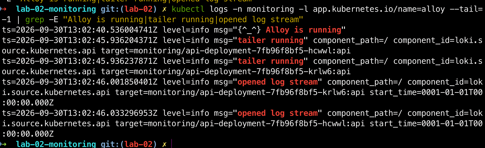

Сестра на месте, обход делает, карты собирает. Красотка, что сказать...


---

### Шаг 2.3. Читаем историю болезни

Метрики вижу, а что пациент при этом писал в дневник, нет. Пора открыть его записи в том же окне.

Подключаю `Loki` к `Grafana` как второй источник. Прописал адрес из прошлого шага и жму проверить. Графиня зелёным мигнула, связь есть.

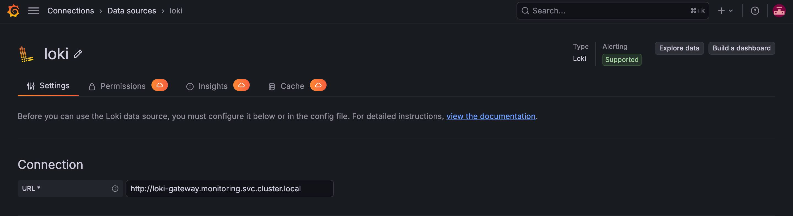

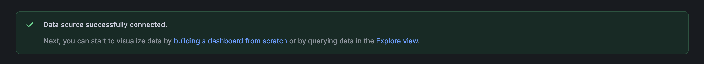

Дальше открываю `Explore` и ищу записи по нашим палатам. И тишина. `No logs found`. Почесал затылок. Оказалось, пациент пишет дневник только когда к нему кто-то заходит. А с Части 1 в палате глухо, никто не заглядывал.

Разбудил его, дёрнул ручку `/fail` двадцать раз. Дневник сразу ожил. Синие записи info, красные error, всего 63 строчки.

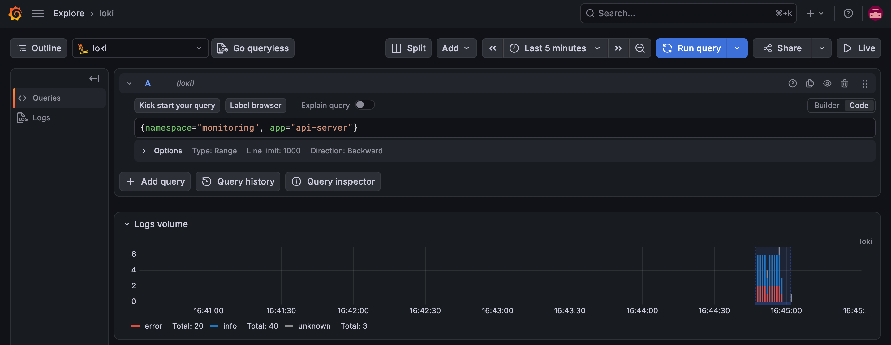

В записях вижу ошибку и `trace_id`.

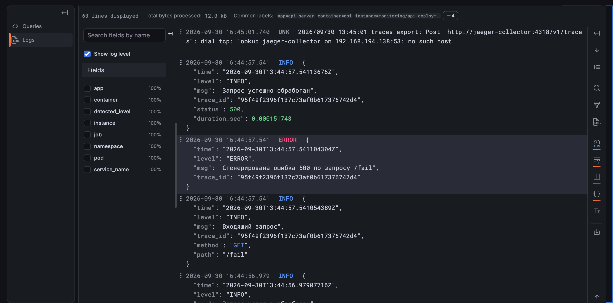

Теперь графики и записи лежат в одном окне. Удобно, ничего искать не надо...


---

## Часть 3 - Трейсы (OpenTelemetry + Jaeger). Сюжетная арка: Рентген-кабинет

### Шаг 3.1. Подготовка кабинета к приему

Аппаратом у меня будет `Jaeger`. Ставлю его в режиме `all-in-one`, то есть один под на всё: сам снимает, сам хранит, сам показывает. Для домашнего кабинета самое то.

Цепляю репозиторий и ставлю:

```bash
helm repo add jaegertracing https://jaegertracing.github.io/helm-charts
helm repo update
helm install jaeger jaegertracing/jaeger -n monitoring -f deploy/values/jaeger.yaml
```

Проверяю, заехал ли аппарат в кабинет:

```bash
kubectl get pods -n monitoring -l app.kubernetes.io/name=jaeger
```

Стоит, дышит. `1/1 Running`.

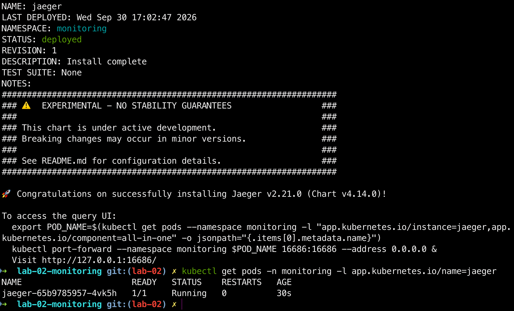

Смотрю, какие двери у него открыты для приёма пациентов:

```bash
kubectl get svc -n monitoring | grep -i jaeger
```

Всё на месте. Осталась мелочь: направить моего Гофера на этот аппарат. В манифесте раньше был прописан левый адрес, поэтому рентген молчал и снимков не делал. Поменял на верный, применил заново:

```bash
kubectl apply -f deploy/api.yaml
```

Под пересоздался, в файле теперь правильный адрес.

```bash
grep -nE "OTEL|jaeger|4318" deploy/api.yaml
```

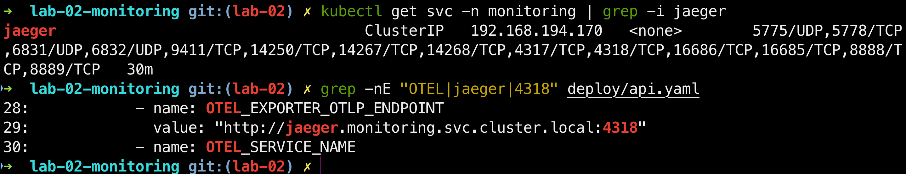

Аппарат стоит, свет горит, всё готово. Ждём первого пациента.

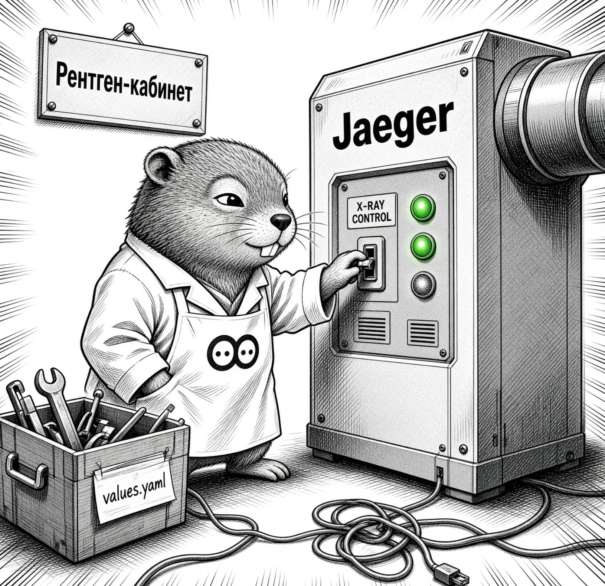

---

### Шаг 3.2. Принимаем пациента

Сначала пациент ко мне вообще не доехал. Проброс порта отвалился после перезапуска подов, и мои запросы уходили в никуда. Перезапустил проброс, дёрнул `/health` для проверки. В логах сразу появилась свежая строчка, а в `Jaeger` вылез мой сервис. Ну наконец-то, пациент на кушетке.

Прогнал его по трём ручкам, чтобы было что смотреть:

```bash
for i in $(seq 1 3); do curl -s -o /dev/null http://localhost:8090/slow; done
for i in $(seq 1 3); do curl -s -o /dev/null http://localhost:8090/fail; done
```

Выбрал своего Гофера в списке, интервал в час, жму искать. Аппарат выдал семь снимков.

Сразу видно:
Три медленных, `/slow`. Висели по три, три и две секунды. Крепкие ребята, но тормозные.
Три быстрых с ошибкой, `/fail`. Красная метка в колонке ошибок, не спрячешь.
И один обычный, `/health`. Мама, я живой!

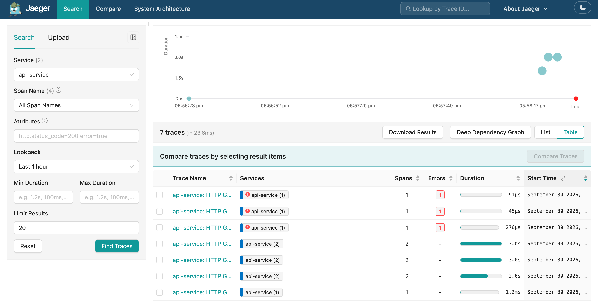

Открыл медленный снимок. Снаружи запрос висел три секунды, и почти всё это время сожрал один вложенный кусок. Значит, тормоз сидит конкретно в этой операции, а не размазан по пути. Вот тут и болит.

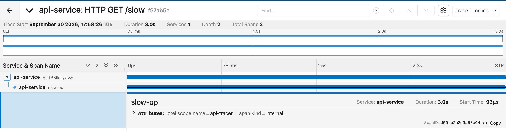

Открыл снимок с ошибкой. Слева от запроса красная метка. Раскрыл подробности и вижу прямо в лоб: статус `ERROR`, причина искусственный сбой. Это тот самый выстрел в колено, который я сам и прописал. Аппарат всё зафиксировал, ничего не утаил.

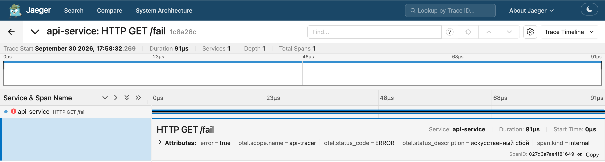

Снимки чёткие. Каждый шаг виден как на ладони...


### Шаг 3.3. Сшиваем всё

Хочу, чтобы из дневника сразу открывался нужный снимок. Читаю строчку, тык, и уже смотрю рентген. Никаких поисков руками.

В настройках `Loki` добавил специальное поле. Оно вытаскивает из записи метку и делает её кликабельной.

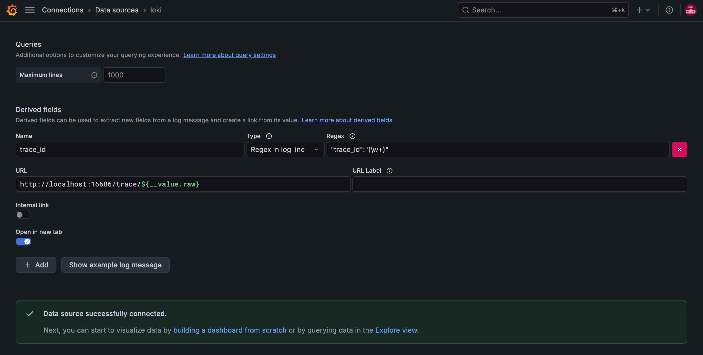

Сохранил, проверил. Графиня мигнула, связь есть.

Теперь открываю записи. В каждой строчке торчит эта метка, и она уже не серый текст, а самая настоящая ссылка.

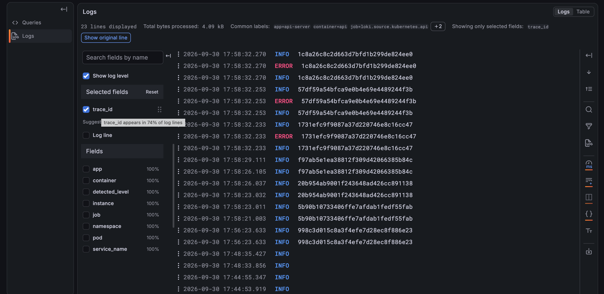

Тыкнул на неё из строки с ошибкой. Открылась новая вкладка, а в ней тот самый снимок с красной меткой и той же ошибкой внутри. Ничего не потерялось, всё сошлось.

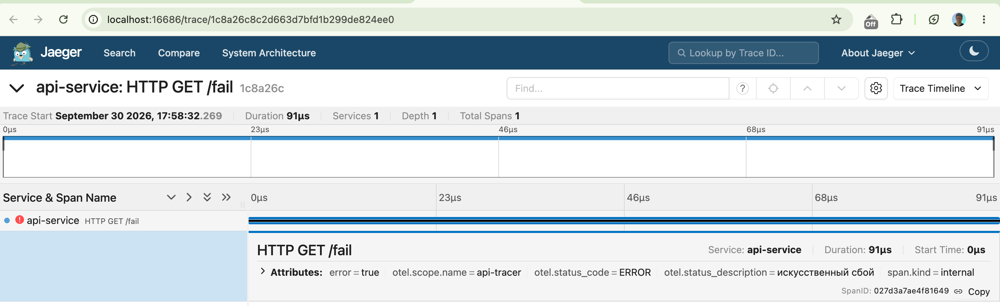

Вот теперь всё работает как надо.

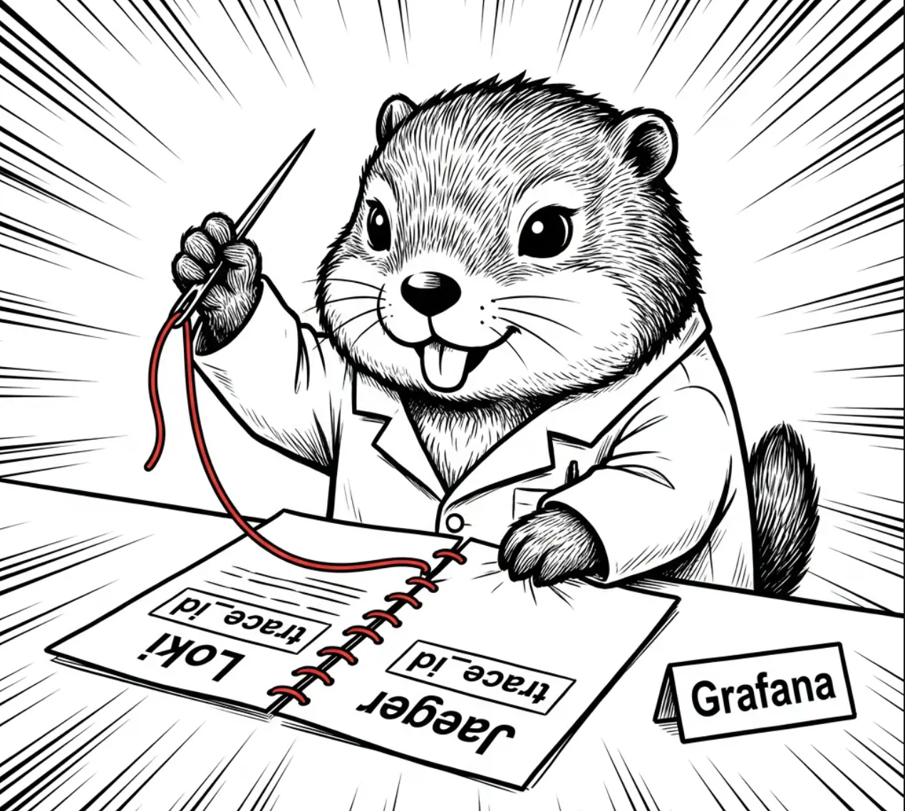

---

## Часть 4 - Алерты (Alertmanager + Karma). Сюжетная арка: Ночное дежурство

### Шаг 4.1. Инструктаж

Смотреть на всё это глазами уже надоело. Глаза имеют свойство отвлекаться на кофе и обед. Пора научить систему орать самой!

Сажусь писать инструкции для ночного дежурного. Мол, если пациент делает вот так, бей тревогу. Пишу три штуки в файлик `deploy/prometheus-rules.yaml`.

**Первая.** Слишком много ошибок. Если каждый двадцатый запрос уходит с браком, это уже не случайность, а стабильный косяк. Тревога!

**Вторая.** Слишком медленно. Если 95 процентов пользователей ждут ответа дольше секунды, пациент тупит. Тоже тревога, даже если ошибок нет.

**Третья.** Совсем не отвечает. Тут уже клиническая смерть, звони всем сразу.

Дописал к каждой инструкции, что дежурному делать. Куда бежать, где смотреть, чем чинить.

Раздаю смене:

```bash
kubectl apply -f deploy/prometheus-rules.yaml
```

Оператор всё принял и разложил по полочкам. Открываю `Prometheus`, проверяю... Все три инструкции на месте, все три в статусе OK. Пока тихо.

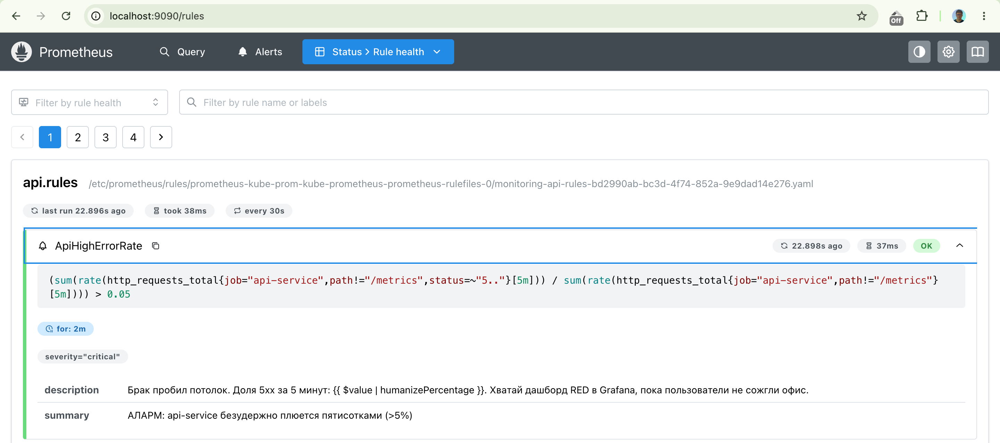

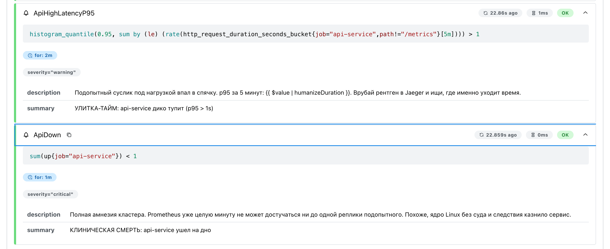

Инструкции написаны, разложены, дежурный в курсе.


---

### Шаг 4.2. Звонок в регистратуру

Инструкции у дежурного есть, но `Prometheus` сам никому не звонит. Он только замечает проблему. А звонить и поднимать смену должен `Alertmanager`. Он уже стоит с самого начала, но с дефолтным конфигом все тревоги улетают в пустоту.

Чиню! Надо: `приёмник`, `маршрут` и `группировка`, чтобы дежурного не забомбили двадцатью звонками подряд.

Первым делом поднимаю приёмник. Маленький сервис `webhook-echo`, он просто принимает звонки и пишет в журнал. Туда и будут лететь все тревоги.

Дальше пишу правила маршрутизации в `deploy/values/alertmanager.yaml`.

Тут важная бумажка `configSecret`. Без неё оператор не знает, откуда брать мой конфиг, и генерит свой. Поэтому сначала прописал её.

Получателей два. Первый `webhook-receiver`, туда летят настоящие тревоги. Второй `"null"`, в него уводим пустышку `Watchdog`, чтобы не спамил.

Критические тревоги обрабатываются быстрее, `group_wait: 10s`. Если у пациента клиническая смерть, ждать полчаса нельзя.

Поймал две грабли. Забыл про `configSecret`, оператор молча генерил свой конфиг. И слово null в YAML зарезервированное, без кавычек всё падает.

Применил. Два `helm upgrade` подряд, потом перезапуск `Alertmanager`.

```bash
kubectl rollout restart statefulset -n monitoring alertmanager-kube-prom-kube-prometheus-alertmanager
```

Захожу в его UI, проверяю. Всё на месте: маршрут ведёт в `webhook-receiver`, критические отдельно, Watchdog отдельно.

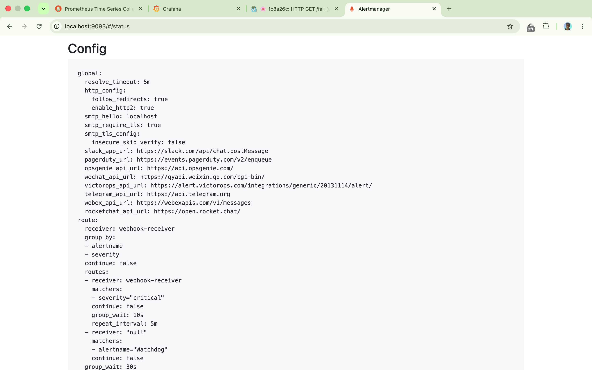

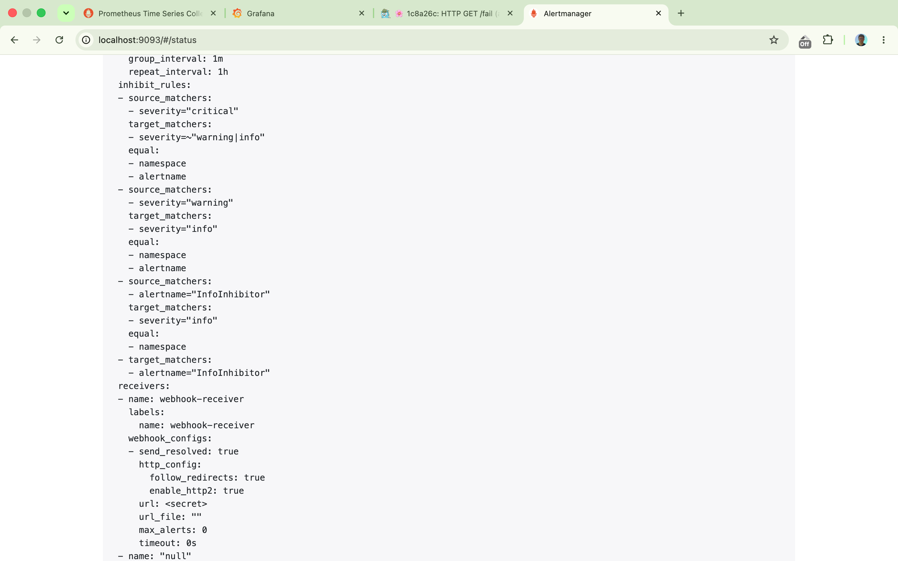

Адрес приёмника в UI спрятан за <secret>. Это не баг, это фича. Реальный адрес лежит в секрете, я проверял.

Ну и теперь регистратура готова принимать звонки.

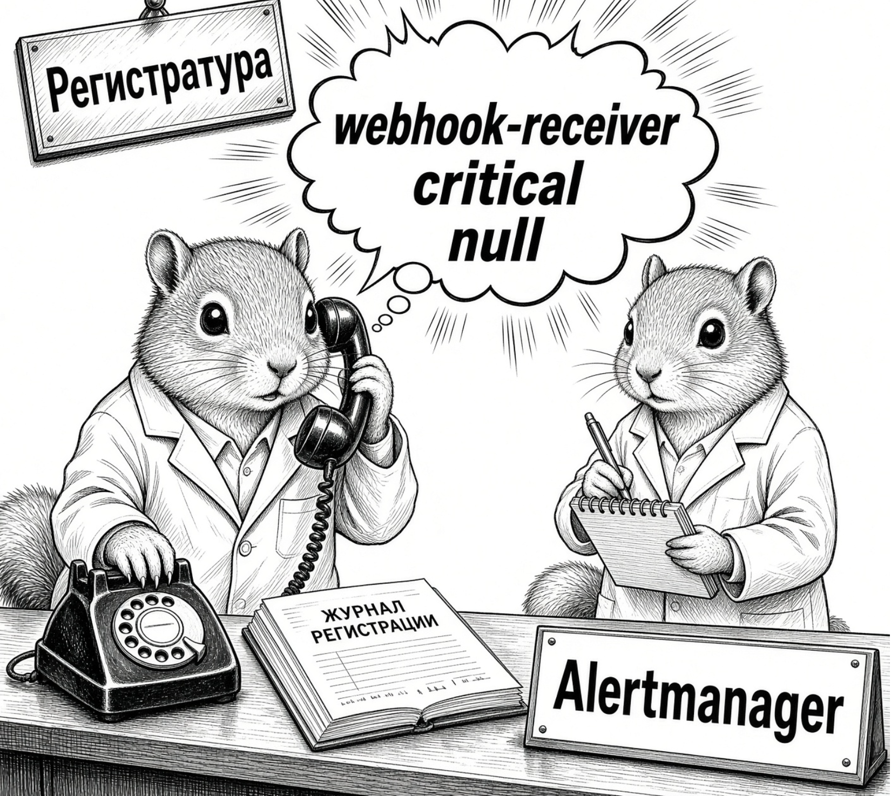

---

### Шаг 4.3. Пульт дежурного

Штатный пульт у `Alertmanager` есть, но он бедный. Никакой группировки, никаких фильтров, тёмной темы нет. Когда тревог три, терпимо. А когда пятьдесят в три часа ночи, нужен нормальный пульт, где всё видно одним взглядом. Вот тут на сцену и выходит `Karma`.

Сам он тревоги не хранит, просто дёргает `Alertmanager` и рисует красиво.

Официального чарта от авторов нет, поискал через `helm search hub karma`. Живым оказался `zekker6/karma`, свежий и с хорошей репутацией. Цепляю репозиторий:

```bash
helm repo add zekker6 https://zekker6.github.io/helm-charts/
helm repo update
```

Настройки минимальные. В `deploy/values/karma.yaml` указал только адрес нашего Alertmanager, больше ничего не нужно.

```yaml
env:
  ALERTMANAGER_URI: "http://kube-prom-kube-prometheus-alertmanager.monitoring:9093"
```

Ставлю:

```bash
helm install karma zekker6/karma -n monitoring -f deploy/values/karma.yaml
```

Проверяю, что заступил:

```bash
kubectl get pods -n monitoring -l app.kubernetes.io/name=karma
```

Стоит, дышит. `1/1 Running`.

Открываю и сразу вижу четыре карточки, которые уже висели в системе.

Пустышка `Watchdog`, уходит в null, как и договаривались в прошлом шаге. И три чужих тревоги про `KubeScheduler`, `KubeControllerManager` и `KubeProxy`. Это не мои, просто в OrbStack эти ребята не живут, поэтому система их шлёт в critical. Уходят в `webhook-receiver`, тоже как и договаривались.

Мои собственные тревоги тут пока не горят. Пока тихо...

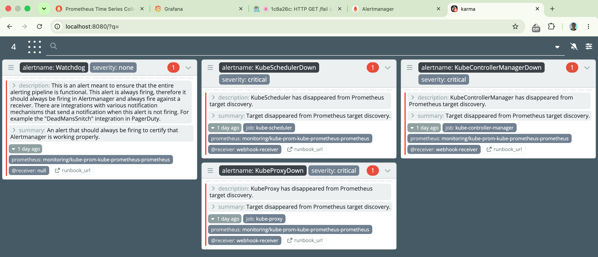


---

### Шаг 4.4. Учебная тревога

Инструкции розданы, рации настроены, пульт стоит. Но пока ничего не горело, проверить нечего. Пора устроить учебную тревогу и посмотреть, прибежит ли смена.

Сначала валю пациента по ошибкам и тормозам. Два цикла в разных вкладках, один долбит `/fail`, второй `/slow`.

```bash
while true; do curl -s -o /dev/null http://localhost:8090/fail; sleep 0.1; done
while true; do curl -s -o /dev/null http://localhost:8090/slow; done
```

Мониторы ожили. Пульс подскочил до семи с лишним, брак почти под сто, время ответа улетело к полутора секундам.

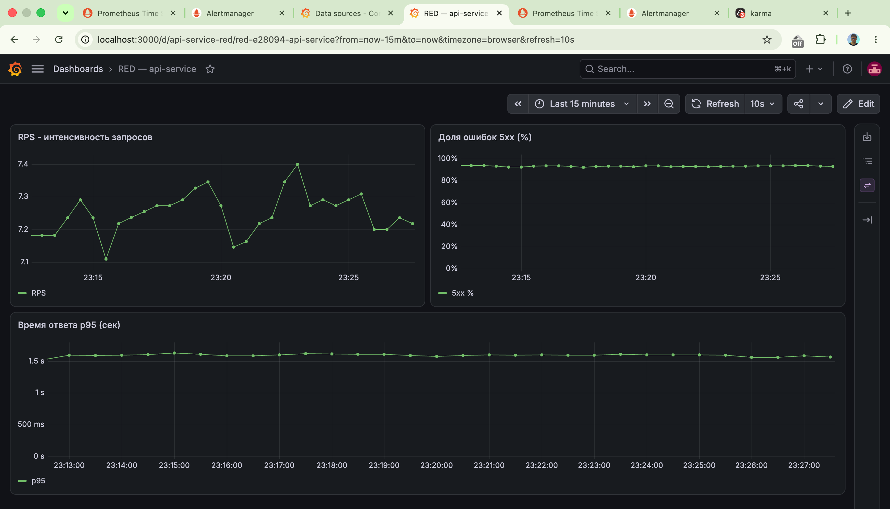

Через пару минут с Prometheus не выдержал и заорал. Обе инструкции перешли в статус `FIRING`.

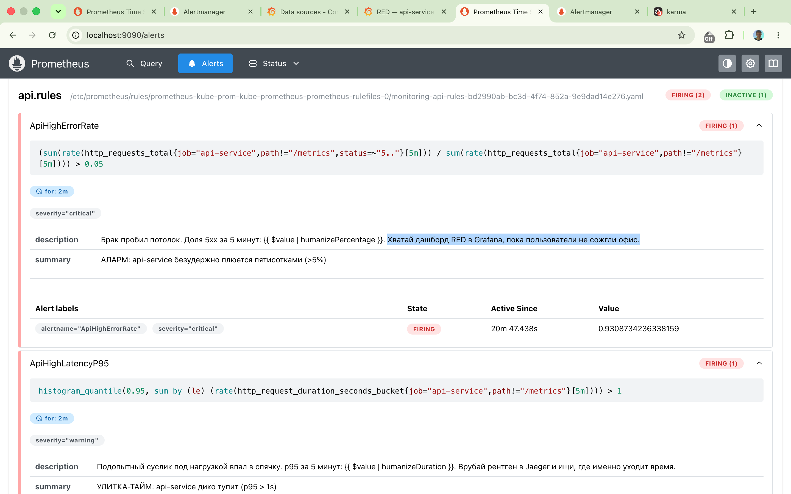

Alertmanager разложил тревоги по маршрутам. Обе полетели в `webhook-receiver`, а пустышка `Watchdog` ушла в `null`, как и договаривались.

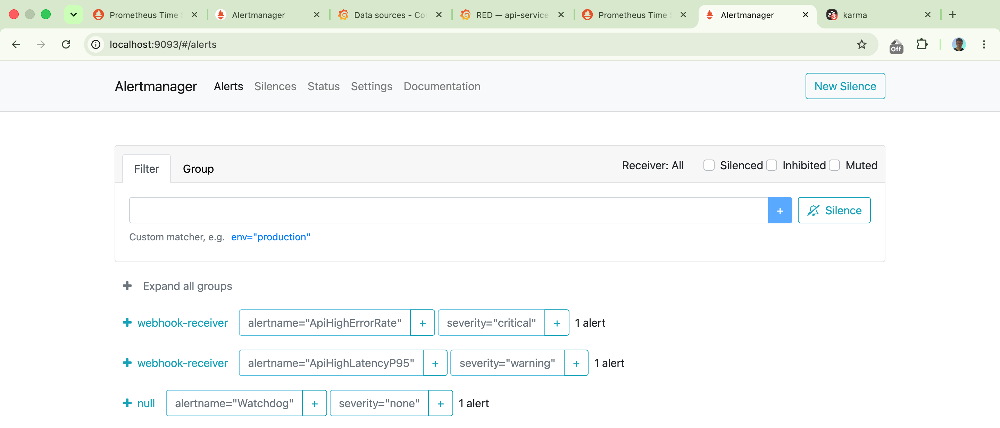

`Karma` показала карточки с моими формулировками. Тот самый момент, когда понимаешь, что все эти инструкции писались ради этого:

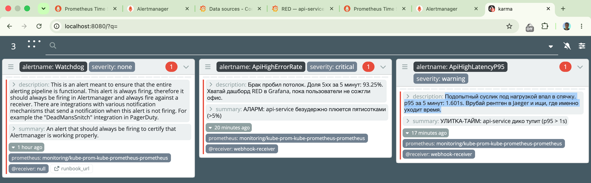

Дальше валю пациента совсем. Убираю поды на ноль:

```bash
kubectl scale deployment api-deployment -n monitoring --replicas=0
```

Первые две тревоги сами погасли, метрик больше нет. Зато загорелась третья, клиническая смерть.

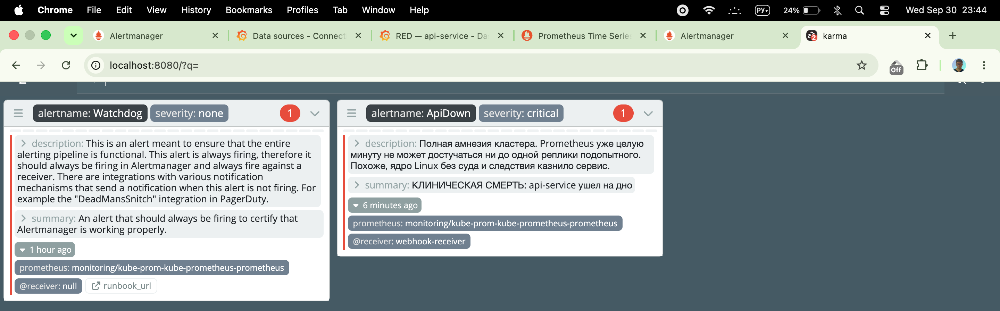

Поднимаю поды обратно:

```bash
kubectl scale deployment api-deployment -n monitoring --replicas=2
```

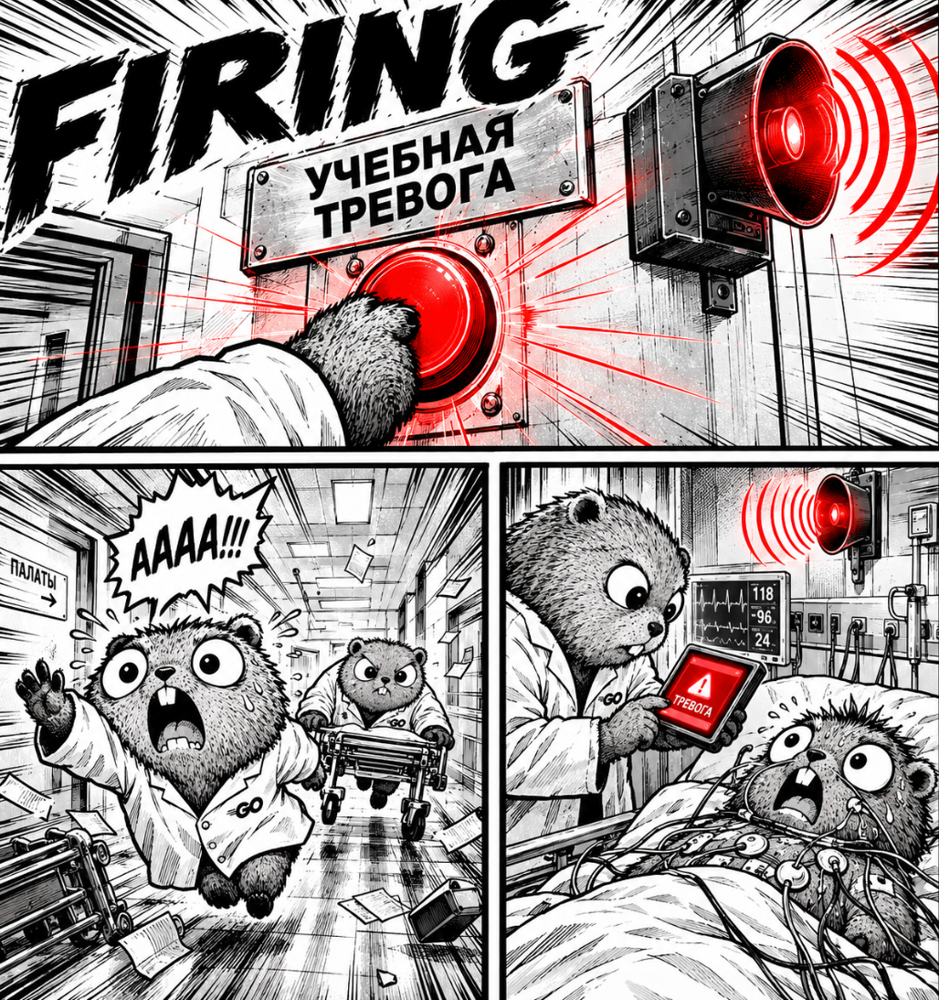

Все три тревоги долетели куда надо. Пациент заорал, сирена взвыла, дежурный прибежал. Учения прошли без потерь.
---
