# Хроники Гофера. Сезон 3: Завод "ООО Gopher-shop" (Политики, Helm, Операторы, Отказоустойчивость)

- **Язык сервисов:** Go 1.27
- **Стенд:** Kubernetes-кластер OrbStack
- **Инструменты развертывания:** Helm v4
- **Движок политик:** Kyverno
- **Namespace приложения:** shop
- **Namespace мониторинга:** monitoring, переходит из второго сезона


---

## Введение и цель работы. Сюжетная арка: Конвейер

Заглянем за кулисы нашего производства...

В прошлых сезонах наш Гофер успел посидеть в одиночке в тюрьме ядра Linux и побывать под микроскопом в роли подопытного суслика шоу `За стеклом`. Теперь пора делать бизнес!

Мы открываем Завод `"ООО Gopher-shop"` - гигантское промышленное предприятие по производству и обработке заказов.
Но на любом заводе без жестких ГОСТов наступает разруха. Ленивые рабочие пытаются протащить в сборочный цех левые детали и кривые чертежи, то есть `YAML манифесты` без лимитов ресурсов, без опознавательных знаков и с деталями из сомнительных реестров образов. Руками проверять каждую гайку нереально, брак тихо уедет к клиентам. Вдобавок БД требует постоянных пинков инженера, а дирекция завода `control plane` в любой момент может уйти на забастовку...

В этом сезоне мы строим полностью автономную и защищенную от дурака фабрику:

- Жесткий Ростехнадзор `Kyverno`. Ставим на проходной автоматический детектор брака. Если чертеж нарушает правила, система физически закрывает ворота и бьет инженера по рукам.
- Конвейерная автоматизация `Helm`. Пишем единый генеральный план завода. Будем менять станки на ходу без остановки производства и мгновенно сжигать бракованные партии апдейтов.
- Робот-Завскладом `Оператор БД`. Увольняем инженера с лопатой, к большому сожалению. Наша база данных теперь управляется умным роботом, который сам чинит станки и быстро ликвидирует аварии. Будущее наступило...
- День независимости цехов `Падение control plane`. Устроим жесткий саботаж и полностью отключим Главный Штаб Управления. Докажем, что наши рабочие у станков продолжают штамповать детали по старой памяти, даже когда руководство лежит в нокауте.

Ну и в качестве бонуса мы натягиваем систему датчиков и пожарную сирену `ServiceMonitor` и `PrometheusRule` поверх нашего старого промышленного комбайна из второго сезона.

Испытательный полигон: Локальный цех `OrbStack`.

Нус, поехали, запускаем турбины!

### Кастинг на должность начальника охраны: Kyverno против Gatekeeper

Перед запуском конвейеров нужно выбрать главу безопасности для нашего завода. На собеседование пришли двое:

- `Мастер Kyverno` - наш выбор! Понятный, суровый местный мужик. Пишет должностные инструкции на чистом YAML, том же языке, на котором работают наши станки. Ставится одной командой, не ворует ресурсы фабрики и сразу выдает списки нарушителей `PolicyReport` прямо на вахте. Идеален для нашего локального `OrbStack цеха`.
- `Профессор Gatekeeper`. Заумный эксперт с кучей дипломов. Разговаривает на странном языке `Rego`, какой-то сложный `DSL`, который у нас на заводе никто ни черта не понимает. Требует нововведений, возведения отдельного КПП `admission контроллер`, да еще и жрет оперативку на проходной как не в себя.

Вердикт директора завода: Берем `Kyverno`. Меньше бюрократии, ниже порог входа, быстрее запустим конвейер.

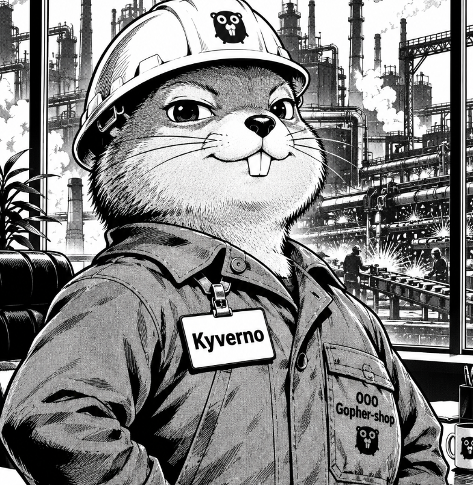

---

## Часть 0 - Сервисы. Сюжетная арка: Запуск сборочной линии

### Шаг 0.1 - Сборка станков

Разделяем обязанности на нашем производстве микросервисов приложения `shop`:

- `api`, синхронный цех, принимает входящий трафик, проверяет чертежи заказов и фиксирует их на складе.
- `worker`, асинхронный конвейер, в фоновом режиме разгребает завалы на складе и обрабатывает очереди.

Вся доменная логика работы со складом и шпионские датчики слежения упакованы в изолированный ящик `internal/`, чтобы не плодить дубликаты на рабочих верстаках.

- Отказоустойчивый запуск `internal/db/db.go`. База данных `PostgreSQL` при первом запуске может долго раскочегариваться. Чтобы Гофер не паниковал и не улетал в аварийный рестарты, в пул `pgxpool` встроен механизм ожидания, сервис делает до `30 попыток подключения` с интервалом в `2 секунды`, терпеливо дожидаясь готовности склада.
- Конвейер без драки за заказы. Когда мы начнем масштабировать воркеров пачками, несколько роботов могут одновременно схватить один и тот же заказ. Чтобы избежать производственных травм и `double-processing`, на уровне SQL-запросов применена конструкция `SELECT ... FOR UPDATE SKIP LOCKED`. Теперь каждый воркер мгновенно блокирует свою деталь, а остальные роботы просто пропускают ее и идут дальше по конвейеру.
- Искусственный инфаркт для тестов `cmd/api/main.go`. В эндпоинт `GET /health` на `порту 8080` вшит секретный триггер. Если подкинуть станку переменную окружения `HEALTH_FAIL=true`, он моментально переключается на выдачу кода `503 Service Unavailable`. Эта фича нам жизненно необходима, чтобы проверить реакцию проходной `Kyverno` и завалить `rolling update` в будущем.
- Фоновый аудит `cmd/worker/main.go`. Наш воркер не просто молча обрабатывает заказы `раз в 2 секунды`, а параллельно поднимает независимый порт `8081` с ручками `/health` и `/metrics`, чтобы датчики `Prometheus` из второго сезона могли непрерывно считывать его пульс.

---

### Шаг 0.2. Проверка ОТК и запуск энергосети

Перед отправкой кодовых чертежей на производство устраиваем бинарникам жесткий техосмотр стандартными утилитами Go:

```bash
go mod tidy
go build ./...
go vet ./...
```

Контроль пройден, компилятор молчит, утилиты завершили выполнение.
Теперь проверяем, жива ли главная подстанция завода в лице локального кластера `OrbStack` и дышат ли приборы слежения, которые перешли к нам из прошлых сезонов:

```bash
kubectl config current-context
kubectl get nodes
kubectl get pods -n monitoring
```

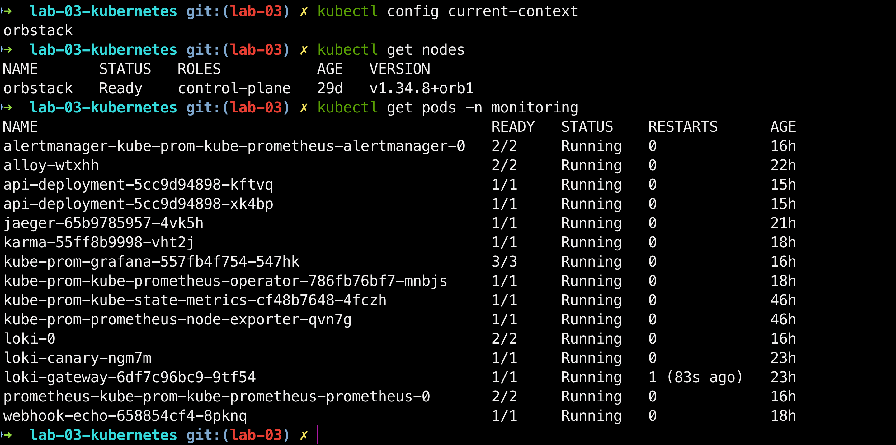

Контекст валиден, системные ноды активны, а поды `Prometheus`, `Loki` и `Jaeger` находятся в статусе `Ready/Running`. Энергосеть завода полностью готова к скрейпингу новых целей!

### Шаг 0.3. Многоэтапная штамповка

Настраиваем сборку так, чтобы на выходе получить чистые исполняемые файлы без лишнего системного веса. Используем образы `FROM scratch` и собираем компоненты независимо:

```bash
docker build --target api    -t shop-api:1.0.0    .
docker build --target worker -t shop-worker:1.0.0 .
```

Процесс полностью готов к работе. На выходе имеем два легких бинарника для конвейера.

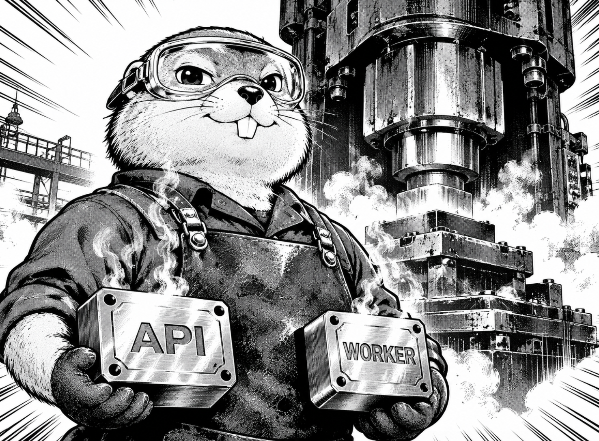

---

## Часть 1 - Ограждения на кластер. Сюжетная арка: ГОСТы

### Шаг 1.1. Начальник охраны

Ставим систему автоматического контроля брака Kyverno в отдельный загон с помощью `Helm`:

```bash
helm repo add kyverno https://kyverno.github.io/kyverno/
helm repo update
helm install kyverno kyverno/kyverno -n kyverno --create-namespace
```

Контроллеры успешно запустились и встали на дежурство:

```bash
kubectl get pods -n kyverno
```

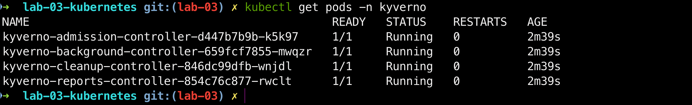

Все правила пишем через классические манифесты `ClusterPolicy`. Этот синтаксис полностью поддерживается, наглядно описывает правила и готов к жесткой фильтрации входящих чертежей.

---

### Шаг 1.2. Лимиты цехов

Для защиты завода от перегрузки подстанции вводим обязательные нормативы. Политика `require-resources` запрещает запуск оборудования без четких границ по памяти и процессору.

Включаем систему защиты:

```bash
kubectl apply -f policies/01_require_resources.yaml
```

Попытка протащить чертеж без ограничений сразу вызвала ресурсный голод. Охрана нашла контейнер без ресурсного паспорта и заблокировала деплой, чтобы нода не упала в обморок:

```bash
kubectl apply -f policies/violations/01_no_resources.yaml
```

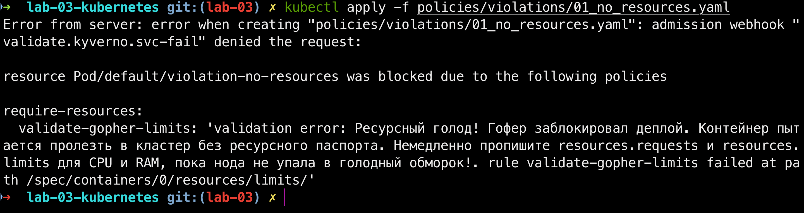

Кластер надежно застрахован от прожорливого оборудования..

---

### Шаг 1.3. Контрабанда сырья

Для защиты сборочных цехов от левых материалов вводим жесткий пограничный контроль. Правило `trusted-registry` закрывает доступ для любых внешних деталей, кроме проверенных официальных образов `docker.io/library/*` и наших личных локальных сборок `shop-api` и `shop-worker`.

Запускаем сканирование грузов на проходной:

```bash
kubectl apply -f policies/02_trusted_registry.yaml
```

Таможня Гофера моментально обнаружила контрабанду из серого реестра. Автоматика объявила план-перехват и депортировала нелегальный контейнер на этапе создания:

```bash
kubectl apply -f policies/violations/02_bad_registry.yaml
```

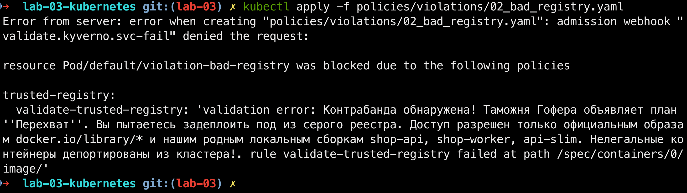

Черный импорт успешно остановлен, ворота закрыты для сомнительных поставщиков.

---

### Шаг 1.4. Маркировка деталей

Для наведения порядка на складе вводим жесткую паспортизацию. Политика `require-labels` требует обязательного наличия меток `app` и `owner` на каждом поде, чтобы сетевые службы и датчики мониторинга могли мгновенно находить оборудование.

Применяем регламент маркировки:

```bash
kubectl apply -f policies/03_require_labels.yaml
```

Когда в цех попытались протащить деталь без опознавательных знаков, автоматика заблокировала деплой. Гофер потерял клеймо, а без документов в этот кластер вход закрыт:

```bash
kubectl apply -f policies/violations/03_no_labels.yaml
```

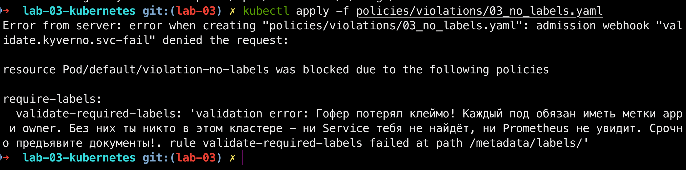

Все немаркированные ресурсы успешно отсекаются на проходной!

---

### Шаг 1.5. Режим секретности

Для защиты операционной системы завода от захвата контроля вводим жесткие инструкции по безопасности. Политика `no-privileged` полностью запрещает запуск контейнеров с флагами `privileged: true` и `allowPrivilegeEscalation: true`, блокируя любые попытки скрытого повышения прав процессов.

Активируем режим повышенной безопасности:

```bash
kubectl apply -f policies/04_no_privileged.yaml
```

Когда один из сотрудников попытался протащить чертеж с требованием выдать ему ключи от главного сейфа хоста, автоматика пресекла нарушение на входе:

```bash
kubectl apply -f policies/violations/04_privileged.yaml
```

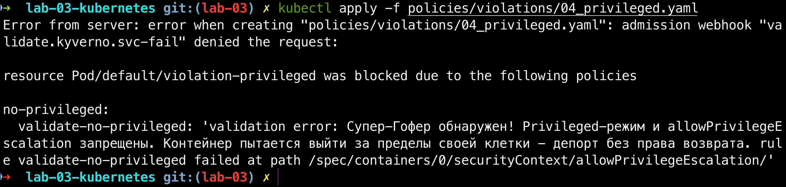

Чтобы система не сыпала ложными тревогами, когда инженеры вообще не запрашивают этот блок настроек, мы применили условный оператор `=(securityContext)`. Если блока прав в чертеже нет, система спокойно пропускает его дальше, а блокирует только явных узурпаторов с флагом `true`.

---

### Шаг 1.6. Финальный аудит

Для исключения неопределенности на линии запрещаем использование деталей без точной маркировки. Политика `no-latest-tag` блокирует любые чертежи с тегом `:latest` или вовсе без указания версии. Без точных номеров партий инженеры не поймут, что реально работает на станках, а автоматический откат брака станет невозможен.

Внедряем запрет на лотерею версий:

```bash
kubectl apply -f policies/05_no_latest_tag.yaml
```

Попытка пропихнуть деталь с тегом `latest` была мгновенно пресечена. Гофер требует ясную версию, лотерея официально окончена:

```bash
kubectl apply -f policies/violations/05_latest_tag.yaml
```

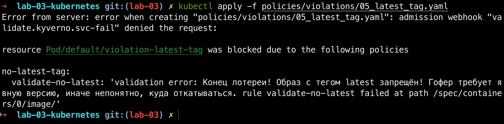

Итог контроля безопасности: на заводе развернуты и переведены в боевой режим `Enforce` все пять защитных политик:

```bash
kubectl get clusterpolicy
```

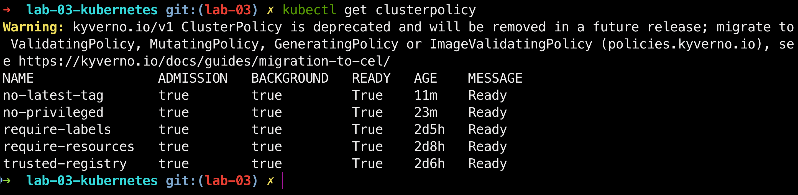

Каждый регламент успешно прошел краш-тесты вредоносными чертежами из папки `violations`. Автоматика отсекает брак на входе, не давая ему дойти до `etcd кластера`. Столбцы подтверждают статус контура: `ADMISSION=true` перехватывает манифесты на лету, `BACKGROUND=true` непрерывно сканирует цеха, а статус `READY=True` гарантирует, что Ростехнадзор Гофера полностью готов к защите производства.

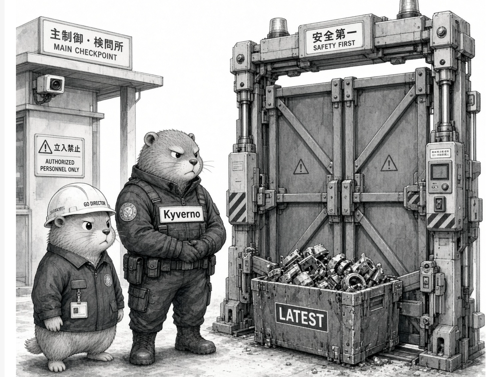

---

## Часть 2 - Чарт api и worker. Сюжетная арка: Бесперебойное производство

### Шаг 2.1. Генеральный план

Перед запуском конвейера зачищаем рабочую зону от старого мусора из второго сезона, чтобы избежать конфликтов оборудования по именам и меткам:

```bash
kubectl delete deployment api-deployment -n monitoring
kubectl delete service api-service -n monitoring
kubectl delete servicemonitor api-servicemonitor -n monitoring
```

Разрабатываем план завода. Все переменные параметры, включая число реплик: `api 3`, `worker 2`, порты и лимиты, выносим в пульт управления `values.yaml`.
В шаблоны жестко закладываем ГОСТы: клейма `app` и `owner`, `лимиты ресурсов` и `проверенные образы`. Для работы без простоя прописываем обновление строго по одному станку через параметры `maxSurge: 1` и `maxUnavailable: 0`, а проверку пульса вешаем на `/health`
.
Проверяем чертежи на корректность:

```bash
helm lint charts/shop
helm template shop charts/shop -n shop
```

Тесты пройдены, ошибок в плане нет.

---

### Шаг 2.2. Проверка прочности

Запускаем конвейер в изолированном пространстве имен `shop`:

```bash
helm install shop charts/shop -n shop --create-namespace
```

Охрана `Kyverno` на входе одобрила чертежи, но станки ушли в аварию `CrashLoopBackOff`. Причина, коду для старта необходима `PostgreSQL`, а ее развертывание намечалось только в следующей части :(

Чтобы обойти этот архитектурный тупик и запустить проверку здоровья, внедряем в чарт временный склад СУБД `templates/postgres-temporary.yaml`.

Синхронизируем параметры и перезапускаем зависшее оборудование:

```bash
helm upgrade shop charts/shop -n shop
kubectl rollout restart deployment api -n shop
kubectl rollout restart deployment worker -n shop
```

Инспектируем итоговое состояние сборочных линий:

```bash
kubectl get pods -n shop
```

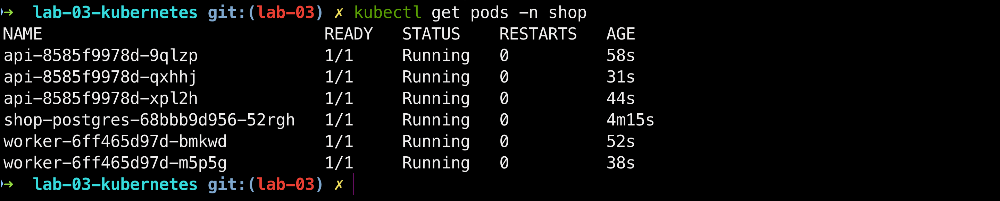

Все шесть агрегатов платформы: `3 реплики api`, `2 реплики worker` и `временная база` вышли на полную мощность и стабильно работают в статусе `1/1 Running`.

---

### Шаг 2.3. Испытания оборудования

Проверяем способность автоматики завода удерживать заданную конфигурацию при авариях и расширении цехов.

Тест 1. Уничтожение станка: вручную ломаем и удаляем один из трех активных `подов api`:

```bash
kubectl delete pod api-8585f9978d-9qlzp -n shop
```

Система заметила нехватку оборудования и автоматически собрала на конвейере новый рабочий под взамен уничтоженного:

```bash
kubectl get pods -n shop
```

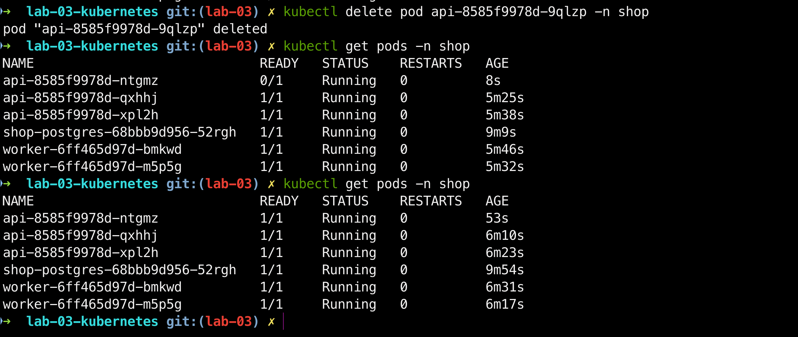

Новый под `api-8585f9978d-ntgmz` запустился автоматически и перешел в статус `1/1 Running`. Количество реплик восстановилось без внешнего вмешательства.

Тест 2. Изменение масштабов производства: в файле `values.yaml` увеличено значение параметра `api.replicas` с 3 до 5:

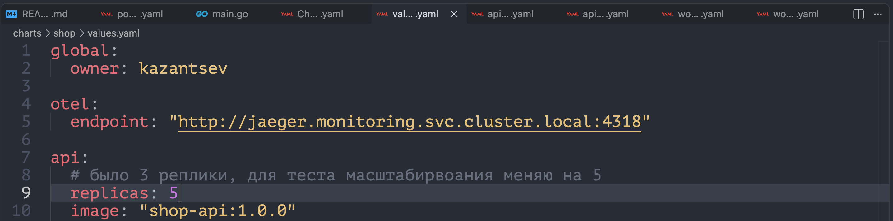

Синхронизировано состояние релиза `Helm`:

```bash
helm upgrade shop charts/shop -n shop
```

Автоматика отреагировала на команду и расширила цех до пяти подов:

```bash
kubectl get pods -n shop
```

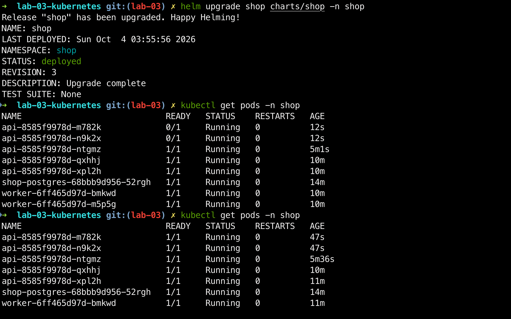

Параметр `api.replicas` в `values.yaml` возвращен к исходному значению в 3 реплики:

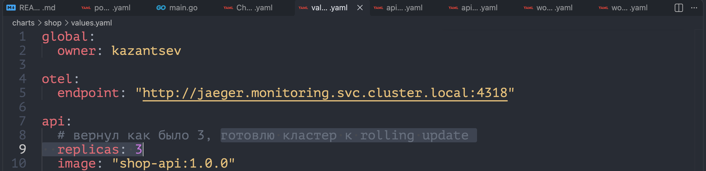

Применено обратное обновление:

```bash
helm upgrade shop charts/shop -n shop
kubectl get pods -n shop
```

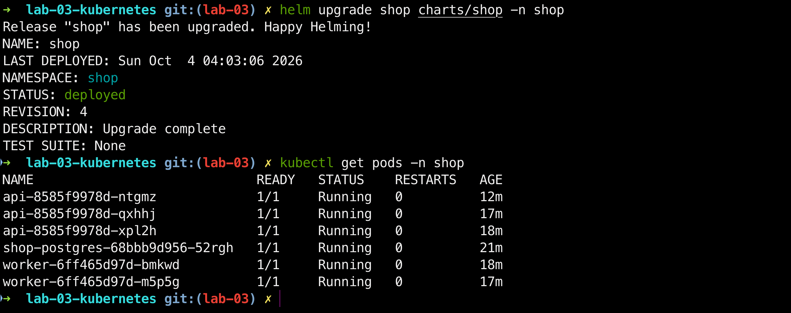

Лишние станки демонтированы, состав цеха вернулся к `трем подов api`. Испытания доказали, что автоматика держит целевую конфигурацию как при физическом падении оборудования, так и при обновлении плана через `Helm`.

---

### Шаг 2.4. Смена агрегатов

Проверяем стратегию бесшовной замены узлов под непрерывной рабочей нагрузкой. Изменяем номер партии прошивки в пульте управления `charts/shop/values.yaml` с версии `1.0.0` на `1.0.1`:

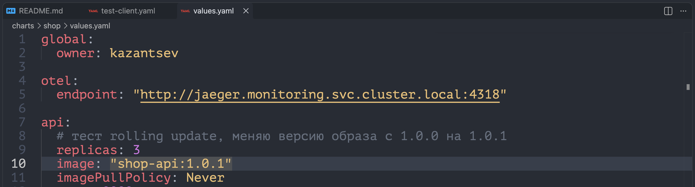

Для контроля пропускной способности конвейера запускаем подстанцию `curl-test`, которая непрерывно бомбардирует линию запросами через внутреннюю сеть завода:

```bash
kubectl logs -f curl-test -n shop
```

Запускаем переоснащение цеха:

```bash
helm upgrade shop charts/shop -n shop
```

За счет заводских параметров `maxSurge: 1` и `maxUnavailable: 0` автоматика монтирует новые станки строго по одному. Она не списывает старые узлы до тех пор, пока новые агрегаты успешно не пройдут проверку ОТК.

Инспектируем цех и фиксируем переходной этап, старые и новые агрегаты распределяют нагрузку в параллельном режиме:

```bash
kubectl get pods -n shop -l app=api-server
```

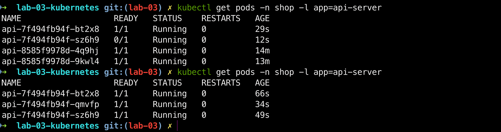

Пока шла замена, поток готовой продукции на линии не прерывался ни на секунду. Все датчики зафиксировали чистые `ответы 200`, никаких сбоев, задержек или обрывов связи не обнаружено:

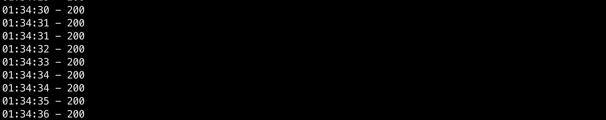

Испытание подтверждает: завод выполнил техническую замену узлов в горячем режиме, сохранив стопроцентную выдачу плана для потребителей!

---

### Шаг 2.5. Списание брака

Проводим испытания системы при попадании брака на линию. В пульте управления `charts/shop/values.yaml` переводим тумблер `healthFail` в положение `"true"`:

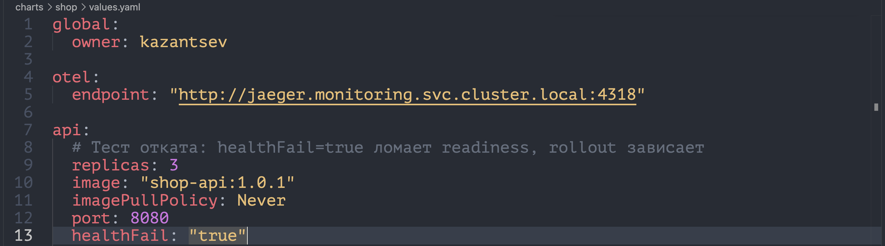

Запускаем поставку дефектной партии узлов в цех:

```bash
helm upgrade shop charts/shop -n shop
```

Автоматика смонтировала один новый агрегат `api-56c88c4fd4-l6bn7`, но он полностью провалил проверку ОТК на линии здоровья. За счет жесткого заводского норматива `maxUnavailable: 0` конвейер моментально встал, старые исправные станки не были списаны, а дефектный узел система изолировала от общей сети, не пустив на него трафик.

Фиксируем блокировку конвейера автоматикой безопасности:

```bash
kubectl get pods -n shop -l app=api-server
kubectl rollout status deployment api -n shop
```

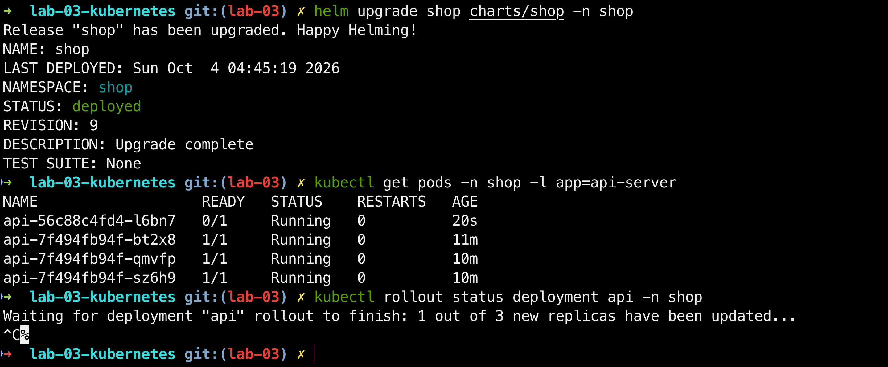

Пока линия была заблокирована, завод продолжал бесперебойно выдавать готовую продукцию. Испытательный стенд `curl-test` на протяжении всей аварии фиксировал стабильные `ответы 200` от старых резервных мощностей:

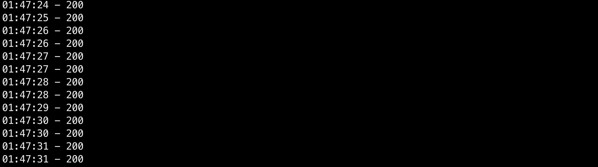

Дергаем рычаг экстренного реверса и возвращаем цех к предыдущей проверенной ревизии плана

```bash
helm rollback shop -n shop
```

Проверяем исправность оборудования после восстановления:

```bash
kubectl get pods -n shop -l app=api-server
kubectl rollout status deployment api -n shop
```

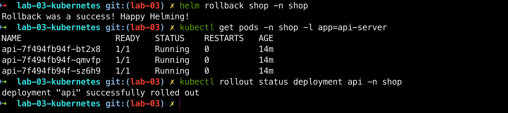

Бракованный узел полностью демонтирован, три проверенных станка вернулись в штатный режим работы, автоматика рапортует об успехе. Простой производства не случилось.

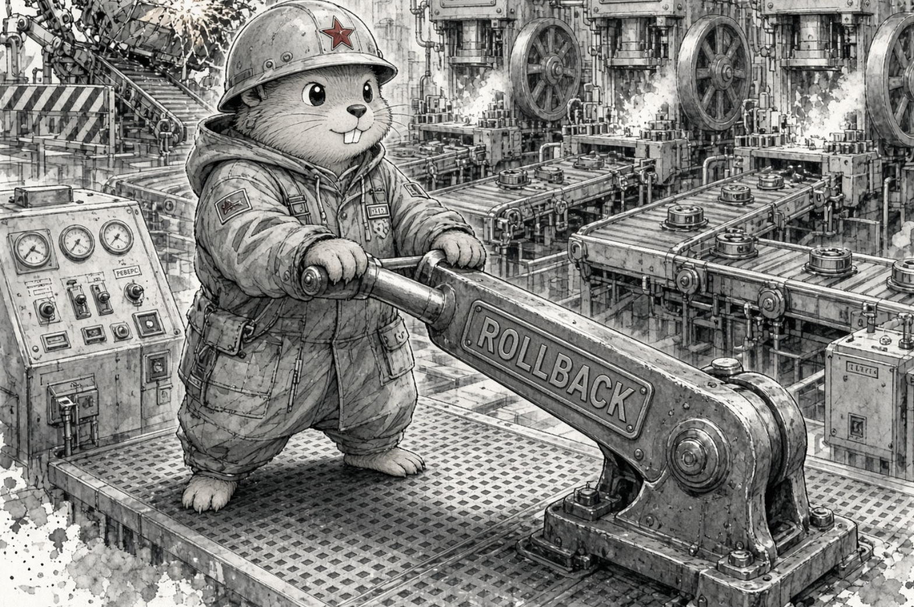

---

## Часть 3 - Postgres через оператора. Сюжетная арка: Завскладом

### Шаг 3.1. Монтаж автоматики

Вносим точечные исключения в правила охраны `Kyverno`, чтобы система не заблокировала спецтранспорт на проходной:

- В белый список `trusted-registry` добавляем реестр `ghcr.io/cloudnative-pg/*`.
- В регламент маркировки `require-labels` вносим исключение для складской зоны `cnpg-system` и деталей с меткой `cnpg.io/cluster`.
- В нормативы лимитов `require-resources` прописываем исключение для сектора `cnpg-system`.

Разворачиваем автоматику управления складом `CloudNativePG` через `Helm`:

```bash
helm repo add cnpg https://cloudnative-pg.github.io/charts
helm repo update
helm install cnpg cnpg/cloudnative-pg -n cnpg-system --create-namespace
```

Инспектируем готовность управляющего узла:

```bash
kubectl get deployments -n cnpg-system
kubectl get crd | grep cnpg.io
```

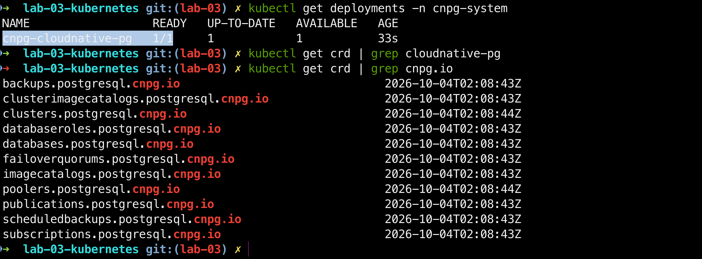

Узел `cnpg-cloudnative-pg` успешно заступил на смену. В реестр завода добавлены `11 кастомных спецификаций` во главе с паспортом `clusters.postgresql.cnpg.io`.

---

### Шаг 3.2. Перестройка

Полностью демонтируем временную пристройку для сырья из генерального плана. В основном пульте `charts/shop/values.yaml` возвращаем тумблер искусственной аварии `healthFail` в штатное положение `"false"`.

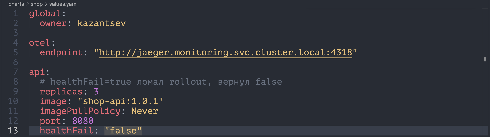

Вносим в чертежи постоянное капитальное хранилище: закрытый сейф с ключами доступа и спецификацию автоматизированного склада сырья.

Запускаем масштабную перестройку снабжения:

```bash
helm upgrade shop charts/shop -n shop
kubectl get pods -n shop
```

Капитальное автоматическое спецхранилище `shop-postgres-1` успешно введено в эксплуатацию. Цеха `api` и `worker` восстановили бесперебойную подачу сырья и вышли на штатную мощность.

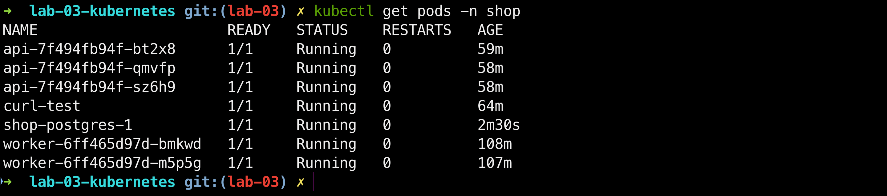

---

### Шаг 3.3. Плановые учения ГО и ЧС

Проверяем способность завскладом самостоятельно ликвидировать последствия ЧП и удерживать подачу сырья без вмешательства инженеров.

Имитируем внезапную аварию и принудительно уничтожаем под капитального хранилища:

```bash
kubectl delete pod shop-postgres-1 -n shop
```

Кладовщик мгновенно зафиксировал пропажу склада и начал заново отстраивать объект с нуля. Цикл восстановления фиксировался оп датчикам.

```bash
kubectl get pods -n shop -w
```

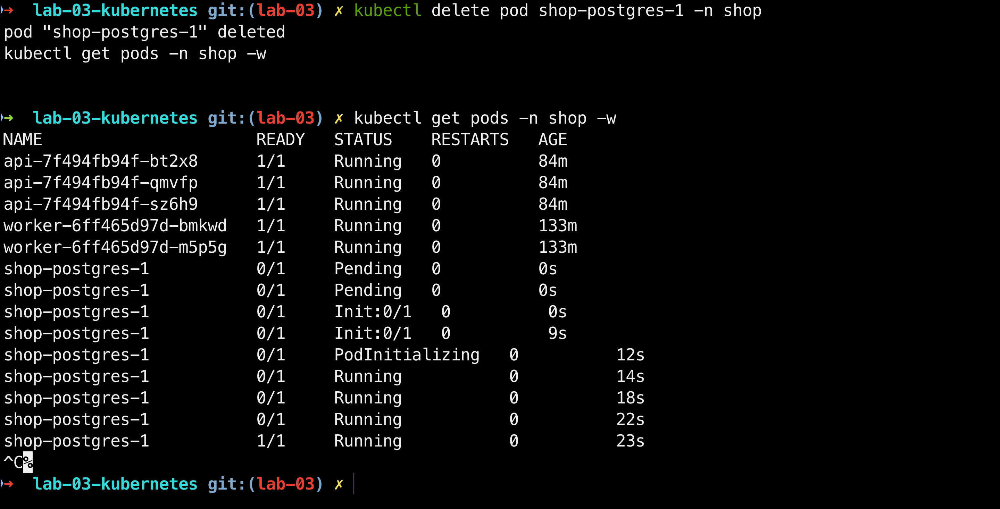

Этапы:

- `Pending`, автоматика запросила ресурсы на возведение новых закромов.
- `Init:0/1`, первичная подготовка площадки под сырье `0–9 секунд`.
- `PodInitializing`, разгрузка и монтаж оборудования `12 секунд`.
- `Running 0/1`, турбины склада запущены, но финальная проверка ОТК еще не пройдена `14–22 секунды`.
- `1/1 Running`, спецхранилище полностью готово к выдаче угля `на 23 секунде`.

Пока склад восстанавливался, цеха `api` и `worker` не потеряли устойчивость и продолжали штатно молотить. Автоматический ремонт занял всего `23 секунды`.

---

### Шаг 3.4. Сверка документов

Выполнен анализ манифеста запущенного кластера СУБД:

```bash
kubectl get cluster shop-postgres -o yaml -n shop
```

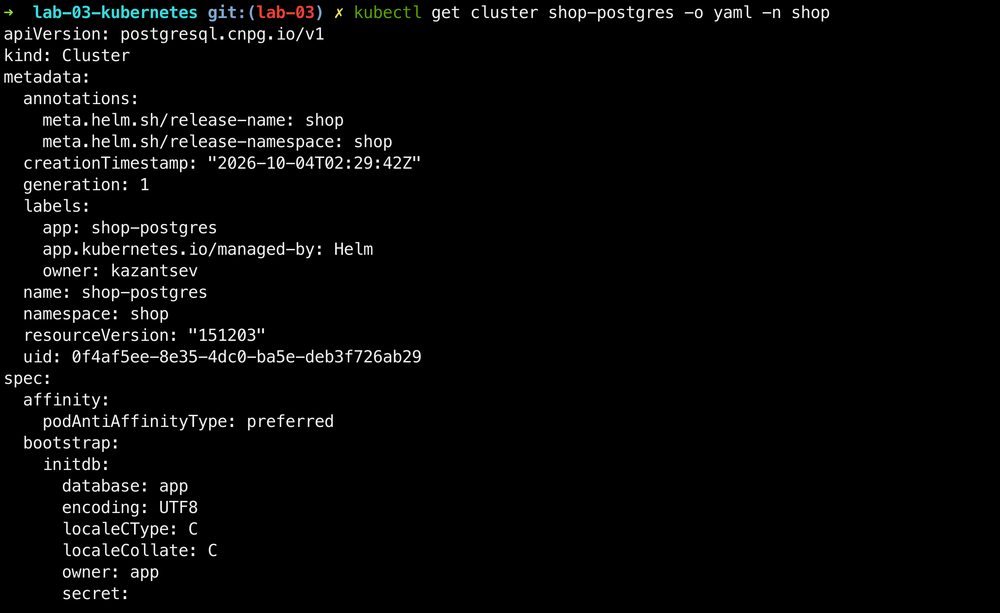

- Раздел `spec` (План) жестко фиксирует желаемое состояние, задекларированное в чертежах чарта: количество требуемых инстансов, специализированный образ и объем хранилища.
- Раздел `status` (Факт) отражает реальную обстановку на производстве, заполненную автоматикой: текущую фазу работы, имя активного мастера и точное число готовых реплик

Различие квалификации: бригадир и оператор

- Обычный бригадир `controller-manager` умеет работать только с простыми коробками вроде подов. Ему вообще плевать, что за программа крутится внутри станка. Если база данных накроется, максимум, что он сделает, так это попробует тупо перезапустить упавший контейнер. Переключать роли мастера и реплики при аварии или делать консистентные бэкапы он просто не умеет.
- Автоматический оператор `наш Завскладом` соображает как опытный инженер. Он изнутри видит все процессы: кто сейчас главный на выдаче, как идет архивация логов и живы ли ключи доступа. Если главный под упадет, робот сам без пинков человека переключит роли, подкинет бэкап и спасет производство от простоя

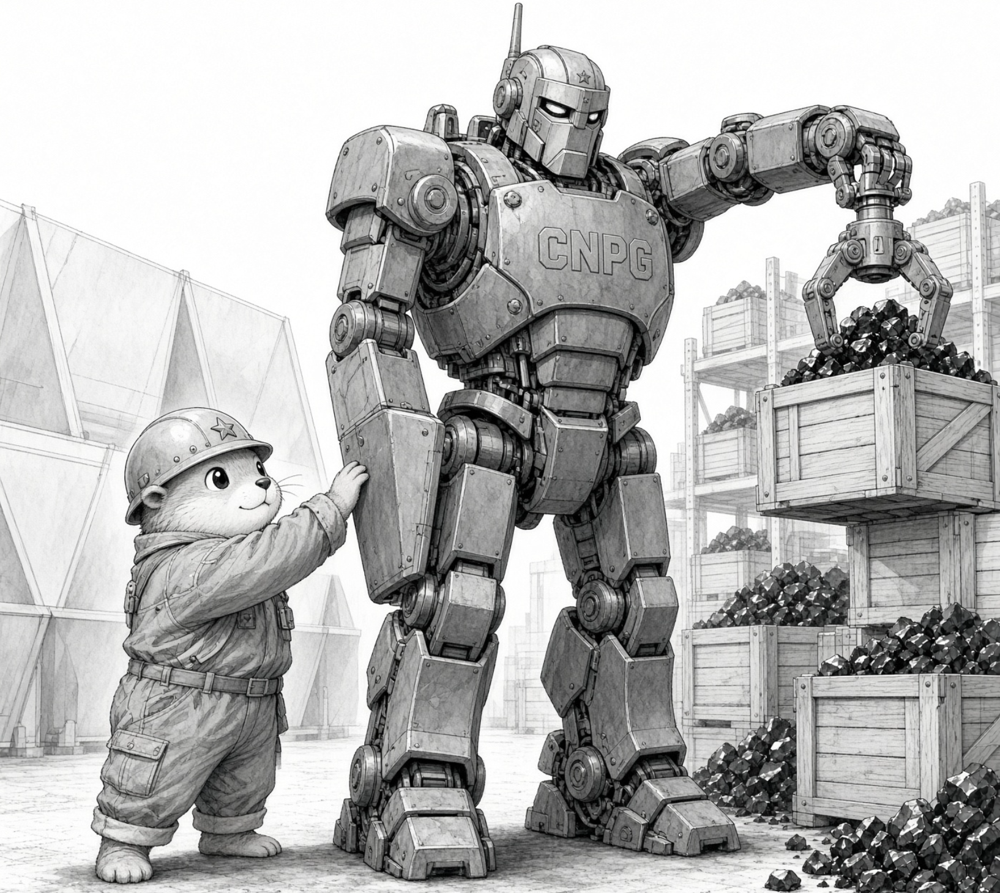

---

## Часть 4 - Падение control plane. Сюжетаня арка: Пульт управления

### Шаг 4.1. Проверка ограничений

По инструкциям требовалось отключить главный пульт управления завода `etcd` или `kube-apiserver`. Однако на нашей платформе OrbStack сделать это напрямую невозможно:

- Наш стенд работает на встроенном монолите `k3s`, который намертво вшит в системную виртуальную машину кластера.
- Управляющий штаб не вынесен в отдельные контейнеры или поды. Команда `docker ps` видит только рядовые станки, а проверка сектора `kube-system` отображает лишь сетевые службы.
- Доступа к внутренним процессам через `утилиту orbctl` нет, а единственный системный переключатель `vmcontrol.sock` рубит всю виртуальную машину целиком, и вместе со штабом могут упасть и рабочие цеха, что нарушает правила теста.
  Прямая остановка управляющих органов без отключения всего завода невозможна!

### Шаг 4.2. Обрыв связи

Для проверки независимости цехов от главного управления имитируем полную потерю связи с диспетчерской. Создаем копию плана с заведомо неверным адресом коммутатора, оставив оригинальные провода целыми:

```bash
cp ~/.orbstack/k8s/config.yml ./kubeconfig-broken.yaml
sed -i '' 's/:26443/:29999/g' ./kubeconfig-broken.yaml
```

Пробуем запросить рапорт о состоянии оборудования через поврежденную линию связи:

```bash
KUBECONFIG=./kubeconfig-broken.yaml kubectl get nodes
```

Система выдает отказ, связь полностью заблокирована.

При этом станки в цехах продолжают работать в автономном режиме. Выделенная телефонная линия, запущенная до обрыва, держит соединение, и контрольный запрос к датчику здоровья `/health` возвращает стабильный `код 200`:

```bash
curl -s -o /dev/null -w "%{http_code}\n" http://localhost:8080/health
# 200
```

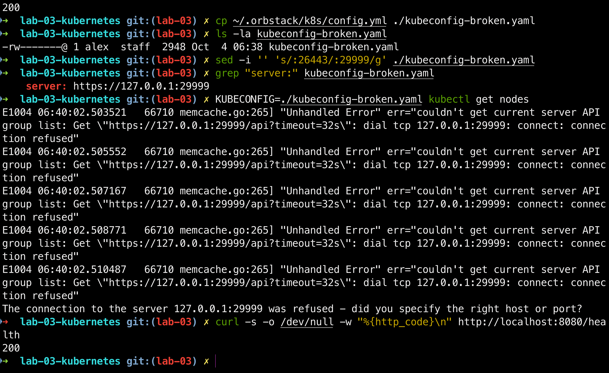

Испытание подтвердило, что сборочные линии и склады сырья никак не зависят от падения главного штаба управления.

### Шаг 4.3. Штатный режим

Поскольку оригинальный конфигурационный файл мы не трогали, для восстановления контроля над заводом достаточно просто вернуться к стандартным линиям связи.

Проверяем доступность диспетчерской:

```bash
kubectl get nodes
```

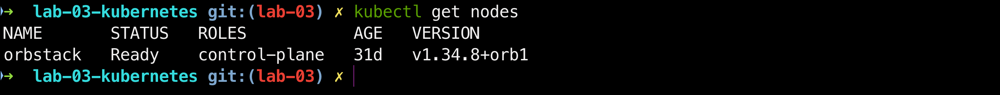

Связь со штабом восстановлена!

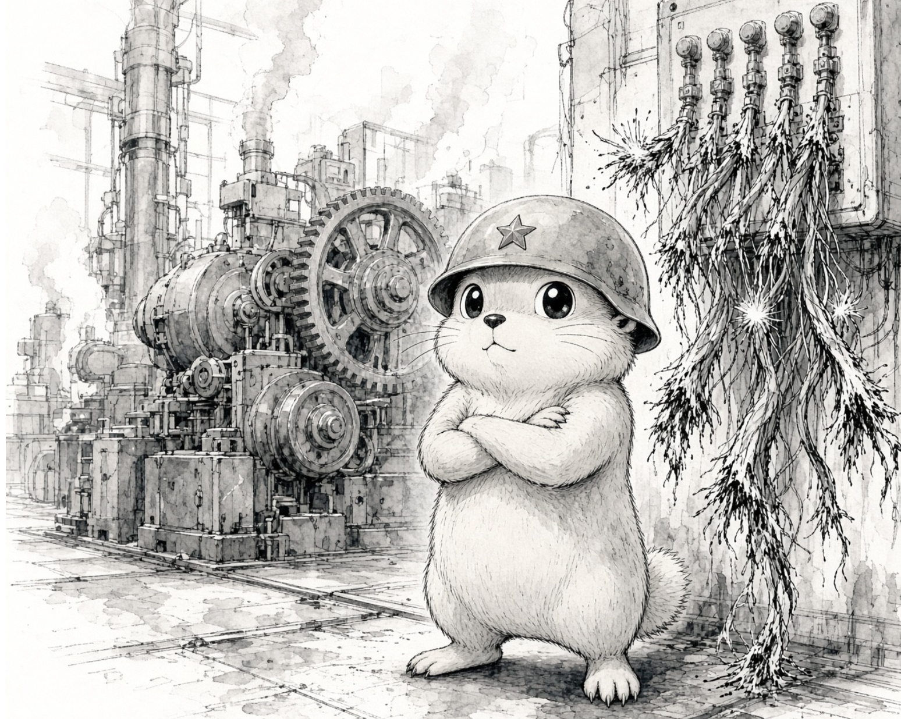

---

## Часть 5 — Мониторинг. Сюжетная арка: Датчики КИПиА

### Шаг 5.1. Подключение...

Внедряем в генеральный план шаблоны `templates/servicemonitor-api.yaml` и `templates/servicemonitor-worker.yaml`. Они подводят сигнальные линии от цехов `shop` к центральному пульту КИПиА, чтобы непрерывно снимать показания со станков.

Помечаем ресурсы обязательным штампом `release: kube-prom`, по которому пульт автоматически берет приборы на учет.

Запускаем обновление оборудования:

```bash
helm upgrade shop charts/shop -n shop
kubectl get servicemonitor -n shop
```

Приборы успешно подключены. На главном диспетчерском табло в секции `/targets` загорелись `3 сигнальные лампы для цеха api` и `2 для worker`. Все линии рапортуют о стабильном `статусе UP`, а задержка сбора телеметрии составляет менее одной минуты.

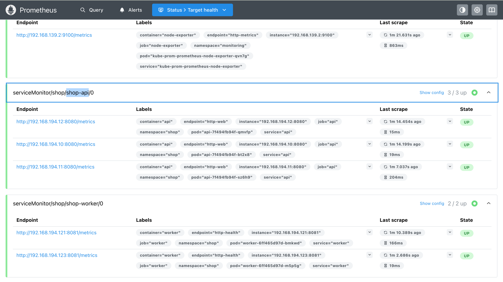

---

### Шаг 5.2. Критические пороги

Внедряем шаблон `templates/prometheus-rules.yaml`, содержащий три критических порога для сигнальных реле. Ресурс маркируем штампом `release: kube-prom`, чтобы центральный пульт КИПиА автоматически взял правила на вооружение.

Запускаем обновление настроек:

```bash
helm upgrade shop charts/shop -n shop
kubectl get prometheusrule -n shop
```

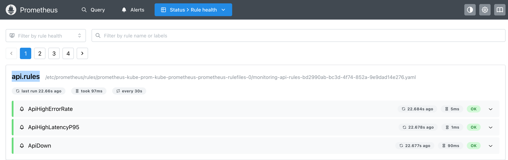

Назначение и обоснование уставок:

- `ApiHighErrorRate` (Критический брак)
  Суть: Доля бракованных ответов 5xx превышает 5% за 5 минут, и сбой держится 2 минуты.
  Обоснование: Если каждый двадцатый сигнал идет с ошибкой, то это системная авария, блокирующая отгрузку продукции. Порог в 5% отсекает случайные разовые колебания, а задержка в 2 минуты бережет систему от ложных тревог при плановом перезапуске оборудования.

- `ApiHighLatencyP95` (Замедление конвейера)
  Суть: Время отклика станков по 95-му перцентилю превышает 1 секунду на отрезке в 5 минут, и задержка длится более 2 минут.
  Обоснование: Торможение конвейера срывает темпы выдачи плана. Расчет по `P95` игнорирует редкие единичные аномалии и показывает реальную картину работы для абсолютного большинства агрегатов, фиксируя границу комфортного ожидания.

- `ApiDown` (Остановка цеха)
  Суть: На пульте КИПиА полностью исчезли сигналы от живых реплик цеха `api` в течение `1 минуты`.
  Обоснование: Означает полный паралич производственной линии. Минутная пауза не дает сработать сирене во время штатной замены агрегатов. Функция `absent()` гарантированно перехватывает ЧП, когда датчики вообще перестают слать телеметрию, например, при случайном списании всех станков.

---

### Шаг 5.3. Проверка сигнализации

Для сквозной проверки аварийной цепочки намеренно закладываем дефект в логику станка `api` - ручку `/fail`, которая всегда сыплет браком с `кодом 500`. Пересобираем прошивку приложения с номером партии `1.0.2` и обновляем генеральный план:

```bash
docker build --target api -t shop-api:1.0.2 .
helm upgrade shop charts/shop -n shop
```

Чтобы проверить реакцию приборов, пускаем по линии непрерывный поток бракованных деталей:

```bash
while true; do curl -s -o /dev/null http://localhost:8080/fail; sleep 0.1; done
```

Спустя 2 минуты непрерывного потока брака реле `ApiHighErrorRate` замкнуло контакты, Пульт КИПиА перевел сигнал из режима ожидания в боевой статус `FIRING`.

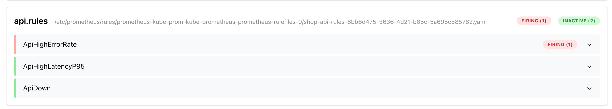

Служба `Alertmanager` мгновенно перехватила этот сигнал и вывела тревожную карточку на диспетчерский экран `Karma`. На табло включилась аварийная сирена, выдав четкую инженерную сводку: `Брак пробил потолок. Доля 5xx за 5 минут: 79.52%. АЛАРМ: api-service безудержно плюется пятисотками!`.

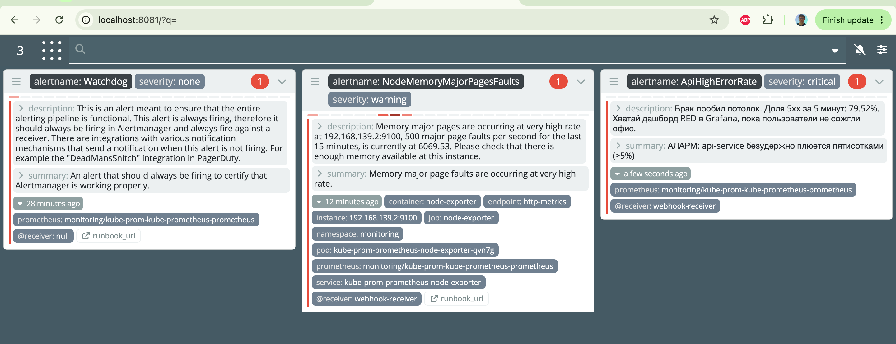

Генеральный итог испытаний: вся цепочка от настройки критических порогов в чертежах до сирены на табло диспетчера отработала безупречно, подтвердив полную готовность контура КИПиА к автоматическому контролю производства.

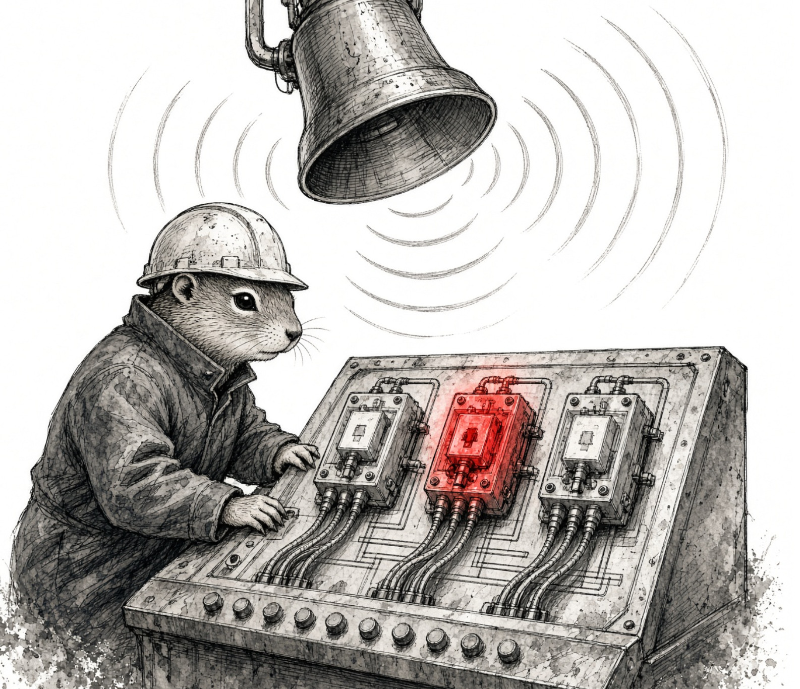

---
