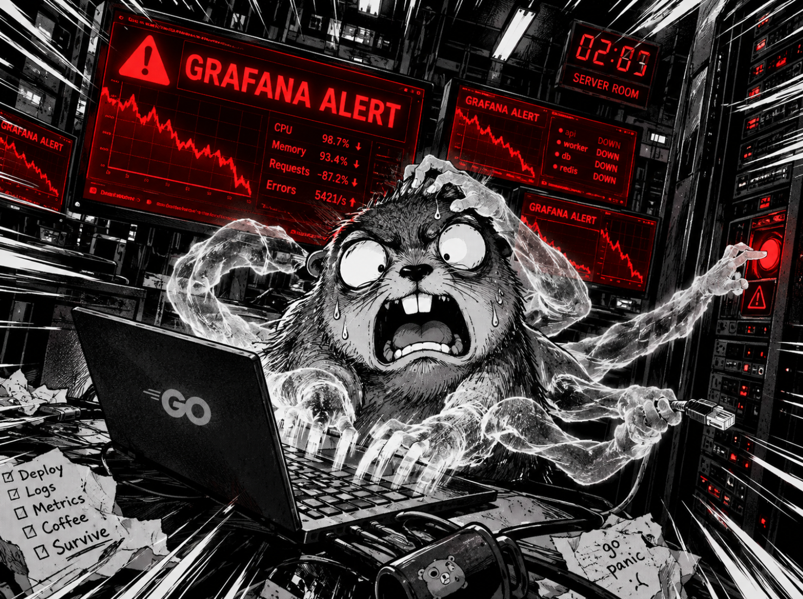

# Хроники Гофера. Сезон 3: Автоматизация devops-процесса.

# Спецвыпуск: Инспектор Гофер ведёт дело

- **Язык сервисов:** Go 1.27
- **Стенд:** Kubernetes-кластер OrbStack + n8n в Docker
- **Инструменты AI:** n8n `self-hosted`, Ollama `llama3.2`, Filesystem MCP
- **Мониторинг:** стек из второго сезона `Prometheus` + `Loki` + `Jaeger` + `Alertmanager` + `Karma`
- **Развертывание:** Helm v4, чарт `shop` из 3 сезона

---

## Часть 0 - Введение и цель работы. Сюжетная арка: Бюро расследований

В прошлых сезонах наш Гофер прошёл путь от узника ядра Linux до начальника охраны завода. Он построил конвейер `Helm`, настроил датчики `Prometheus + Loki + Jaeger`, нанял Ростехнадзор `Kyverno` и научил `Postgres` самовосстанавливаться.

Казалось бы, всё под контролем... Но есть дыра, которую не закрывает ни один из его инструментов. Когда что-то ломается, диагноз ставит человек, и ставит его медленно. Особенно по ночам, когда на смене один дежурный.

Так вот, дирекция устала терять деньги на ночных простоях. На заводе решили открыть новый отдел под названием `GOPHER A.I.D.D.` - Департамент Автономного ИИ-Мониторинга и DevOps-Расследований.

Теперь наш детектив сам собирает улики: читает метрики, сверяет с манифестами, смотрит логи, и выдаёт готовый рапорт с диагнозом.

---

## Часть 1 - Придумай кейс. Сюжетная арка: Клиент на пороге

### Шаг 1.1. Ночной звонок

В три часа ночи тишину дежурки завода `Gopher-shop` разорвал сигнал `Alertmanager`. Под api ушёл в `CrashLoopBackOff`, а критический путь оформления заказов `api -> postgres` оборвался на середине. Дежурный инженер открыл `Grafana`, увидел падающие графики, побежал в `Loki` за логами, потом в `Git` за свежими коммитами, потом в `values.yaml` за лимитами. К утру он так и не понял, что именно сломалось.

Утром у дверей кабинета инспектора Гофера появился директор завода. Он устал терять деньги на ночных простоях и хочет, чтобы расследования шли сами. Инспектор берётся за дело. Но сначала ему нужно понять, с чем именно он работает.

---

### Шаг 1.2. Кому помогает инспектор

Клиент - команда DevOps из трёх человек, которая отвечает за доступность сервиса `shop`. Они несут ночные дежурства по очереди и чинят всё вручную. Их главная задача, это держать живым критический путь от `api` к `postgres`, потому что от него зависят все заказы завода.

Днём инженеры справляются, но проблема начинается ночью, когда на смене один человек, и ему нужно одновременно смотреть метрики, читать логи, сверять манифесты и искать виновника.

### Шаг 1.3. Что за проблема на столе у инспектора

Информация об инциденте размазана по нескольким системам. Метрики в `Prometheus`, логи в `Loki`, трейсы в `Jaeger`, лимиты и реплики в `values.yaml` чарта shop, алерты в `Alertmanager`. Чтобы собрать цельную картину, инженер тратит время на переключение между окнами и вкладками. Это не расследование, а какой-то бег по кругу.

Ночью, когда падает прод, у дежурного нет и сорока минут на такую суету. Ему нужен один короткий документ с диагнозом и рекомендацией. Пока такого документа нет, завод продолжает терять деньги на каждом ночном инциденте.

### Шаг 1.4. Что делает инспектор от начала до конца

Инспектор не бегает по системам сам. Он запускает `конвейер n8n`, который выполняет всю работу за него.

Триггер:
`Cron` срабатывает каждое утро в `09:00`. В боевом режиме здесь был бы вебхук от `Alertmanager`, но для локального запуска используем расписание, чтобы не поднимать настоящий сервис.

Шаги без AI:
Конвейер читает три файла из песочницы. Первый файл - `values.yaml` из чарта shop, там текущие лимиты, реплики и пороги. Второй файл - `metrics.json` с сырыми метриками за ночь по `CPU, RAM и числу горутин`. Третий файл - `errors.log` с логами ошибок, которые успели накопиться.

Шаг с AI:
Все три файла уходят в агента `Ollama` с моделью `llama3.2`. Инспектор следует своему `skill` и действует по строгому порядку. Сначала смотрит метрики. Потом сравнивает их с лимитами из манифеста. Дальше ищет подтверждение в логах. Затем считает процент отклонения через `tool калькулятор`. И в конце формулирует диагноз в три предложения.

Результат:
Конвейер `n8n` записывает ответ инспектора в файл `incident_report.md`. Утром дежурный открывает этот файл и читает готовый рапорт с диагнозом и рекомендацией. Сорок минут работы превратились в две минуты чтения.

---

## Часть 2 - Что должно быть в реализации. Сюжетная арка: Метод дедукции

---

## Часть 3 - Запусти локально. Сюжетная арка: Дело о ночном падении

---

## Часть 4 - Мониторинг. Сюжетная арка: Дневник доктора Ватсона

---
